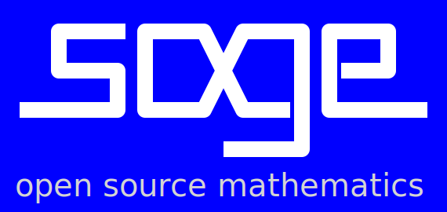
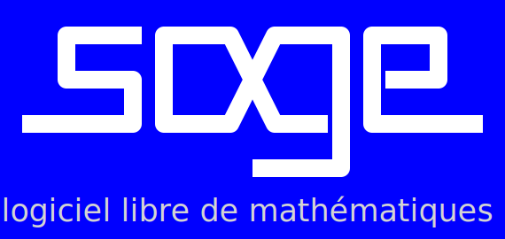
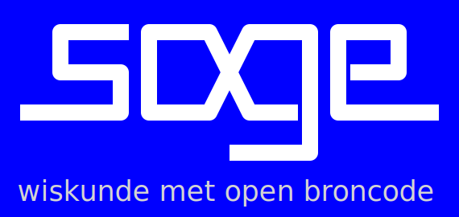
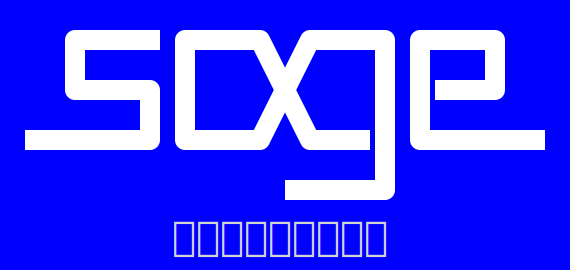
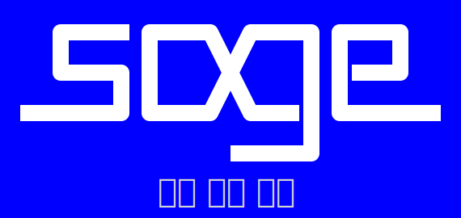
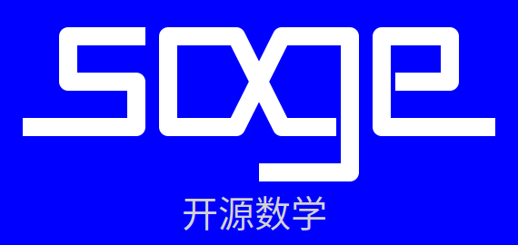

# Logos and icons

You will find here a selection of logos and icons for SageMath. 

There is also a repository on Github: <a class="https" href="https://github.com/sagemath/artwork">github.com/sagemath/artwork</a>. 

## Logo

  

## Logos with translated motto

   

   

   

    

  

## Logos for web components

   

   

  

## Icons

    

## Wallpaper

    

## Color scheme
White on blue background

## Links

<a class="https" href="https://github.com/sagemath/artwork">Artwork on github</a> <a class="http" href="http://www.sagemath.org/library-marketing.html">Marketing Resources</a> <a class="https" href="https://github.com/sagemath/website/tree/master/src/pix">Images of website</a> 

## Terms of Usage
