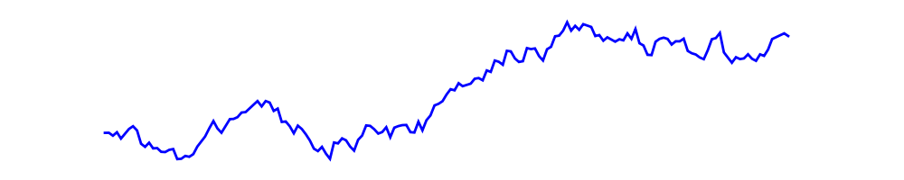

[[!map pages="sagefinance/* and !sagefinance/*/*"]] 

# Quantitative Finance in Sage

[[_TOC_]] 

 

# People

   * <a href="/WilliamStein">William Stein</a> 
   * Brett Nakashima 
   * Christopher Swierczewski 
   * <a href="/GlennTarbox">Glenn Tarbox</a> 

# Mailing list

   * <a href="http://groups.google.com/group/sage-finance">http://groups.google.com/group/sage-finance</a> 

# Links and quotes

   * <a href="/SageFinance/EarlyThoughts">SageFinance/EarlyThoughts</a> 

# Fetching and plotting stock market data

   * <a href="https://wiki.sagemath.org/interact/web">https://wiki.sagemath.org/interact/web</a> 

---

 

<a href="/CategoryFinance">CategoryFinance</a> 
