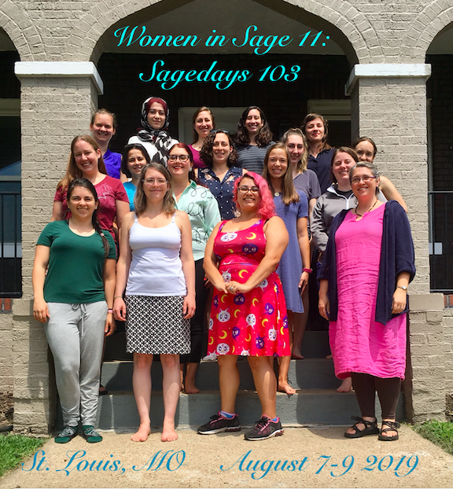

# Sage Days 103 : Women in sage (2019)

_**August 7-9, 2019**_ _**St. Louis, MO**_ 

[[_TOC_]] 

 

These Sage days are a special event for women* who develop in <a class="http" href="http://www.sagemath.org/">SageMath</a> or wish to learn Sage. They will include introduction presentations, training,  and team work on specific projects. There is no initial knowledge needed, everyone is welcome whether they are new Sage learners or Sage expert. We believe in diversity in backgrounds and experiences. 

*This event is primarily targeted at women as to help form a team of women developers and to reduce the gap between men and women developers in Sage Math in particular and in open scientific software in general. It is for all who self identify as a woman. 

## Organizers

<a class="https" href="https://www.lifebynumber.org/">R. Lauren Miller</a> is an adjunct at Fontbonne University. She has been working in sage since 2016. 

<a class="https" href="https://biancasmath.wordpress.com/">Bianca Thompson</a> 

<a class="https" href="https://people.kzoo.edu/mwest/">Mckenzie West</a> 

## Project Leaders

* <a class="https" href="https://www.math.wisc.edu/~rdavis/">Rachel Davis</a> and <a class="https" href="https://sites.google.com/view/jenberg/home">Jen Berg</a> 
* <a class="http" href="http://cs.kingsu.ca/~afeaver/">Amy Feaver</a> and <a class="https" href="https://www.evagoedhartphd.com/">Eva Goedhart</a>  
* <a class="https" href="https://sites.google.com/site/heidigoodson/">Heidi Goodson</a> and <a class="https" href="https://www.uvm.edu/~cvincen1/">Christelle Vincent</a> 

## Projects and Progress

* <a href="/Surfaces%20group">Surfaces group</a>: Lines on degree 3 del Pezzo surfaces.  Can we find them?  Code exists that will, given time, find the lines on a given cubic. 
* <a href="/Crypto%20Group">Crypto Group</a>: Improving the cryptography functionality and documentation. We will be editing <a class="https" href="https://wiki.sagemath.org/interact/cryptography">this</a> page on the Wiki, amongst other things. Feel free to start contributing to the page before you arrive at Sage Days (or even if you're not coming but you have something you are interested in contributing. This page is linked to from the Sage Interactions page: <a href="https://wiki.sagemath.org/interact/">https://wiki.sagemath.org/interact/</a> 
* <a href="/Team%20Believe%20the%20Hype%21">Team Believe the Hype!</a>: (Computing the identity components of Sato-Tate groups for trinomial hyperelliptic curves) 

## Venue

The workshop will take place in St. Louis, MO.  

Lodging will be shared Air BNBs or Dorms. 

**How to come?** The closest airport is St. Louis Lambert International Airport. From there, you can take a Lyft. 

## The event

The event will be workshop style. 

We will start the week by some introduction presentations and tutorials especially targeted at those who don't know much Sage. Then each project leader will present their mathematical and / or Sage project to the group. After that we will split into groups and work together on our projects. Groups can then share what they've accomplished and their next goals at the end of each day.  

## Application

<a class="https" href="https://docs.google.com/forms/d/e/1FAIpQLSdy3xS8xidWvxsJj0xEvZ4cqRU71DuNwYgcb8wJRu3ux4IqBg/viewform?usp=sf_link">Apply Here!</a> 

Due June 15th. People will be notified by June 30th on acceptance.  

## Confirmed Participants

Sarah Arpin 

Catalina Camacho-Navarro 

Holly Paige Chaos 

Fatma Cicek 

Holley Friedlander 

Sumita Garai 

Marie Jameson 

Sara Lapan 

Alexis Newton 

Nandita Sahajpal 

## Tickets

Please add #sagedays103 to any tickets you are working on on trac.  If your ticket needs review, add it to the list on the tickets page to advertise. 

* <a href="/sd103tickets">sd103tickets</a> 

## Reimbursement info

You can find the form to fill out here: <a href="days103/Sage 103 reimbursement form.pdf">Sage 103 reimbursement form.pdf</a> Please email the form to Pam Kelley Ellend at <a href="mailto:pke2@uw.edu">pke2@uw.edu</a> no later than September 9, 2019. You can also mail it to her; the address is on the form. 

