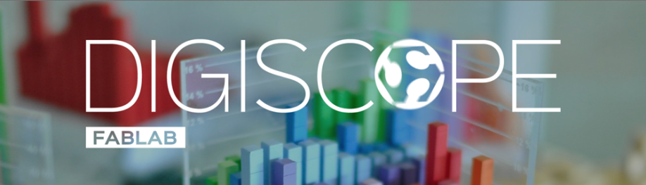

# Outils logiciels pour les mathématiques et l'illustration

## Journées Sage 107

# Software tools for mathematics and illustration

## Sage Days 107

Une rencontre «Outils logiciels pour les mathématiques et l'illustration» aura lieu à Orsay, du 17 au 21 février 2020. 

Entre autres logiciels, on y parlera de Sage, et à ce titre la rencontre est répertoriée parmi les «journées Sage» et porte le numéro 107 dans cette série. 

A conference on Software tools for mathematics and illustration will take place in Orsay, 17--21 Feb 2020. 

Among other software, there will be presentations about Sage, and we thus include this conference in the "Sage Days" series, with the number 107. 

## Aperçu -- Overview

Rencontre destinée à aider les chercheur-es en mathématiques à utiliser plus efficacement leurs ordinateurs, et notamment les logiciels de mathématiques et de modélisation, avec une grande place pour <a class="https" href="https://www.sagemath.org/">SageMath</a>, les autres logiciels de mathématiques étant les bienvenus aussi. 

La rencontre s'adresse aux débutant-es, l'objectif premier est 

* découverte et initiation, avec beaucoup de tutoriels 
On proposera aussi s'intéresser à l'illustration mathématique: 

* illustrer des notes de cours ou des articles de recherche 
* créer des modèles pour l'impression 3d, la découpe et la gravure laser, etc. 
Programme: <a href="/days107/schedule">days107/schedule</a> 

These days aim to help researchers in mathematics better use their computers and especially mathematical and modelling software, with an emphasis on <a class="https" href="https://www.sagemath.org/">SageMath</a>, other math software being welcome too. 

The target audience is beginners, with a primary focus on 

* discovery and initiation, with lots of tutorials 
There will also be a focus on illustrating mathematics: 

* illustrating lecture notes or research articles 
* create models for 3d-printing, laser engraving and cutting, etc. 
Schedule: <a href="/days107/schedule">days107/schedule</a> 

## Lieu -- Venue

Les journées Sage auront lieu à Orsay du lundi au jeudi, plus précisément: 

* Salle du conseil (salle 1F12), premier étage. 
* Institut de mathématique d'Orsay, 307 rue Michel Magat, 91400 Orsay, France. 
* Carte: <a href="https://www.imo.universite-paris-saclay.fr/Acces-130?lang=fr">https://www.imo.universite-paris-saclay.fr/Acces-130?lang=fr</a> 
* Accès par la station RER B "Orsay-ville". 
Le vendredi, nous serons sur la partie du campus située sur le plateau: 

* Salle 1018, bâtiment Claude Shannon (bâtiment 660) 
* Inria Saclay, Digiteo Labs Moulon, 660 rue Noetzlin, 91190 Gif-sur-Yvette, France. 
* Carte: <a href="https://fablabdigiscope.gitlab.io/page/where/">https://fablabdigiscope.gitlab.io/page/where/</a> 
* Accès par l'arrêt de bus Moulon, lignes 91.06, 91.10, ou 9 
These Sage days will take place in Orsay from Monday until Thursday, more precisely: 

* Salle du conseil (room 1F12), first floor. 
* Orsay Mathematics Institute, 307 rue Michel Magat, 91400 Orsay, France. 
* Map: <a href="https://www.imo.universite-paris-saclay.fr/Acces-130?lang=en">https://www.imo.universite-paris-saclay.fr/Acces-130?lang=en</a> 
* Access via the "Orsay-ville" RER B station. 
On Friday, we will be on the upper part of the campus, on the plateau: 

* Room 1018, Claude Shannon building (building 660) 
* Inria Saclay, Digiteo Labs Moulon, 660 rue Noetzlin, 91190 Gif-sur-Yvette, France. 
* Map: <a href="https://fablabdigiscope.gitlab.io/page/where/">https://fablabdigiscope.gitlab.io/page/where/</a> 
* Bus stop Moulon, lines 91.06, 91.10, or 9 

## Participant-es -- Participants

Voir la page dédiée: <a href="/days107/participants">days107/participants</a>. 

See dedicated page: <a href="/days107/participants">days107/participants</a>. 

## Thèmes, projets -- Themes, projects

Voir la page dédiée: <a href="/days107/projects">days107/projects</a>. 

See dedicated page: <a href="/days107/projects">days107/projects</a>. 

## Transport

Vérifiez les conditions de circulation des transports en commun: 

* infos RATP: <a href="https://www.ratp.fr/information">https://www.ratp.fr/information</a> 
* conditions de circulation: <a href="https://www.ratp.fr/infos-trafic">https://www.ratp.fr/infos-trafic</a> 
* travaux et manifestations: <a href="https://www.ratp.fr/travaux-manifestations">https://www.ratp.fr/travaux-manifestations</a> 
Please check traffic conditions for public transport: 

* RATP information: <a href="https://www.ratp.fr/en/information">https://www.ratp.fr/en/information</a> 
* daily traffic conditions: <a href="https://www.ratp.fr/en/infos-trafic">https://www.ratp.fr/en/infos-trafic</a> 
* works and demonstrations: <a href="https://www.ratp.fr/en/travaux-manifestations">https://www.ratp.fr/en/travaux-manifestations</a> 

## Inscription -- Registration

Pour participer, merci de remplir le formulaire d'inscription: 

* <a href="https://framaforms.org/outils-logiciels-orsay-2020-02-1580929351">https://framaforms.org/outils-logiciels-orsay-2020-02-1580929351</a> 
To participate, please fill in the registration form: 

* <a href="https://framaforms.org/outils-logiciels-orsay-2020-02-1580929351">https://framaforms.org/outils-logiciels-orsay-2020-02-1580929351</a> 

## Financement -- Funding

Si vous avez besoin de financement pour assister à ces journées, indiquez-le dans le formulaire d'inscription. 

If you need funding to attend, please say so in the registration form. 

## Programme -- Schedule

On commencera par deux jours de formation aux outils informatiques généraux (utiliser le terminal, contrôle de version avec Git, rudiments de programmation en Python), suivis de trois jours plus spécifiquement consacrés aux logiciels de mathématiques. 

* lundi et mardi: formation "Software Carpentry" 
* mercredi, jeudi, vendredi: logiciels de mathématiques 
Programme détaillé:  <a href="/days107/schedule">days107/schedule</a> 

We will spend two days on general computer tools (the Unix shell, version control with Git, and programming with Python), and follow with three days on mathematical software. 

* Monday, Tuesday: "Software Carpentry" training 
* Wednesday, Thursday, Friday: mathematical software 
Detailed schedule:  <a href="/days107/schedule">days107/schedule</a> 

## Remerciements -- Acknowledgments

Le comité d'organisation remercie pour leur soutien à cette rencontre -- This workshop could be held thanks to the support of 

   * Laboratoire de mathématiques d'Orsay 
         *  
   * Fablab Digiscope 
         *  