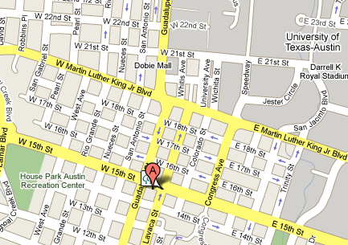
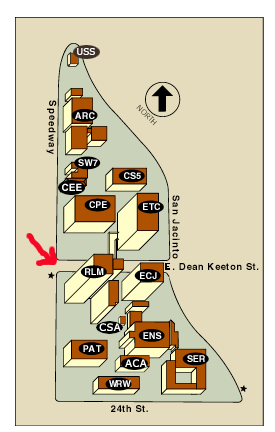

[[_TOC_ 2]] 

# Sage Days 11

## Special functions and computational number theory meet scientific computing

## Projects

      * <a href="/days11/projects">List of Projects</a> 

## Photos

      * <a href="http://picasaweb.google.com/wstein/SageDays11Day1DinnerAndDay2">http://picasaweb.google.com/wstein/SageDays11Day1DinnerAndDay2</a> 

## November 7 -- 10, 2008, Austin, Texas

Organizers: William Stein, Fernando Perez, Fernando Rodriguez-Villegas, Irene Gamba, Salman Butt, Craig Citro 

Sage Days 11 is being funded by the National Science Foundation (NSF) and the Institute of Computational Engineering and Sciences (ICES) and the Mathematics Department at the University of Texas at Austin. 

NOTE: The Supercomputing 2008 conference (officially known as SC08) is described here: <a href="http://sc08.supercomputing.org/">http://sc08.supercomputing.org/</a>  It takes place from November 15-21 at the Austin convention center. 

## Official Webpage

We have an official webpage for the conference <a class="http" href="http://www.math.utexas.edu/sage">here</a>. Please visit this page to register for the conference! 

## Registration and Funding

We have some limited funding available for participants. Please register <a class="http" href="http://www.ma.utexas.edu/sage/rform1.php">here</a> if you are planning on attending, and indicate whether you would like reimbursement for travel, hotel, or both. 

## Participants

Please add your name to the list if you're going to be coming to SD11. 

* Silvia Adduci, UT-Austin 
* Evan Archer, UT-Austin 
* Michael Abshoff, TU Dortmund 
* Herivelto Borges, UT-Austin 
* Salman Butt, UT-Austin 
* Craig Citro, UCLA 
* Yingda Cheng, UT-Austin 
* Timothy Clemans, Sage 
* Inderjit Dhillon, UT-Austin 
* Victor Eijkhout, UT-Austin 
* Irene Gamba, UT-Austin 
* Brian Granger, Cal Poly San Luis Obispo 
* Chris Hall, University of Michigan 
* Jonathan Hanke, University of Georgia, Athens 
* David Harvey (Nov 7-9), NYU 
* Kimberly Hopkins, UT-Austin 
* Flourent Jouve, UT-Austin 
* Martin Mereb, UT-Austin 
* Travis Oliphant, Enthought 
* Fernando Perez, Berkeley 
* Rishikesh, University of Waterloo 
* Miguel Rodriguez, UT-Austin 
* Fernando Rodriguez-Villegas, UT-Austin 
* Michael Rubinstein, University of Waterloo 
* Adriana Salerno, UT-Austin 
* Phillip Schmitz, UT-Austin 
* Sourav Sen Gupta, University of Washington 
* William Stein (Nov 7-9), University of Washington 
* Chia-Liang Sun, UT-Austin 
* Gonzalo Tornaría, Universidad de la República, Uruguay 
* Robert van de Geijn, UT-Austin 
* John Voight (Nov 8-9), University of Vermont 
* Felipe Voloch, UT-Austin 
* R. Clint Whaley, UT San Antonio 

## Schedule

* Friday, November 7 
   * Video for day 1: <a href="http://sage.math.washington.edu/home/was/days11/">http://sage.math.washington.edu/home/was/days11/</a> 
   * 09:00 - 09:30: Opening Remarks, Villegas, 12.104 (12th Floor Lounge) 
   * 09:30 - 10:15: Intro to Sage, Citro, RLM 9.166 
         * Talk slides <a href="days11/citro-slides.pdf">here</a> 
         * Sage worksheet as <a href="days11/citro-sage-worksheet.sws">worksheet</a> and <a href="days11/citro-sage-worksheet.pdf">pdf</a>. 
   * 10:15 - 10:30: Break 
   * 10:30 - 11:15: Computing on TACC, Eijkhout, RLM 9.166 
   * 11:15 - 11:30: Break 
   * 11:30 - 12:15: <a class="http" href="http://www.ma.utexas.edu/sage/talks/oliphant.ppt">Overview of Enthought Technologies: NumPy, SciPy, and the Enthought Tool Suite</a>, Oliphant, RLM 9.166 
   * 12:15 - 02:00: Lunch break 
   * 02:00 - 02:45: Symmetric eigenvalue problem, Dhillon, RLM 10.176 
   * 02:45 - 03:00: Break 
   * 03:00 - 05:00: Lab session for TACC/Work, RLM 7.122 
   * 05:00 - 06:00 (?): Linear algebra Birds of a Feather/Work, RLM 9.166 
   * 06:00 - 07:00: Coding Sprint Organization 
* Saturday, November 8 
   * 09:00 - 10:00: Catered breakfast 
   * 10:00 - 10:45: <a class="http" href="http://www.cs.utexas.edu/users/flame/pubs/sc08_workshop.pdf">Beautiful Parallel Code: Evolution vs. Intelligent Design</a>, van de Geijn, RLM 12.166 
   * 10:45 - 11:00: Break 
   * 11:00 - 11:45: <a href="days11/rubinstein.pdf">Introduction to computing L-functions</a>, Rubinstein, RLM 12.166 
   * 11:45 - 01:00: Lunch break 
   * 01:00 - end of day: Work/informal talks (Stein/Gupta - Dokchitser at 3:30pm <a href="days11/dokchitser.pdf">dokchitser.pdf</a> ; Citro/Stein - Cythonization at 5pm; Citro/Stein - Modular Symbols at 8pm) 
* Sunday, November 9 
   * 09:00 - 10:00: Catered breakfast 
   * 10:00 - 10:45: <a class="http" href="http://www.cems.uvm.edu/~voight/nf-tables/austin-quintics-beamer.pdf">A database of totally real quintic fields</a>, Voight, RLM 12.166 
   * 10:45 - 11:00: Break 
   * 11:00 - 11:45: <a href="days11/vandiver-talk.pdf">Large-Scale Verification of Vandiver's Conjecture</a>, Harvey, RLM 12.166 
   * 11:45 - 01:00: Lunch break 
   * 01:00 - end of day: Work/informal talks (Chris Hall - Drinfeld stuff at 2pm; <a href="/days11/muppy">Mabshoff - Muppy at 3pm</a>)  
   * 06:00 - 07:00: Catered dinner, RLM 12th floor lounge 
* Monday, November 10 
   * 10:00 - 11:00: Work/Lunch, RLM 12.104 
   * 01:00 - end of day: Work, ACES 2.402 

## Hotel Info

A block of rooms has been reserved for us at the Doubletree Guest Suites, 303 W. 15th St, Austin, Texas. <a class="http" href="http://maps.google.com/maps?f=q&amp;hl=en&amp;geocode=&amp;q=doubletree,+15th+st,+austin,+texas&amp;ie=UTF8&amp;ll=30.27986,-97.741971&amp;spn=0.020161,0.025878&amp;z=15">Here</a> is a link to a google maps view of the hotel. 

 

## Ground Transportation

**NOTE: Capital Metro bus drivers went on strike November 5, 2008. Some core routes will still be available from 6am to 7:30pm daily and all UT shuttles will continue to run as usual. No fares will be charged during the strike. BUT the Airport Flyer will not be running. If the strike is still going on when you arrive, your best bet may be to take a cab or shared-ride van. We will update this space as we get more information.** 

Austin's bus system is run by <a class="http" href="http://www.capmetro.org/">Capital Metro</a> which has a number of bus routes that service the UT campus. UT shuttle buses are marked by white and burnt orange buses that use letters for their route as opposed to numbers. UT shuttles are free to ride. 

An important note: there is a football game that Saturday. Expect a lot of traffic and people on and near campus. Most places near campus will be crowded, so keep that in mind. There isn't much we can do about it, but the inside of RLM will be nice and quiet. 

### To and From the Airport

There are a couple of options to get to and from the Austin-Bergstrom International Airport (ABIA). 

* Capital Metro has a bus (the Airport Flyer, Route 100) that runs between ABIA and central Austin. Its schedule can be found <a class="http" href="http://www.capmetro.org/riding/schedules.asp?f1=100">here</a>. It doesn't have many stops, but they are all centrally located and intersect other bus routes. Many UT graduate students use the Airport Flyer and find that it is a very inexpensive and easy way to travel (1.50 USD or 3 USD for a 24-hour pass). This may be due to their knowledge of the bus system and knowing what bus to take get home. 
* There are also plenty of cabs and shared-ride vans as well. 
If you will be staying at the Doubletree Suites, you can take the Airport Flyer to 15th and Lavaca St, right next to the hotel. Otherwise, if your hotel is centrally located, my suggestion would be to use the Airport Flyer. A cab or shared-ride van is probably your best option if your hotel is not along the Airport Flyer route. It takes about 20-30 minutes to reach central Austin from the airport (depending on traffic). 

### To and From RLM

Robert Lee Moore (RLM) Hall is the home of the Math Department at UT. Maps of the University can be found <a class="http" href="http://www.utexas.edu/maps/">here</a> -- click on the "4" to get a zoom in of RLM, at the corner of Dean Keaton St and Speedway St. A picture of RLM can be found <a class="http" href="http://www.utexas.edu/maps/main/buildings/rlm.html">here</a>.  

#### From the Doubletree Suites

* Walking: You can walk from the hotel to RLM by walking one block west along 15th St to Guadalupe St, then walking north along Guadalupe (which marks the west end of campus), and finally making a right to walk east once you get to Dean Keaton. RLM will be on the corner of Dean Keaton and Speedway, on the south side of Dean Keaton. 
* Bus: You can take the Enfield Road (ER) or Lake Austin (LA) UT shuttle that Capital Metro runs. They both can be grabbed along 15th St and will wind you around campus. **Note that these buses will still be running during the strike.** 
   * Going to RLM, you will want to get off on 21st St and Speedway, walk along Speedway north (the bus drops you off on the north side of 21st St) to RLM. 
   * Returning from RLM, you will want to grab the bus at the 21st and Speedway stop and take it to Guadalupe St and 15th St, walk east along 15th St one block to Lavaca St and the Doubletree Suites. 
   * After 7pm, the ER and LA combine routes to become the ER/LA route. It runs until 11pm and has the same route around campus as the ER and LA do separately. 

## Food

### Near the Doubletree Suites

* <a class="http" href="http://www.claypit.com/">Clay Pit</a>: contemporary Indian cuisine. Fairly good and not overly expensive. They have a lunch buffet (including on Saturday) this is an excellent deal. On Guadalupe St, between 16th and 17th streets (Guadalupe is one block west of Lavaca). 
* <a class="http" href="http://www.cactushill.com/TCP/home.htm">Texas Chili Parlor</a>: chili, burgers, tacos/enchiladas, bar food. Tasty, but probably not the healthiest option. They are located on Lavaca between 14th and 15th streets, so very close to the Doubltree Suites 

### Between the Doubletree Suites and RLM

As you walk up to campus along Guadalupe to RLM, you will find lots of dining options. There's a range of restaurants that vary between fast food and sit-down restaurants. Here are some highlights, listed in increasing proximity to RLM. 

* Players: Burgers and bar food. Located on the corner of Guadalupe and MLK Blvd. 
* Taco Cabana: A fast food place serving Mexican food. Think Taco Bell but with fresher ingredients that won't make you sick. Located on MLK Blvd about 1.5 blocks west of Guadalupe. 
* Veggie Heaven: A quite tasty veggie/vegan informal sit-down restaurant. Located on Guadalupe, just north of MLK Blvd, on the west side of Guadalupe. 
* Pho Hoang: Vietnamese place specializing in pho. Located near Veggie Heaven on Guadalupe, just north of MLK Blvd, on the west side of Guadalupe. 
* Chipotle: I'm sure you all know about Chipotle. Located on Guadalupe on the west side of the street, just north of 22nd St. 
* Pot Belly: A (hot) sandwich place that sells Nantucket Nectar drinks (the only place in Austin where I have found Nantucket Nectars). Located on the west side of Guadalupe, just north of 23rd St. 
* Which Wich: A sandwich place. Located on the west side of Guadalupe, just north of 23rd St. 
* Kismet Cafe: A falafel/gyro place. Tasty and well-priced. Located on 24th St, just a few feet west of Guadalupe. 
* Kerbey Lane Cafe: A 24 hour cafe/diner. Moderately priced (entrees are about $10), but a great place for breakfast or brunch. Expect long lines for Saturday or Sunday brunch as nearby undergrads flock to it then. Located on the west side of Guadalupe, just north of 26th St, it's a little out of the way from RLM but still not very far (just one block north of Dean Keaton). 
* Madam Mam's: A very tasty Thai restaurant. I've never been to Thailand, but friends who have say Madam Mam's is legit. Reasonably priced (curries are around $7), though you should expect a wait during the lunch hour rush. They also do pick-up orders. Located on the west side of Guadalupe at its intersection with Dean Keaton. 
* Slices and Ices: Pizza joint offering NY style (i.e. thin crust) pizza. In my (Salman's) opinion, one of the top three pizza places in Austin. A couple of slices and a drink will set you back about $7. Located at the intersection of Guadalupe and Dean Keaton, just a few feet north of Madam Mam's. 

### Near RLM

* <a class="http" href="http://www.oscampuscafe.com/">O's Campus Cafe</a>: UT-run restaurant (only open on weekdays until 3pm). Just south of RLM in the ACES building at the corner of 24th St and Speedway St. 
* <a class="http" href="http://www.utexas.edu/student/housing/index.php?site=0&amp;scode=5&amp;id=1073&amp;menu=284">Littlefield Patio Cafe</a>: UT-run cafe offering sandwiches, burgers, pizza, etc. Quick, inexpensive, and located near RLM on Dean Keaton and University Ave (2 blocks west of Speedway). 
* <a class="http" href="http://posseeast.com/">Posse East</a>: Burgers, tacos, and bar food. On the corner of Duval St and San Jacinto Blvd (just a little northeast of RLM). 
* <a class="http" href="http://www.saopaulos.net/">Sau Paulo's Restaurante</a>: Brazilian restaurant close to campus. Entrees are very tasty and about $10. Located on San Jacinto Blvd, up the street from Posse East. 

### Coffee/Tea

* <a class="http" href="http://www.jpsjava.com/">JP's Java</a>: The unofficial Math Department coffee shop, their coffee, espresso, and tea are quite good. The back room is ideal for a large group working together. Power outlets can be a problem, so bringing along power strips would be a good idea. Located at the corner of Duval St and San Jacinto Blvd, just across the street from Posse East. 