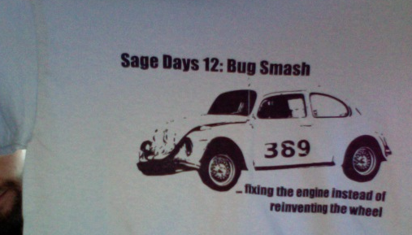

# Sage Days 12: San Diego

## Final Status Reports

Final status reports are <a href="/days12/statusreports">here</a>. 

## Schedule: Jan 21-24, 2009

* Wednesday at 2pm -- talk by William Stein and Craig Citro on Introduction to Sage 
* Wednesday at 4pm -- talk by Michael Abshoff on The Sage Community 
* Wednesday at 5pm -- bug triage session 
* Wednesday at 8pm - late: coding in lobby 
* Thursday at 4pm -- a talk by Simon King on cohomology of p-groups in Atkinson 4004 
* Thursday at 5pm -- bug triage session in Atkinson 4004 
* Thursday at 7pm -- dinner at Sea Rocket Bistro 
* Thursday 10pm - late: coding in lobby 
* Friday at 4pm -- John Perry's talk on F5 in Atkinson 4004 
* Friday at 5pm -- bug status report in Atkinson 4004 
* Friday at 7pm - late: coding in lobby 
* Saturday at 11:45am -- meet in hotel lobby for lunch  
* Saturday 7pm - late: coding in lobby 

## About

Sage is a free open-source mathematics software system licensed under the GPL. It combines the power  of many existing open-source packages into a common Python-based interface.  Sage Days 12 is a mainly developer-oriented workshop for work on the Sage mathematical software system.  It will be held at the <a class="http" href="http://www.calit2.net/">Calit2 Center at UC San Diego</a> and is funded by <a class="http" href="http://www.ccrwest.org/">CCR La Jolla</a>.  

 

## Tickets

* <a href="http://trac.sagemath.org/sage_trac/wiki/sd12-bugs">http://trac.sagemath.org/sage_trac/wiki/sd12-bugs</a> 

## Talks

* <a href="/days12/abstracts">Abstracts</a> 
* Slides for the first two talks: <a href="days12/craig-stein.pdf">PDF</a> and <a href="days12/craig-stein.sws">SWS</a> 
* Slides of Simon's talk on <a href="days12/Cohomology2.pdf">Cohomology</a> 
* Slides of John's talk on <a href="days12/F5SageDays12.pdf">F5</a> 

## Date and Location

The workshop will be  held Jan 21-24, 2009 at <a class="http" href="http://atkinsonhall.calit2.net/">Atkinson Hall (Calit2)</a> in Room 4004.  There are <a class="http" href="http://atkinsonhall.calit2.net/directions/">several maps here</a>.  The best map there is probably <a class="http" href="http://atkinsonhall.calit2.net/directions/pdf/UCSD_map_Calit2.pdf">this one (3MB pdf)</a>; our hotel is just below the bottom of that map around 13E. 

On Jan 21, 2pm - 5pm, there will be three colloquium-style talks aimed at a general audience: 

      * 2pm: _Introduction to Sage_ (William Stein, Univ. of Washington, Project Founder and Director) 
      * 3pm: _The "Killer Apps" in Sage: Cython, Interact, and 3d Graphics_ (Craig Citro, UCLA, Developer) 
      * 4pm: _The Sage Community_ (Michael Abshoff, Dortmund, Sage Release Manager) 
We will have a bug triage at 5pm. 

## Getting there

The conference hotel is _<a class="http" href="http://www.marriott.com/hotels/travel/lajca-residence-inn-san-diego-la-jolla/">The Residence Inn</a> on Gilman, across from UCSD_.  

      * The Cloud 9 Shuttle is probably the most straightforward thing to do --- www.cloud9shuttle.com: "It is possible to make a reservation online, but it's almost always fine to just show up on the sidewalk where all the shuttles show up.   I have dim recollections that there are several stops, depending on where you are going, and that you want one labeled "north" or "north county," and that the price is about $25."   
      * Public transportation (bus): "You can take the 992 from the airport to 4th and Broadway and then take the 30 north to UCSD.  It's like an hour and 45 minutes and $4.50." 
      * BETTER Public transportation (bus + trolley): "Danalee likes to ride busses and trolleys.  Here's how she would get to the Gilman Residence Inn from the airport: Take 992 to the transit center at 4th and Broadway.  Take the trolley (either red or blue line) to the Old Town transit center (several stops).  In Old Town, take bus 150 north.  Bus 150 gets on the freeway and takes the Gilman exit, i.e., passes right by the Marriott Residence Inn after a light or two (half a mile?).  This is almost certainly faster than using bus 30, but it does get on the freeway.  Note that the bus web site won't suggest this because it uses the trolley." 
      * Rent a car 
      * A Taxi -- about $50 

## Mailing List

* <a href="http://groups.google.com/group/sagedays12">http://groups.google.com/group/sagedays12</a> 

## Organization Committee

* Michael Abshoff 
* Martin Albrecht 
* Joe Buhler 
* Craig Citro 
* William Stein  (206)419-0925  (cell phone) 

## Goals and Structure

The structure of the workshop is as follows: there will be very few lectures, and the rest of the day is spent with intense working sessions.  This will consist mostly of: 

      * Fix bugs in Sage: there are hundreds of known documented bugs in Sage; let's fix them. 
      * Write doctests: the coverage score of sage as of Jan 1 2009 is 64.3%; let's get this to 80% by writing about 3400 new doctests 
Though a small group will focus on discussing and implementation Jean-Charles Faugere's F5 algorithm for computing Gröbner bases, _by far the main goal of this workshop_ is **fixing bugs and writing doctests**, which will uncover numerous additional bugs.   

## Hit Lists

## Confirmed Participants

### Out of town

1. Michael Abshoff 
1. Martin Albrecht 
1. Nick Alexander 
1. Tom Boothby 
1. Craig Citro 
1. Burcin Erocal 
1. Alex Ghitza 
1. Jason Grout 
1. Mike Hansen 
1. Simon King 
1. Robert Miller 
1. John Perry 
1. David Roe 
1. Dan Shumow 
1. ~~Phaedon Sinis~~ 
1. ~~Till Stegers~~ 
1. William Stein 

### Locals

1. Joe Buhler 
1. Alex Clemesha 
1. Dorian Raymer 
1. Joe Wetherell 

### Remote: Not actually coming

1. Robert Bradshaw 
1. Timothy Clemans 
1. David Harvey 
1. Kiran Kedlaya 

## Pictures

* by <a class="http" href="http://www.flickr.com/photos/martinralbrecht/tags/sagedays12/">Martin Albrecht</a> 
* by <a class="http" href="http://picasaweb.google.com/wstein/SageDays12InSanDiego">William Stein</a> 