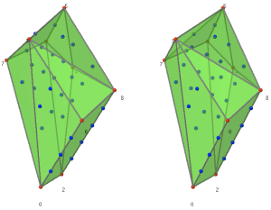

# Sage Days 14: Sage and Macaulay2 for Algebraic Geometry Experimentation

 

[[_TOC_]] 

March 10 - 12, 2009 in Berkeley, CA 

* <a class="http" href="http://picasaweb.google.com/wstein/SageDays14AtMSRI">Photos</a> 
* <a class="http" href="http://www.msri.org/calendar/workshops/WorkshopInfo/502/show_workshop">Official MSRI Page</a> 
This is part of the <a class="http" href="http://ag.msri2009.org/">massive 2009 algebraic geometry program at MSRI</a>. 

We now have a <a href="days14/sd14.pdf">poster</a> (or get the <a href="days14/sd14.svg">svg source file</a>). 

## Schedule

### Tuesday, March 10
 9 - 10 am  |  William Stein: <a class="http" href="http://wstein.org/talks/20090310-msri-sd14/">Introduction to Sage</a> (NOTE: some examples rely on functionality not yet merged into Sage.  Stay tuned!) 
 10:30 - 11:30  |  David Eisenbud and Mike Stillman: Doing Algebraic Geometry in Macaulay2 -- an introduction <a href="days14/cubicsurface.m2">cubicsurface.m2</a> and <a href="days14/cubicsurface.sws">cubicsurface.sws</a> 
 1:00 - 2:00pm  |  Mike Hansen: The Sage/Macaulay2 interface 
 2:30 - 3:30 pm  |  Alex Ghitza: Algebraic Geometry using Sage <a href="days14/main.pdf">main.pdf</a>, <a href="days14/SD14__Algebraic_schemes.sws">SD14__Algebraic_schemes.sws</a>, <a href="days14/SD14__Morphisms_and_points.sws">SD14__Morphisms_and_points.sws</a>, <a href="days14/SD14__Curves.sws">SD14__Curves.sws</a>, <a href="days14/SD14__Elliptic_curves.sws">SD14__Elliptic_curves.sws</a>, <a href="days14/SD14__Visualisation_1.sws">SD14__Visualisation_1.sws</a>, <a href="days14/SD14__Visualisation_2.sws">SD14__Visualisation_2.sws</a>, <a href="days14/SD14__Visualisation_3.sws">SD14__Visualisation_3.sws</a> (NOTE: some graphing functionality relies on patches not yet merged into Sage -- so they'll probably not work for you yet.) 
 4:00 - 5:30 pm  |  Justin Walker et al.:  Interactive Sage Tutorial - Using Sage (bring your laptop!) <a href="days14/Tut.pdf">Sage Tutorial,</a><a href="days14/Resources.pdf">Sage Resources,</a><a href="days14/stuff.sage">Sage Examples,</a><a href="days14/ram.sage">RamifiedPrimes function</a>
 5:30 - 6:00pm  |  Project organization -- discussion by people interested in coding

### Wednesday, March 11
9:30 - 10:30 am  |  Andrey Novoseltsev: Fibered K3 Surfaces using Sage (a.k.a. Lattice Polytopes using Sage) <a href="days14/K3viaSage.pdf">K3viaSage.pdf</a>, <a href="days14/SD14PolytopeDemo.sws">SD14PolytopeDemo.sws</a>
11:00am - 12:00 pm |  William Stein et al.: discussion about mathematical software -- what do you want? <a href="/days14/what">Questions</a> 
 1:30 - 3:00 pm  |  Mike Hansen, Michael Abshoff: Interactive Sage Tutorial - Developing for Sage (bring your laptop!)
 afternoon/evening  |  projects and discussion by people interested in coding in Evans Hall
  4:10–5:00pm, 740 Evans  |  William Stein: Number Theory Seminar (not on Sage)

### Thursday, March 12
 10:30 - 11:30am  |  Dan Bump: Lie theoretic methods in Sage (see <a href="http://sporadic.stanford.edu/bump/sagedays/">http://sporadic.stanford.edu/bump/sagedays/</a>)
 1:30 - 3:00pm  |  final coding sprint project wrap-up 

## Organizers

* Local organizers: David Eisenbud (UC Berkeley), Daniel Erman (UC Berkeley), Dan Grayson (University of Illinois at Urbana-Champaign), Mike Stillman (Cornell University) 
* Sage organizers: William Stein (University of Washington), Mike Hansen (University of Washington) 

## Projects

* <a href="/days14/projects">List of Projects</a> 

## Participants

See <a href="http://www.msri.org/calendar/workshops/WorkshopInfo/502/show_participants">http://www.msri.org/calendar/workshops/WorkshopInfo/502/show_participants</a> for the official list -- the below is not comprehensive! 

* Michael Abshoff 
* David Eisenbud 
* Daniel Erman 
* Alex Ghitza 
* Dan Grayson 
* Mike Hansen 
* Kiran Kedlaya (March 11-13) 
* Mathias Koeppe 
* ~~Emily Kirkman~~ 
* Peter Malkin 
* Andrey Novoseltsev 
* Steve Pon 
* William Stein 
* Mike Stillman 
* Nicolas M. Thiéry 
* Justin Walker 
* Sébastian Xambo 

## Hotel

* We have a block of 8 rooms reserved at <a class="http" href="http://www.rosegardeninn.com/">the Rose Garden Inn</a>. 
Participants needing hotel room (please add your name and dates here): 

* William Stein (arrive March 9; leave March 12) 
* Justin Walker (arrive March 9; leave March 12; have a room reserved) 
* Alex Ghitza (March 8 to March 13) 
* Andrey Novoseltsev (arrive March 9, leave March 12) 
* Kiran Kedlaya (March 11 to 13, but may not need to use the block) 
Reservations may be made by calling 1-800-992-9005 OR <a class="https" href="https://reservations.ihotelier.com/onescreen.cfm?hotelid=5082&amp;languageid=1">directly on their website</a>. Click on Corporate at the bottom of the screen reached by the link in the previous sentence. 
