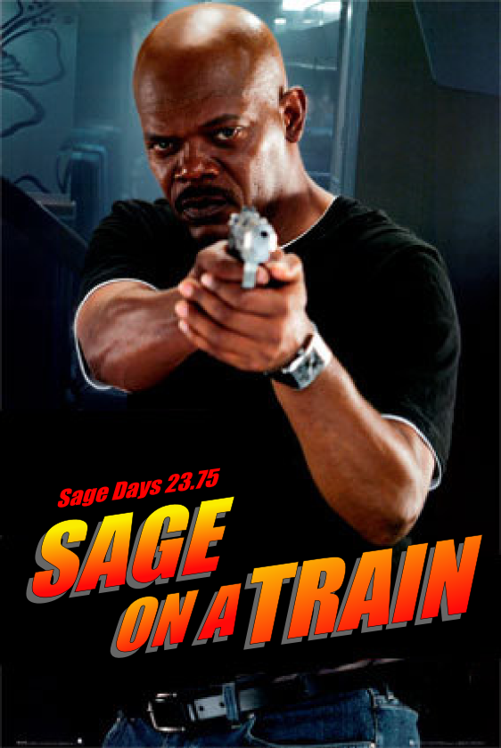

## Sage Days 23.75 (17.7.2010, Kaiserslautern -> Linz)

 

### Schedule

1. Kaiserslautern Hbhf - Mannheim Hbhf 
1. Mannheim Hbhf - Frankfurt Hbhf 
1. Frankfurt Hbhf - Linz Hbhf 

### Participants

* Martin Albrecht - I wrote the first version of the mother***in <a class="http" href="http://bitbucket.org/malb/m4rie-old">M4RIE</a> on the mother***in train. 
* Alexander Dreyer - I tried to teach <a class="http" href="http://polybori.sf.net">PolyBoRi</a> the reachability problem for digital systems win unknown inputs. 
* Burcin Eröcal 
* Simon King -- I wrote most of <a href="days23.75/GroupCohomology.pdf">this talk</a> on the train. 
* Robert Miller -- I wrote some of this mother***in <a class="http" href="http://trac.sagemath.org/sage_trac/ticket/9559">code</a> on that mother***in train 
* Oleksandr Motsak 
* William Stein -- I wrote <a class="http" href="http://wstein.org/talks/stein-sd24/stein-sd24.pdf">this talk</a> entirely on the train, and some of <a class="http" href="http://sagenb.org/home/pub/2256/">this talk</a>. 