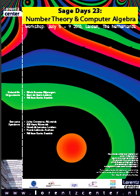

# Sage Days 23: Leiden -- Number Theory and Algebra

* _Dates_: July 5-9, 2010 
* _Organizers_:  Wieb Bosma, Bart de Smit, William Stein,  
* _Mailing list_: <a href="http://groups.google.com/group/sagedays23">http://groups.google.com/group/sagedays23</a> 

## Offical website

   * <a href="http://www.lorentzcenter.nl/lc/web/2010/415/info.php3?wsid=415">http://www.lorentzcenter.nl/lc/web/2010/415/info.php3?wsid=415</a> 

## Working Sessions

   * <a href="/days23/CodingProjects">Coding Sprint Projects</a> 

## Schedule

### Monday, July 5

* Pictures: <a href="http://picasaweb.google.com/wstein/20100705Sagedays23Day1">http://picasaweb.google.com/wstein/20100705Sagedays23Day1</a> 10:30am-10:50am | Introduction and Orientation
11:00am-11:50am | <a class="http" href="http://www.math.rwth-aachen.de/~Frank.Luebeck/talks/SageDays23Leiden2010.pdf">Frank Lubeck: Finite Fields</a>
2:00pm-2:45pm |  <a class="http" href="http://sagenb.org/home/pub/2233/">William Stein: Introduction to the Sage Project</a>
2:50pm-3:05pm | Introductions
3:10pm-4:00pm | Project organization session
4:00pm-5:00pm | Working Sessions
5:00pm-6:30pm | Wine and Cheese Welcome Party

### Tuesday, July 6

* Pictures: <a href="http://picasaweb.google.com/wstein/20100706Sagedays23Day2">http://picasaweb.google.com/wstein/20100706Sagedays23Day2</a> 9:30am-10:00am | Coding sprint status reports
10:10am-11:00am | <a href="days23/hart.pdf">Bill Hart: Fourier Transform</a>
11:10am-12:00pm | Robert Miller: Sage Newbies Tutorial
12:10pm-2:00pm | Lunch
2:00pm-late | Working Sessions
2:00pm | ABC in 201; Function fields and models for curves in 335
3:00pm | Sage Notebook in 201; Conics in 335
4:00pm | Factoring in 201; Sums of Squares in 335
5:00pm | ECHIDNA in 201; Function fields in 335

### Wednesday, July 7

* Pictures: <a href="http://picasaweb.google.com/wstein/20100707Sagedays23Day3">http://picasaweb.google.com/wstein/20100707Sagedays23Day3</a> 9:30am-10:00am | Coding sprint status reports
10:10am-11:00am | William Stein: <a class="http" href="http://nt.sagenb.org/home/pub/15/">Torsion points over quartic fields</a> (local copy: <a href="days23/stein.sws">stein.sws</a>)
11:10am-12:10pm | 5-minute Lightning talks: Clement Pernet, Johannes van der Horst, Maite Aranes, Lloyd Kilford, Jeroen Demeyer, Mak Trifkovic
12:10pm-2:00pm | Lunch
2:00pm-4:30pm | Working Sessions
4:45pm-5:00pm | Departure to boat by bus  <a class="http" href="http://maps.google.com/maps?f=d&amp;source=s_d&amp;saddr=Lorentz+Center,+Leiden,+Nederland&amp;daddr=Haven+18,+2312+MH+Leiden,+Nederland+(Haven)&amp;hl=en&amp;geocode=FcwEHAMd9wJEACHr86J9KA-fcylftBYiGcfFRzFBW6k0LUlJSw%3BFdPrGwMdcq9EACHDYC1HbEYU9Slr6Iz3kMbFRzGMryI2SodWDA&amp;mra=ls&amp;sll=52.164509,4.479246&amp;sspn=0.031852,0.055189&amp;ie=UTF8&amp;ll=52.172774,4.490147&amp;spn=0.063692,0.175781&amp;z=13">Google Maps</a>
5:00pm-9:00pm | Boat trip, including dinner.  Here is <a class="http" href="http://maps.google.com/maps/ms?ie=UTF8&amp;hl=en&amp;msa=0&amp;msid=109500648471642954404.00048add9c46cf306662a&amp;ll=52.191193,4.582672&amp;spn=0.064613,0.220757&amp;z=12">the path we took</a> (it ends slightly early due to Jaap Spies's batteries running out)
9:00pm- | Departure by bus to hotel Het Haagsche Schouw, Lorentz Center, and Leiden Central Station

### Thursday, July 8

   * Pictures: <a href="http://picasaweb.google.com/wstein/20100709Sagedays23Day4">http://picasaweb.google.com/wstein/20100709Sagedays23Day4</a> 9:30am-10:00am | Coding sprint status reports
10:10am-11:00am | John Cremona: The complex AGM and periods of elliptic curves over $\mathbb{C}$<a href="days23/cagm.pdf">cagm.pdf</a>
11:10am-12:00pm | Fredrik Johansson: Evaluation of special functions <a href="days23/sd23mpmath.pdf">sd23mpmath.pdf</a>
12:10pm-2:00pm | Lunch
2:00pm-late | Working Sessions

### Friday, July 9
9:30am-10:00am | Coding sprint final status reports
10:30am-11:30am | Hendrik Lenstra: Defining finite fields <a class="http" href="http://www.math.leidenuniv.nl/~desmit/papers/standard_models.pdf">standard_models.pdf</a>
11:40am-12:20pm | Bart de Smit: Standard roots of unity in finite fields

## Poster

   *  
   * <a href="days23/sd23-poster.pdf">sd23-poster.pdf</a> 