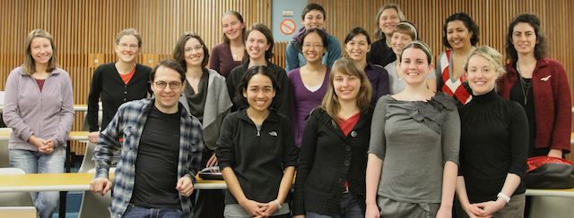

# Sage Days 26: Women in Sage

[[_TOC_]] 

      * Location: Seattle, Washington 
      * Dates: December 7, 2010 to December 10, 2010 
      * Organizers: Alyson Deines (UW), Jennifer Balakrishnan (MIT), Gagan Sekhon (UConn), William Stein (UW) 
      * Funding: Microsoft Research (donation from Kristin Lauter's cryptography group) and The Beatrice Yormark Fund for Women in Mathematics 

## Projects

      * The <a href="/days26/projects">list of projects</a>. 

## Schedule

      * The <a href="/days26/schedule">schedule is here</a>. 

## Photos and Video

      * Stein's snapshots: <a class="http" href="http://picasaweb.google.com/wstein/20101207SageDays26Women_in_sageDay1">day 1</a>, <a class="http" href="http://picasaweb.google.com/wstein/20101208Sagedays26Day2">day 2</a>, <a class="http" href="http://picasaweb.google.com/wstein/20101209Sagedays26Day3">day 3</a> 
      * Sara Billey's Lecture <a href="http://vimeo.com/17680795">http://vimeo.com/17680795</a>. 
      * <a class="http" href="http://sage.math.washington.edu/home/wstein/video/sagedays26/">Flavia Stan's Lecture</a> (not streaming -- just download the whole thing and watch) 
      * Kate Stange's Lecture at Microsoft <a href="http://research.microsoft.com/apps/video/default.aspx?id=142675&amp;l=i">http://research.microsoft.com/apps/video/default.aspx?id=142675&l=i</a> 
      * William Stein's Lecture at Microsoft <a href="http://research.microsoft.com/apps/video/default.aspx?id=142905">http://research.microsoft.com/apps/video/default.aspx?id=142905</a> 

## UW Wireless info

UW NetID: 

event0519 

Password: 

97ff/95ag/55tj 

## Invited Speakers

      * Sara Billey - <a href="/days26/Billey%20Project">Computer proof for k-Schur functions</a> 
      * Rachel Pries - <a href="/days26/Pries%20Project">Computation of p-torsion of Jacobians of hyperelliptic curves</a> 
      * Anne Schilling - <a href="/days26/Schilling%20Project">How to play with crystals and symmetric functions in Sage</a> 
      * Katherine Stange - <a href="/days26/Stange%20Project">Amicable pairs and aliquot cycles for elliptic curves</a> 

## Participants

 

      * Jennifer Balakrishnan 
      * Anja Becker 
      * Erin Beyerstedt 
      * Ilke Canakci  
      * Sarah Chisholm 
      * Alyson Deines 
      * Julie Eaton 
      * Marina Gresham 
      * Kim Hopkins 
      * Jennifer Johnson-Leung 
      * Karen Kohl 
      * Jennifer Park 
      * Gagan Sekhon 
      * Flavia Stan 
      * Lola Thompson 
      * Bianca Viray 

## Projects

* The <a href="/days26/projects">Projects Page is here</a>. 

## Getting to the Collegiana/Hotel Deca from Seattle-Tacoma

Here are some options to get to the hotels from the airport: 

* <a class="http" href="http://www.yelp.com/biz/a-abc-transportation-seattle#hrid:keLb-JbNNBPNxcvoGUwIOQ/src:search/query:car%20service">A-ABC Transportation</a> offers a flat rate ($30-35 typically, before tip) for door-to-door car service. They are a private car service (though they don't have the nicest fleet of cars) and are less expensive than a cab. Call for a reservation. 
* Taxis from the airport cost about $40 (before tip) and can be found by following the signs in the airport. 
* <a class="http" href="http://shuttleexpress.com/seatac-airport/default.aspx">Shuttle Express</a> picks up passengers at the inner curb on the third floor of the Airport Garage. Call  to make a reservation. 
* There is a new light-rail service from the airport to downtown Seattle, but you will then need to take a taxi to the house/hotel (about 5 miles north of downtown). This is not a good option unless you want to spend time in downtown Seattle. 

## Departure times

<a href="http://wiki.sagemath.org/days26/departures">http://wiki.sagemath.org/days26/departures</a> 

## Mailing Lists

      * <a class="http" href="http://groups.google.com/group/sagedays26">Participant mailing list</a> 
      * <a class="http" href="http://groups.google.com/group/sagedays26org">Closed organization mailing list</a> 