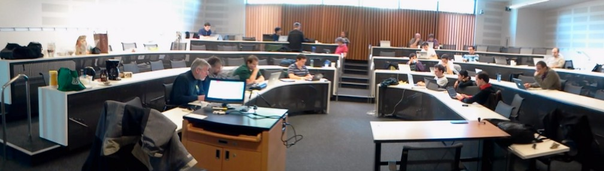

# Sage Days 29

[[_TOC_]] 

## Keep Track of bugs fixed during sage days 29

Important! Keep track of the bugs fixed during these sage days on: <a href="/days29/bugs">Bugs Fixed</a> 

## Topics

For a precise list see <a href="/days29/projects">days29 projects</a> 

* Number theory (elliptic curves, modular forms, etc.) 
* Fixing bugs in Sage or any of its components 
* Sage Notebook rewrite 
* Applied mathematics: Numpy/Scipy development, Neuroimaging 
* SQLite based history 

## Mailing List

* <a href="http://groups.google.com/group/sagedays29">http://groups.google.com/group/sagedays29</a> 

## Dates

* Monday March 21 to Friday March 25, 2011 

## Location

* Seattle, Washington (on the west coast of the USA; *not* in Washington, D.C.), on the <a class="http" href="http://www.washington.edu/">University of Washington</a> campus. 
* We have <a class="http" href="http://www.css.washington.edu/room/PCAR+390">PACCAR HALL 390</a> reserved 9am - 9pm every day March 21 - 25.  This room is in this <a class="http" href="http://www.foster.washington.edu/about/Pages/paccarhall.aspx">beautiful building</a>.  **NOTE:** You can't get in after I think 5pm without calling or emailing somebody who is already in the building (me? at 206-419-0925) to open the door.  
* LODGING: Many participants will be staying at the "UWMC Collegiana Hospitality House" (4311 12th Ave. N.E., Seattle)  (<a class="http" href="http://uwmedicine.washington.edu/Patient-Care/Locations/UWMC/Patient-Family-Resources/Pages/Patient-Family-Housing.aspx">mentioned here</a>), where I have reserved several rooms.  See <a href="days29/collegiana_directions.pdf">collegiana_directions.pdf</a> for more information about getting to the Collegiana. 
* <a href="/days29/lodging">Lodging Details</a> 

## Schedule

Everything Tuesday-Friday is in PACCAR 390.   We also have the breakout rooms nearest the elevator -- 310, 312 and 314 -- reserved for our use.  
Monday March 21, 9am-10am |  Colloquium Talk: John Cremona (Number Theory Software) <a class="http" href="http://tinyurl.com/4bb4nvo">VIDEO</a>
Monday March 21, 10am-12pm | <a class="http" href="http://tinyurl.com/4fazxk9">Participant introductions and coding sprint organization (VIDEO)</a>
Monday March 21, 1pm-9pm | Coding Sprints
Tuesday March 22, 10am-11am | <a href="days29/cython-days29.pdf">Colloquium Talk: Robert Bradshaw (Cython)</a> and <a class="http" href="http://tinyurl.com/5t33vrq">VIDEO</a>
Tuesday March 22, 11am-12:00pm | Status reports
Tuesday March 22, 1:30pm-9pm | Coding Sprints
Wednesday March 23, 10am-11am | Colloquium Talk: Rado Kirov (The Sage Notebook) <a class="http" href="http://tinyurl.com/3f6w4u2">VIDEO</a>
Wednesday March 23, 11am-12:00pm | Status reports
Wednesday, March 23, 2:00pm-2:50pm | Extra Talk: Michael Droettboom (<a href="/PortingToPython3">PortingToPython3</a>)
Wednesday March 23, 3:00pm-9pm | Coding Sprints
Thursday March 24, 10am-11am |  Colloquium Talk: Fernando Perez (Scientific Computing using Python) <a class="http" href="http://tinyurl.com/6a2kqk8">VIDEO</a>
Thursday March 24, 11am-12:00pm | Status reports
Thursday March 24, 2:00pm-2:50pm |  Extra Talk: Robert Miller (Canonical Augmentation) <a class="http" href="http://tinyurl.com/63ersex">VIDEO</a>
Thursday March 24, 3:00pm-3:50pm | <a class="http" href="http://people.mpim-bonn.mpg.de/mraum/data/vortrag.pdf">Extra Talk: Martin Raum (Modular Forms)</a>  <a class="http" href="http://tinyurl.com/5ux2w8f">VIDEO</a> 
Thursday March 24, 4:00pm-9pm | Coding Sprints
Friday March 25, 10am-12:30pm | Status reports and demos
Friday March 25, 2pm-9pm | Coding Sprints

## Lodging

* <a href="/days29/lodging">This page</a> has more precise details about exactly who and when people will **really** be here. 

## Funding

* Write to William Stein <a href="mailto:wstein@gmail.com">wstein@gmail.com</a>.   Plane tickets <a class="http" href="http://www.tvlon.com/resources/FlyAct.html">must be on US flag carriers</a>.  Regarding price, we reimburse up to USD 500 domestic or USD 1000 international (contact us in case of unusual circumstances).  Accommodations and local travel costs will also be reimbursed. 
   * <a href="days29/sd29reimbursement.pdf">Reimbursement form</a> 

## Interested People

The participants are an exciting mix of pure and applied mathematicians and scientists.   

<a href="/days29/lodging">This page has precise details about who is really going to be at the workshop and when.</a> 

1. Ivan Andrus (Mac App, group theory, Central European Univ.) -- March 20-27 
1. Jennifer Balakrishnan (number theory) -- March 20-24, 2011 
1. <a class="http" href="http://buzzard.ups.edu/">Rob Beezer</a> (undergraduate teaching, linear algebra, combinatorics) -- March 20-25, 2011 
1. Robert Bradshaw (number theory, Cython developer) -- local (lodging: his house) 
1. Volker Braun (geometry, software engineering) 
1. Craig Citro (telling stories) -- one or two mornings, hopefully (lodging: his house) 
1. John Cremona (number theory) -- March 20-26, 2011 (lodging: Warwick Hotel with his wife) 
1. Alyson Deines (number theory) -- (lodging: her house) 
1. Maarten Derickx (number theory, from Leiden, Holland) -- March 14-26, 2011.  
1. <a class="http" href="http://droettboom.com/">Michael Droettboom</a> (scientific computing) -- confirmed 
1. Brian Granger (Ipython developer) 
1. <a class="http" href="http://artsci.drake.edu/grout/doku.php">Jason Grout</a> (notebook, combinatorics), Wed, March 23 (evening) - Sat, March 26 
1. Chuck Harris  (numpy developer) 
1. Paul Ivanov (matplotlib) -- March 20-26 
1. Keshav Kini (misc?) -- March 20-26 -- confirmed 
1. Radoslav Kirov (number theory, notebook) -- March 18-26 (need lodging for 21-26) 
1. Thomas Kluyver (Ipython developer) -- March 19-26 
1. Alex Leone (notebook) -- (lodging: his house) 
1. Robert Miller (number theory) 
1. Jarrod Millman (neuroimaging) 
1. Moritz Minzlaff (number theory, TU Berlin) -- March 20-25, 2011 
1. Travis Oliphant (numpy developer) 
1. John Palmieri (University of Washington) 
1. Min Ragan-Kelley (ipython developer) 
1. Robert Kern  (numpy developer) 
1. Fernando Perez (Ipython developer, neuroimaging) -- March 22-25, 2011 
1. <a class="http" href="http://people.mpim-bonn.mpg.de/mraum/en/">Martin Raum</a> (number theory, Bonn, Germany) -- March 20-27, 2011 
1. David Roe (number theory) -- cancelled  
1. Gagan Sekhon -- confirmed 
1. Simon Spicer (number theory, University of Washington) -- (lodging: his house) 
1. William Stein (number theory, Sage notebook, Univ of Washington) -- confirmed (lodging: my house) 
1. Chris Swierczewski (theta functions/applied math, Univ of Washington) -- confirmed for "some days" 
1. John Voight (number theory) 
1. Justin Walker (number theory, Stanford) -- Confirmed: March 20-26, 2011 (lodging: University Inn) 
1. Mark Wiebe (Vancouver) -- March 20-26, 2011. 
1. Jamie Weigandt (number theory) -- March 20-26, 2011 
1. James Pfeiffer (University of Washington) -- confirmed for Tue-Fri 

## Photos

Here are some photos, add yours! 

   * <a class="http" href="http://tinyurl.com/47pfysc">William's Snapshots on the Last Day</a> 
   * <a class="http" href="http://pirsquared.org/seattle/">Paul Ivanov's Pictures</a> 
   * <a class="http" href="http://web.me.com/justin/Site/Sage_Days_29.html">Justin's Pictures from the Last Day</a> 
   * <a class="http" href="http://blog.fperez.org/2011/03/ipython-and-scientific-python-go-to.html">Fernando Perez's Blog</a> 
   * <a class="https" href="https://picasaweb.google.com/takowl/SageDays29Trip?authkey=Gv1sRgCJ2y1ZCK0tCDHg&amp;feat=directlink">Thomas' pictures of the flight & sprint</a> 
 

 
