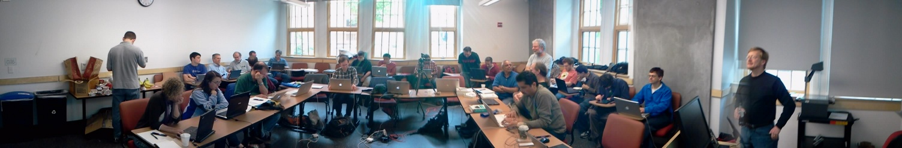

# Sage Days 31: The Sage Notebook

June 13-17, 2011 at University of Washington in Seattle, in conjunction with <a href="/education3">Sage Education Days 3</a>. 

[[_TOC_]] 


## Schedule
  |  Topic  |  Speaker  |  Links 
  |   |   |  
 Monday           |  June 13     |    |  <a class="https" href="https://picasaweb.google.com/wstein/20060613Sagedays31Day1">Pictures</a> 
 10:00 AM  |  Introductions                  |     |   <a class="http" href="http://tinyurl.com/427tye5">Video</a> 
           |  State of the Notebook Address  |  Rado Kirov, Nanyang Technological U      |  <a class="http" href="http://tinyurl.com/44fgkkf">Video (part 1 of 2)</a> <a class="http" href="http://tinyurl.com/3q2gkxr">Video (part 2 of 2)</a> <a class="http" href="http://flask.sagenb.org/home/pub/85/">(worksheet)</a>
           |  Single-Cell Notebook Server    |  Jason Grout, Drake U                     |  <a class="http" href="http://tinyurl.com/6f7sm97">Video</a>
           |  Coding Sprint Organization     |  William Stein, U of Washington           |  
 Tuesday          |  June 14     |   |  
 10:00 AM  |  Status Reports                 |                                           |  <a class="http" href="http://tinyurl.com/4y3vxnx">Video</a> 
   |  Jmol                           |  Jonathan Gutow, U of Wisconsin, Oshkosh  |  <a class="http" href="http://tinyurl.com/3e9f2g3">Video</a>,<a class="http" href="http://www.uwosh.edu/faculty_staff/gutow/Jmol_Web_Page_Maker/Examples/Jmol_Demo.html">Jmol Demo</a>, <a class="http" href="http://www.uwosh.edu/faculty_staff/gutow/Jmol_Web_Page_Maker/Export_to_web_tutorial.shtml">Export to Web Functionality</a> 
           |  An Introduction to `MathJax` for the Technically Inclined  |  Davide Cervone, Union College   |  <a class="http" href="http://www.math.union.edu/locate/Cervone/talks/2011-06-14.sagedays/">Presentation (Slides)</a>, <a class="http" href="http://tinyurl.com/68gjhl7">Video (part 1 of 3)</a>, <a class="http" href="http://tinyurl.com/6c8rdhb">Video (part 2 of 3)</a>, <a class="http" href="http://tinyurl.com/6xy9txh">Video (part 3 of 3)</a> 
 Wednesday        |  June 15     |   |  
 10:00 AM  |  Status Reports                 |                                           |  <a class="http" href="http://tinyurl.com/3hubsen">Video</a>, and <a class="http" href="http://tinyurl.com/4xc5pfy">more by S. Labbe</a> 
           |  <a class="http" href="http://webwork.maa.org/">WebWork</a>                      |  Michael Gage, U of Rochester             |  <a class="http" href="http://tinyurl.com/3od5c32">Video (part 1 of 2)</a>, <a class="http" href="http://tinyurl.com/43rlawt">Video (part 2 of 2)</a>
           |                                 |  and Jason Aubrey, U of Missouri          | <a href="days31/2011_06_15_sage.pdf">Presentation (slides)</a> 
 Thursday  |  June 16  |   |  <a class="https" href="https://picasaweb.google.com/wstein/20110616Sagedays31Day4">Pictures</a>  
  3:30 PM  |  Status Reports                 |    |   <a class="http" href="http://tinyurl.com/3jsht4q">Video</a> 
           |  <a class="http" href="http://wiki.sagemath.org/education3">Sage Education Days 3</a>  |    |  
 Friday  |  June 17  |   |  <a class="https" href="https://picasaweb.google.com/wstein/20110617Sd31Day5">Pictures</a> 
  3:30 PM  |  Status Reports                 |    |  <a class="http" href="http://tinyurl.com/3fbzd8q">Video (part 1 of 2)</a>  <a class="http" href="http://tinyurl.com/3o7zahf">Video (part 2 of 2)</a> 
           |  <a class="http" href="http://wiki.sagemath.org/education3">Sage Education Days 3</a>  |    |  
 Saturday  |  June 18  |   |  
           |  <a class="http" href="http://wiki.sagemath.org/education3">Sage Education Days 3</a>  |    |  


## Topics

* <a href="/days31/projects">Here is the list of Projects and updates</a> 
* <a href="/days31/workinggroups">Working Groups</a> 

## Pictures

 


## Location

* Seattle, Washington (on the west coast of the USA; *not* in Washington, D.C.), on the <a class="http" href="http://www.washington.edu/">University of Washington</a> campus. 
* Sessions will be held in <a class="http" href="http://www.washington.edu/maps/?l=SAV">Savery Hall</a> on the historic Quad, just northeast of Red Square.  Specifically, <a class="http" href="http://www.css.washington.edu/room/SAV+156">Savery 156</a>. 
* LODGING: Many participants will be staying at the "UWMC Collegiana Hospitality House" (4311 12th Ave. N.E., Seattle)  (<a class="http" href="http://uwmedicine.washington.edu/Patient-Care/Locations/UWMC/Patient-Family-Resources/Pages/Patient-Family-Housing.aspx">mentioned here</a>), where I have reserved several rooms.  See <a href="days31/collegiana_directions.pdf">collegiana_directions.pdf</a> for more information about getting to the Collegiana. 

## Participants

1. <a class="http" href="http://www.math.missouri.edu/personnel/other/aubreyj.html">Jason Aubrey</a> (university of Missouri) -- `WebWork` 
1. <a class="http" href="http://buzzard.ups.edu/">Rob Beezer</a> (University of Puget Sound)  
1. Robert Bradshaw (Google)  
1. <a class="https" href="https://profiles.google.com/vbraun.name/about">Volker Braun</a> (Dublin, Ireland) -- computational physicist 
1. <a class="http" href="http://www.math.union.edu/~dpvc/">Davide P. Cervone</a> (Union College, New York) -- author of jsmath and `MathJax` 
1. <a class="http" href="http://www.cgl.ucsf.edu/home/bic">Bruce Cohen</a> (Lowell High School, San Francisco) 
1. <a class="http" href="http://www.math.gordon.edu/~kcrisman/">Karl-Dieter Crisman</a> (Gordon College) 
1. <a class="http" href="http://www.acadiau.ca/~ecurry">Eva Curry</a> (Acadia University) 
1. <a href="/DanDrake">DanDrake</a> (KAIST) 
1. Burcin Erocal (Singular Group, Kaiserslautern, Germany) 
1. <a class="http" href="http://webhost.math.rochester.edu/gage/bio">Michael Gage</a> -- `WebWork` author 
1. <a class="http" href="http://www.uwosh.edu/facstaff/gutow/">Jonathan H. Gutow</a> (Chemistry Department, UWOSH, Wisconsin)  -- JMOL developer 
1. <a class="http" href="http://artsci.drake.edu/grout/doku.php/">Jason Grout</a> (Drake University) 
1. Ryan Grout (BYU, Utah) 
1. Mike Hansen (Berkeley) 
1. Ira Hanson (Drake University) 
1. <a class="http" href="http://www.jasonbhill.com">Jason B. Hill</a> (University of Colorado) 
1. Keshav Kini (Singapore) 
1. <a class="http" href="http://radokirov.com/">Rado Kirov</a> (Nanyang Technological University, Singapore) 
1. Galen Knapp (University of Washington CS undergrad) 
1. <a href="/S%C3%A9bastienLabb%C3%A9">SébastienLabbé</a> (Montréal) 
1. Benjamin <a href="/LeVeque">LeVeque</a> (Brown University) -- doesn't require lodging 
1. Andrey Novoseltsev (University of Alberta) 
1. John Palmieri (University of Washington) 
1. Paul Sharaba (Cleveland State University) 
1. <a class="http" href="http://wstein.org/">William Stein</a> (University of Washington) 
1. Ian Stokes-Rees (Harvard Medical School) 
1. <a class="http" href="http://www.mc.edu/faculty/travis">John Travis</a> (Mississippi College) 
1. Zafeirakis Zafeirakopoulos (RISC - Research Institute for Symbolic Computation) 

## Organizers

* William Stein <a class="http" href="http://wstein.org/">http://wstein.org/</a> 
* Rob Beezer <a class="http" href="http://buzzard.ups.edu">http://buzzard.ups.edu</a> 

## UW Campus Wireless


```txt
UW NetID:       event0896
Password:       kfeu:xsuo:kzoo
```

## Mailing List

* Mailing list for <a class="http" href="http://groups.google.com/group/sagedays31">Sage Days 31</a>.  Please add yourself to this list if you are not already on it.  This will be the primary vehicle for announcements, and last-minute changes during the week. 

## IRC

* There is an IRC channel for sage days: #sagemath-days on irc.freenode.net. Feel free to join to discuss whatever...   For those without IRC clients, <a href="http://webchat.freenode.net/?channels=sagemath,sagemath-days">http://webchat.freenode.net/?channels=sagemath,sagemath-days</a> , but using an IRC client is strongly recommended. <a class="http" href="http://xchat.org/">Xchat</a> is a popular cross-platform choice. 

## Funding

* If you're interested in attending, there may be funding for you.   Email <a href="mailto:wstein@gmail.com">wstein@gmail.com</a>.  **Be sure to buy your plane ticket on a US carrier.** 

## Logistics

* <a href="/education3">Sage Education Days 3</a> will happen at the end of the week, June 16-18, 2011. 
* Lodging will likely be arranged for the participants at the Collegiana Inn near the UW campus.  Details later. 
* See the <a href="/uw-local-info">local information page</a> for more specifics. 

## Flask Notebook Development

   * Rado's leading edge repo:  <a class="http" href="http://code.google.com/r/rkirov-flask/">http://code.google.com/r/rkirov-flask/</a> 
   * Find instructions at Rado's site for Linux, Mac OSX installation 
   * Main, official repo: <a class="http" href="http://code.google.com/p/sagenb/">http://code.google.com/p/sagenb/</a> 
   * Development model:  Jason Grout, Rado Kirov, William Stein will pull from repos; a couple of options on how to create and use your own repo: 
         1. Host your repo on Google Code by <a class="https" href="https://code.google.com/r/rkirov-flask/source/createClone">server-side cloning Rado's repo</a> and then cloning your serverside clone ("yourname-sagenb" or something) to your computer (follow the directions on Google Code). Your repository can be pulled from in the standard way, but can only be pushed to by you (you can pull changes from other people and then push them, of course). 
         1. Host your repo on sage.math or somewhere else by cloning Rado's repo (do `hg clone https://rkirov-flask.googlecode.com/hg/` somewhere). If you set appropriate read/write permissions on your repo, then people can push to and pull from your repo using the `ssh://` URI scheme (for example `hg pull ssh://sage.math.washington.edu//home/keshav/some_repo/` -- note the double slash, to use an absolute path rather than a relative patch). 

## Flask Notebook Code Directory Tree

         * flask_version - new flask controller code 
                           * o authentication.py o base.py o ... 
         * sagenb/notebook - old python notebook objects 
                           * o user.py o notebook.py o ... 
         * sagenb/storage - serialization to filesystem code 
                           * o abstract_storage.py o filesystem_storage.py 
         * sagenb/data - templates and js libraries 
                           * o sage/js - javascript and sage/html - templates o jmol o jsmath 
         * notebook folder with worksheets and settings is by default in ~/.sage/sage_notebook.sagenb/ 