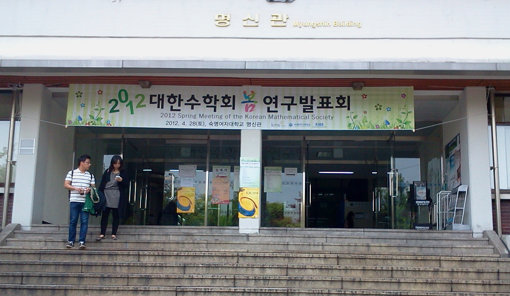
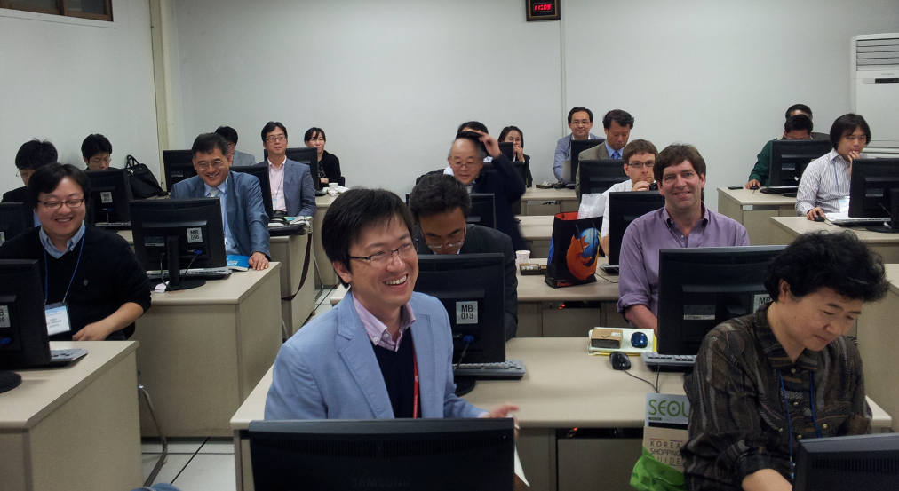
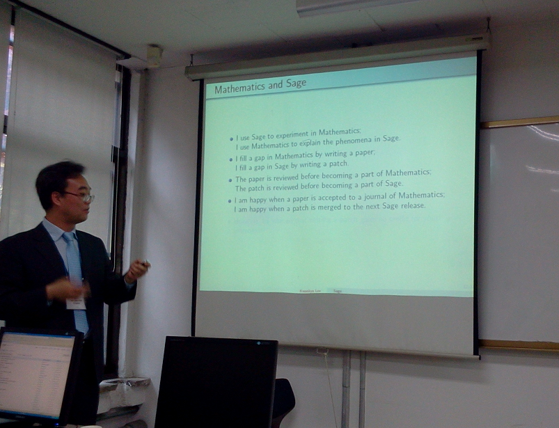
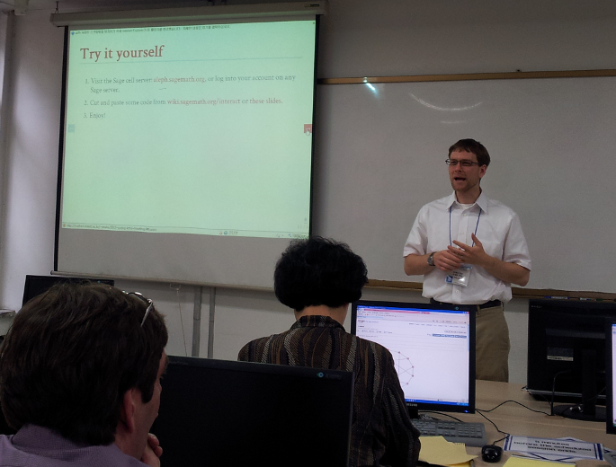

# Sage Days 37: Seoul South Korea

## When and where?

28 April 2012 (so it's more of a "Sage Day"), at the <a class="http" href="http://www.kms.or.kr/meetings/spring2012/home.htm">spring meeting of the Korean Mathematical Society</a> at <a class="http" href="http://www.sookmyung.ac.kr/">Sookmyung Women's University</a> in downtown Seoul. Our session is from 9:00 to 11:40. We hope to provide space in the afternoon for you to experiment and learn about Sage with some expert help. 

## Activities

Right now we intend to focus on introducing Sage and its capabilities to new users. 

## Organizers

For more information, contact: 

   * <a href="/DanDrake">DanDrake</a> 
   * <a class="http" href="http://matrix.skku.ac.kr/sglee/">Sang-gu Lee (이상구)</a> 
   * <a class="http" href="http://www.chosun.ac.kr/~kwankyu/index.html">Kwankyu Lee (이관규)</a> 

## Participants

   * <a class="http" href="http://buzzard.pugetsound.edu/">Rob Beezer</a> 
   * Yasuhide NUMATA 

## Pictures

 

Spring Meeting of the Korean Mathematical Society 

 

Participants 

 

Kwankyu Lee and Why He Likes Sage 

 

Dan Drake 
