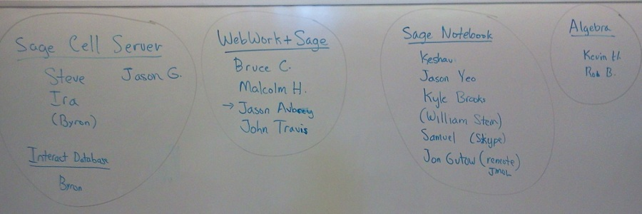

# Sage Days 41: The Sage Notebook

June 11-15, 2012 at University of Washington in Seattle, in conjunction with <a href="/education4">Sage Education Days 4</a>. 

[[_TOC_]] 


## Schedule
  |  Topic  |  Speaker  |  Links 
  |   |   |  
 Monday           |  June 11     |    |   
  9:30 AM  |  Introductions                  |     |  <a class="http" href="http://www.youtube.com/watch?v=wVxL0H-w_74&amp;feature=plcp">Video</a> 
  11:30 AM |  Sage Notebook New UI  |  Samuel Ainsworth  |  <a class="http" href="http://youtu.be/yPx3-3UrE10">Recorded Hangout</a> 
  3:00 PM         |  State of the Notebook Address  |  Jason Grout  |  <a class="http" href="http://www.youtube.com/watch?v=NE3TPxMCrdY&amp;feature=plcp">Video</a>, <a class="http" href="http://www.youtube.com/watch?v=E76QFiGyIAs&amp;feature=plcp">screen recording</a> 
  4:00 PM         |  Patches, mq, trac, and Sage  |  Rob Beezer  |  <a class="http" href="http://www.youtube.com/watch?v=7GlVszb_ouI&amp;feature=plcp">Part 1</a>, <a class="http" href="http://www.youtube.com/watch?v=8TQ_CEyEd9M&amp;feature=plcp">Part 2</a> 
 Tuesday           |  June 12     |    |   
  4:00 PM         |    Status Reports            |    |  <a class="http" href="http://www.youtube.com/watch?v=EqyC4lfuJ7k&amp;feature=plcp">Part 1</a>, <a class="http" href="http://www.youtube.com/watch?v=5hXQbdmdsIM&amp;feature=plcp">Part 2</a> 
 Wednesday           |  June 13     |    |  <a class="http" href="http://wiki.sagemath.org/education4">Sage Education Days 4</a> 
  |   |   |  
 Thursday           |  June 14     |    |  <a class="http" href="http://wiki.sagemath.org/education4">Sage Education Days 4</a> 
  |   |   |  
 Friday           |  June 15     |    |  <a class="http" href="http://wiki.sagemath.org/education4">Sage Education Days 4</a> 
  |   |   |  


## Logistics

* <a href="/education4">Sage Education Days 4</a> will happen at the end of the week, June 13-15, 2012. 
* See the <a href="/uw-local-info">local information page</a> for more specifics. 
* All sessions are **now** in <a class="http" href="http://www.css.washington.edu/room/SAV+132">SAVERY 132</a>.  This building is just north of the campus center  <a class="http" href="http://www.washington.edu/maps/">interactive campus map</a>. 
* Seattle, Washington (on the west coast of the USA; *not* in Washington, D.C.), on the <a class="http" href="http://www.washington.edu/">University of Washington</a> campus. 

## Mailing List

Mailing list for the workshop is <a class="https" href="https://groups.google.com/forum/#!forum/sagedays41">Sage Days 41</a>.  Please add yourself to this list when available.  This will be the primary vehicle for preliminary announcements, and last-minute changes during the week. 


## UW Campus Wireless


```txt
UW NetID:       event0146
Password:       6U6B;8B7K;5P6R
```

## Organizers

* William Stein <a class="http" href="http://wstein.org/">http://wstein.org/</a> 
* Rob Beezer <a class="http" href="http://buzzard.ups.edu">http://buzzard.ups.edu</a> 

## Participants

To register, please add yourself alphabetically by last name.  You need to request a Trac account to be able to login to the wiki - you can do that by following the instructions at the top of the page located <a class="http" href="http://trac.sagemath.org/sage_trac">here</a>.  As a last resort, email Rob Beezer  at <a href="mailto:beezer@ups.edu">beezer@ups.edu</a> and he'll add your name (please include a relevant web link, if available). 

1. <a class="http" href="http://www.math.missouri.edu/personnel/other/aubreyj.html">Jason Aubrey</a> (University of Missouri) 
1. <a class="http" href="http://buzzard.ups.edu/">Rob Beezer</a> (University of Puget Sound) 
1. Kyle Brooks (University of Puget Sound) 
1. <a class="http" href="http://www.tetrahedra.net">Bruce Cohen</a> (Lowell High School, San Francisco) 
1. <a class="http" href="http://www.uwosh.edu/facstaff/gutow">Jonathan Gutow</a> (Remotely) (University of Wisconsin, Oshkosh) 
1. <a class="http" href="http://artsci.drake.edu/grout/">Jason Grout</a> (Drake University) 
1. Kevin Halasz (University of Puget Sound) 
1. Ira Hanson (Drake University) 
1. Malcolm Harper (Champlain College Saint Lambert) 
1. Steven Johnson (Drake University) 
1. <a class="http" href="http://www1.spms.ntu.edu.sg/~krkini/">Keshav Kini</a> (Nanyang Technological University, Singapore) 
1. <a class="http" href="http://www.math.washington.edu/~palmieri/">John Palmieri</a> (University of Washington) 6/12-6/15 
1. <a class="http" href="http://wstein.org/">William Stein</a> (University of Washington) 
1. <a class="http" href="http://math.mc.edu/travis">John Travis</a> (Mississippi College) 
1. Byron Varberg (Drake University) 
1. <a class="http" href="http://technotroph.wordpress.com">Jason Yeo</a> (National University of Singapore) 

## Topics

 


## Funding

If you're interested in attending, there may be funding for you.   Email <a href="mailto:wstein@gmail.com">wstein@gmail.com</a>, and include a cc to <a href="mailto:beezer@ups.edu">beezer@ups.edu</a>.  Include information about projects you have in mind for the notebook or Sage. 

* **Be sure to buy your plane ticket on a US carrier.** 

## Important: Lodging

**There are only limited rooms available in the campus vicinity, so please make arrangements immediately.** 

We have limited rooms available at the Collegiana Inn.  This operation is somewhere between a dormitory and a hotel, perhaps "boarding house" describes it.  Rooms are designed to be shared and have their own bathrooms.  You can read a bit more about the Collegiana on the <a href="/uw-local-info">local information</a> page.  If we fill these rooms, or if you prefer less-rustic accomodations, suggestions for lodging are available on the <a href="/days41/travel#hotels">travel</a> page.  You should make these arrangements yourself.  If you have been approved for funding, then you will be reimbursed.   


## Pictures


## IRC

* There is an IRC channel for sage days: #sagemath-days on irc.freenode.net. Feel free to join to discuss whatever...   For those without IRC clients, <a href="http://webchat.freenode.net/?channels=sagemath,sagemath-days">http://webchat.freenode.net/?channels=sagemath,sagemath-days</a> , but using an IRC client is strongly recommended. <a class="http" href="http://xchat.org/">Xchat</a> is a popular cross-platform choice. 