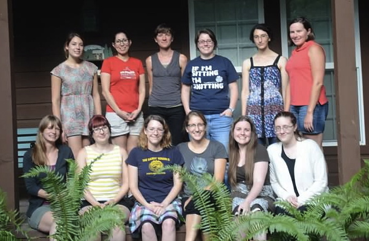

# Sage Days 62: Women in Sage 5

 

<a class="http" href="http://sagemath.org/">Sage</a> is a mathematics software package, developed by and for the mathematical community.  It aims to become a viable alternative to commercial software packages on the basis of an open-source model. 

This 4-day workshop will include talks, tutorials, and time spent in small project groups developing Sage code. We will focus on various aspects of computational number theory with the dual goals of enhancing the Sage library, and increasing the number of women in the community of Sage developers. 

Online applications **due May 23rd**. <a class="https" href="https://docs.google.com/forms/d/113wkQ_s5gWOyNqvMlWYR0-p69rOKuSkJ7o6irnsa8Ug/viewform?usp=send_form">Apply Here.</a> Participants will receive lodging and most meals as well as limited funding for travel.    

## Dates/Location

* July 28-August 1, 2014 near Portland, Oregon at <a class="http" href="http://www.vacasarentals.com/unit.php?UnitID=11/">The Lodge at Welches</a> 

## Projects

* **Li coefficients for L-functions** <a class="http" href="http://www.math.ucsd.edu/~alina/">Alina Bucur</a> (UC San Diego) <a href="days62/Li coefficients for L-functions">Li coefficients for L-functions</a> 
   * Lola Thompson 
   * Laura Peskin 
   * Karen Kohl 
   * Kate Thompson 
* **Solving S-unit Equations in Sage** Beth Malmskog (Villanova University) <a href="days62/Solving S-Unit Equations in Sage">Solving S-Unit Equations in Sage</a> 
   * Christelle Vincent 
   * Alejandra Alvarado 
   * Mckenzie West 
* **Computing examples curves that admit QM in Sage** <a class="http" href="http://people.oregonstate.edu/~swisherh/home/">Holly Swisher</a> (Oregon State University) <a href="days62/Computing QM examples in Sage.pdf">Computing QM examples in Sage.pdf</a> 
   * Heidi Goodson 
   * Alicia Marino 
   * Anna Haensch 

## Schedule

Monday:  

* Check-in late afternoon 
* Dinner 
Tuesday:  

* Breakfast 
* 9:00-9:45 Project Talk, Beth Malmskog 
* 10:00-10:45 Project Talk, Holly Swisher 
* 11:00-11:45 Project Talk, Alina Bucur 
* Lunch 
* Afternoon, work in project groups  
* Dinner 
* Evening, work in project groups 
Wednesday:  

* Breakfast 
* 9:00-9:45 Talk on using Git, Anna Haensch 
* Morning, work in project groups 
* Lunch 
* Early afternoon, work in project groups 
* 3:00 Hike to <a class="http" href="http://www.portlandhikersfieldguide.org/wiki/Mirror_Lake_Hike">Mirror Lake</a> in Mt. Hood National Forest 
* Dinner 
* Evening, work in project groups 
Thursday:  

* Breakfast 
* Morning, work in project groups 
* Lunch  
* Afternoon, work in project groups 
* Dinner 
* Evening, project group presentations and campfire with s'mores! 
Friday:  

* Breakfast 
* Check-out late morning 

## Participants

* <a class="http" href="http://www.eiu.edu/math/personnel.php?id=aalvarado2">Alejandra Alvarado</a> (Eastern Illinois University) 
* <a class="http" href="http://math.umn.edu/~goods052/">Heidi Goodson</a> (University of Minnesota) 
* <a class="https" href="https://www.usm.edu/gulfcoast/science-technology/karen-kohl-phd">Karen Kohl</a> (University of Southern Mississippi) 
* Alicia Marino (Wesleyan University) 
* Laura Peskin (University of British Columbia) 
* <a class="https" href="https://sites.google.com/site/katethompsonhomepage/">Kate Thompson</a> (Davidson College) 
* <a class="http" href="http://math.stanford.edu/~cvincent/">Christelle Vincent</a> (Stanford University) 
* <a class="http" href="http://www.mathcs.emory.edu/~mwest6/">Mckenzie West</a> (Emory Universtiy) 

## Getting Started

* <a class="http" href="http://wiki.sagemath.org/DownloadAndInstallationGuide">Installing Sage</a> You will want to do the full build with the source code, not the binaries.  
* <a class="http" href="http://trac.sagemath.org/sage_trac/">Getting a Trac Account</a> This process can take a few days, start this as soon as possible.  
* <a class="http" href="http://wiki.sagemath.org/Installing_Editing_Software">Installing Editing Software</a> 
* <a class="http" href="http://wiki.sagemath.org/problem_sets">Tutorials and Problem Sets</a> 
* <a href="days62/Intro To Patching With Git">Intro To Patching With Git</a> 

## Photos!

<a class="https" href="https://womeninsage5.shutterfly.com">Click here for photos from Women In Sage 5!</a> 

## Other Info

* Organizers: <a class="http" href="http://www.mathcs.duq.edu/~haensch/">Anna Haensch</a> (MPIM/Duquesne), <a class="http" href="http://www.lolathompson.com/Lola_Thompson/Home.html">Lola Thompson</a> (Oberlin)  
* Funding: Microsoft Research  (via Kristin Lauter) and The Beatrice Yormark Fund for Women in Mathematics 