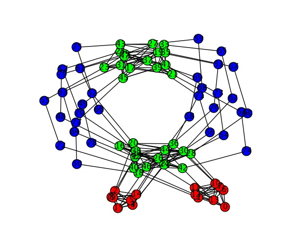
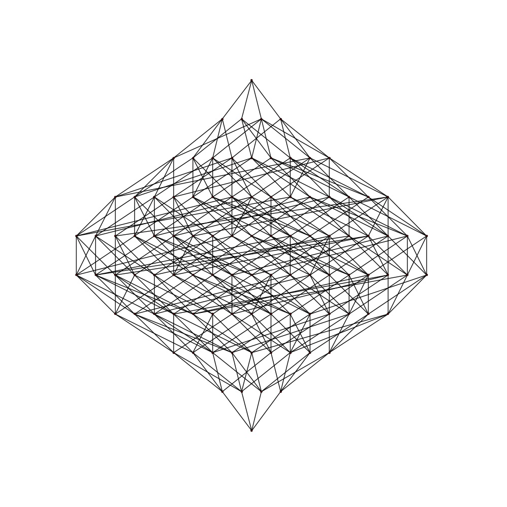

# Sage Days 7: Combinatorics


# ``Come stay up with us...''


## Important Links

* <a href="/days7/schedule">Schedule</a> 
* <a href="/days7/sprints">Sprints</a> 
* <a href="/days7/wishlist">Wishlist</a> 
* <a class="http" href="http://www.sagemath.org/">Sage homepage</a> 
* <a href="/days7/discussions">Discussions</a> 
* <a class="http" href="http://sage.math.washington.edu/home/was/sagedays7/medium/">VIDEO!</a> 

## Speakers & Schedule

The schedule is <a href="/days7/schedule">here</a>. 


## Dates & Location

SD7 will be held Feb. 5-9, 2008. The conference is being hosted and funded by <a class="http" href="http://www.ipam.ucla.edu">IPAM</a>, at UCLA. 


## Description


```txt
Sage is free and open-source software that supports research and teaching throughout mathematics. Both the Sage development model and the technology itself are distinguished by a strong emphasis on openness, community, cooperation, and collaboration: Sage is about building the car, not reinventing the wheel. Sage is several hundred thousand lines of new code that uses standard open source libraries and programs (such as GAP, Maxima, Singular, PARI, and Python) and more specialized libraries to create a unified and powerful open source mathematical software system.

Sage has recently had two major improvements with regards to combinatorics. First, Robert Miller and Emily Kirkman have used NetworkX to provide a huge amount of graph theory functionality in Sage, much more than is provided by NetworkX itself. In addition, Robert made the first open-source graph isomorphism checker, based on the same ideas as Nauty (which is currently available both independently and in MAGMA). Second, Mike Hansen has created a huge framework for working with combinatorics in Sage, with well over 30,000 lines of new code, including an extensive interface to Symmetrica.

The structure of the workshop is as follows: there will be two days of lectures followed by three days of intense working sessions. This will consist mostly of groups working to implement new functionality in Sage, or discussing design decisions for new features. If you are interested, we would be excited to have you stay and be involved in the coding sprints, but you shouldn't feel obliged to do so. (Based on past experience, we expect that roughly half the participants will stay for the whole conference.)
```

## Registration

If you would like to register for the conference, please fill out the <a class="https" href="https://www.ipam.ucla.edu/elements/choose.aspx?pc=sage2008">IPAM registration form</a>, **even if you are not applying for funding**. (If you came to SD3, when you begin the registration process, it will ask you for your "reference code" ... send us an email at <a href="mailto:sagedays@gmail.com">sagedays@gmail.com</a> and we'll get right back to you with it.) 

The funding application deadline has already passed. 


## Hotel Info

Hotel info is <a href="/days7/hotel">here</a>. 


## Ground transportation

* **From the airport into Westwood** 
* 
* Many people have asked us about travel to and from LAX. There are several options, of varying price and speed, but probably one of the best is the relatively new LAX Flyaway Shuttle: 
* 
* <a class="http" href="http://www.lawa.org/lax/LAXflyAway.cfm">http://www.lawa.org/lax/LAXflyAway.cfm</a> 
* 
* The Westwood shuttle will take you to a parking lot that's part of the UCLA campus (though still a few minutes walk from the main part of the campus). A map with that parking lot, Hilgard House, and IPAM (which is labeled "Portola Plaza building") can be found here: 
* 
* <a class="http" href="http://www.ucla.edu/map/map.html">http://www.ucla.edu/map/map.html</a> 
* 
* **From Lot 32 to IPAM, via shuttle** 
* 
* There is a campus shuttle from where the Westwood shuttle drops you off to close IPAM, if you don't feel like walking. A map is <a class="http" href="http://www.transportation.ucla.edu/portal/maps/cemap/CEMAP.htm">here</a>, and more information on the shuttle can be found <a class="http" href="http://map.ais.ucla.edu/portal/site/UCLA/menuitem.789d0eb6c76e7ef0d66b02ddf848344a/?vgnextoid=bd4aaad23985c010VgnVCM200000dd6643a4RCRD">here</a>. 
* 
* **Walking directions from Lot 32 to IPAM** 
* 
* You'll be dropped off at Parking Structure 32 (in sector D8 on the map), and you're trying to get to IPAM in F4, which is labeled "Portola Plaza Building." Take Kinross east to Westwood, then turn left and take Westwood into campus. As Westwood dead-ends, there will be a stairway to the right; go up that and follow the street (Portola Plaza). IPAM will be ahead and slightly to your left. 
* 
* **Walking directions from Lot 32 to Hilgard House** 
* 
* From Lot 32, walk east on Kinross Ave. Follow the road past Westwood Blvd, and it will bear right (just past Haagen-Dazs). Keep following it to the right, until it hits Lindbrook Dr. Make a left on Lindbrook Dr., follow it to Hilgard Ave (the next intersection), and make a left. Hilgard House is ahead on the left, at 927 Hilgard Ave.  
* 

## Organizers

* Craig Citro  
* Mike Hansen  
* Robert Miller  
* William Stein 

## Wishlist

As mentioned in the invitation letters, we'd like participants to contribute ideas to the <a href="/days7/wishlist">wishlist</a> of  things you'd like to see in Sage. 


## Images

<a href="/days7/misc_art">Miscellaneous Artwork</a> 

Right now, just some images I've (Robert M) got lying around, produced using Sage. Maybe for the t-shirts or something... 

  
