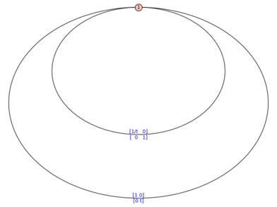
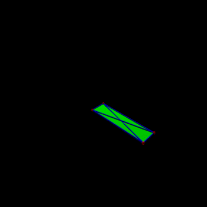
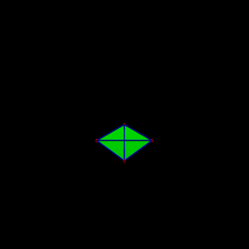
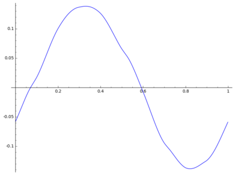
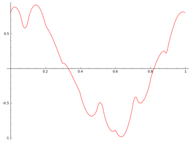
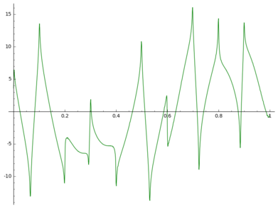
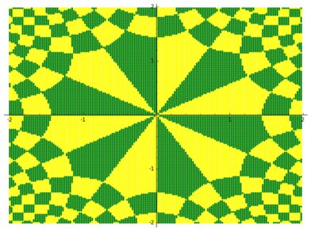
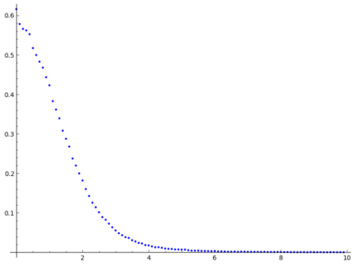
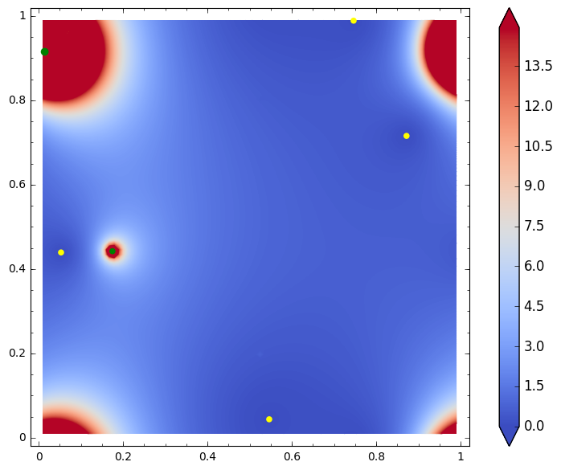

# Sage Days 73 in Oaxaca, Mexico May 04-07 2016

<a class="http" href="http://sagemath.org">Sage</a> is an open source software for mathematics. This is the webpage for the Sage workshop prior to the conference <a class="http" href="http://www.birs.ca/events/2016/5-day-workshops/16w5010">Flat Surfaces and Dynamics of Moduli Space</a> to be held in Oaxaca May 08-13. The aim is to: 

* introduce Sage to people from Oaxaca or assisting to the conference 
* have program and code presentations about geometry and dynamics of surfaces 
* help people to implement their own projects 
The workshop started on wednesday 04 morning and ended on saturday 07. It took place at <a class="http" href="http://www.pmc.gob.mx/">Punto Mexico Conectado @ Oaxaca</a> in <a class="https" href="https://www.google.com.mx/maps/place/Punto+M%C3%A9xico+Conectado+Oaxaca/@17.0630565,-96.7325754,19z/data=!4m2!3m1!1s0x85c722148d9070eb:0x431c6d96d211d5b5">calzada Madero numero 101</a>. 

## Schedule
                     |  Wednesday 4 May  |  Thursday 5 May  |  Friday 6 May  |  Saturday 7 May 
 09:00 - 10:00  |  registro y instalación         |  coding sprint                  |  coding sprint                |  ?                             
 10:00 - 11:00  |  presentación de Sage           |  coding sprint                  |  coding sprint                |  ?                             
 11:00 - 11:30  |  té y café             |  coffe break           |  coffe break         |  coffe break          
 11:30 - 13:00  |  actividades practicas          |  coding sprint                  |  sharing code howto           |  status report                 
 13:00 - 14:30  |  lunch break           |  lunch break           |  lunch break         |  lunch break          
 14:30 - 15:30  |  presentation / discussion      |  coding sprint                  |  coding sprint                |  FREE                          
 15:30 - 17:00  |  tutorial: symbolic vs numeric  |  coding sprint                  |  coding sprint                |  FREE                          
 17:00 - 17:30  |  coffe break           |  coffe break           |  coffe break         |  FREE                          
 17:30 - 18:00  |  Pat Hooper's demo              |  Vincent's demo                 |  Charles's demo               |  FREE                          
 18:00 - 19:00  |  coding spring                  |  status report                  |  coding sprint                |  FREE                          

## Talks

* Presentación de Sage, (jupyter notebook <a href="days73/Sage presentation.ipynb">Sage presentation.ipynb</a> <a href="days73/Sage presentation.pdf">Sage presentation.pdf</a>) During the elaboration of the talk it appeared that many things differ between the jupyter and Sage notebook. It was reported on the mailing list <a class="https" href="https://groups.google.com/forum/#!topic/sage-devel/OO64qyj65oo">sage-devel</a>. Some of the problem are already fixed (see e.g. <a class="http" href="http://trac.sagemath.org/ticket/20562">#20562</a>)! 
* **symbolic vs numerics in Sage** (tutorial, wednesday 15:30 - 17:00, Vincent Delecroix) 
      * There are many ways to deal with numbers within Sage (algebraic numbers, floating points, intervals, ...). We will present and illustrate pros and cons of all of them on some concrete problems: root finding, integration, solving ordinary differential equations.  <a href="days73/symbolic_vs_numeric.rst">symbolic_vs_numeric.rst</a> 
* <a class="https" href="https://github.com/videlec/sage-flatsurf">Flatsurf</a> Pat's demo: <a href="days73/Hooper-sage_days_73-demo1.sws">Demo 1 as a Sage Worksheet</a> <a href="days73/Hooper-sage_days_73-demo1.pdf">Demo 1 as a PDF</a> <a href="days73/Hooper-sage_days_73-demo2.sws">Demo 2 as a Sage Worksheet</a> <a href="days73/Hooper-sage_days_73-demo2.pdf">Demo 2 as a PDF</a> 
* <a class="http" href="http://www.labri.fr/perso/vdelecro/flatsurf.html">the flatsurf package</a> (demo, thursday 17:30 - 18:00, Vincent Delecroix) 
* **computing Lyapunov exponents of the Teichmueller flow** (demo, friday, 17:30 - 18:00, Charles Fougeron): CHARLES WORKHSEET TO COME 

## Projects

### Teichmûller polynomials

people: Ferrán 

* need train-tracks automata with decorations. Then compute effectively dilatations in a given fibered face, Thurston norm, etc 
* Explore Thierry's Coulbois <a class="https" href="https://github.com/coulbois/sage-train-track">train-track code</a> 
The algorithm that given the (decorated) train-track algorithm produces the Teichmueller polynomial is ready!! Remains to produce automatically these graphs. 

   

### flatsurf Package(s)

people: Charles, Pat, Vincent 

Build a nice Sage module for all translation surface related stuff. The aim is to 

* merge four distinct projects 
      * Pat and Vincent <a class="https" href="https://github.com/videlec/sage-flatsurf">sage-flatsurf</a> 
      * Vincent <a class="http" href="http://www.labri.fr/perso/vdelecro/flatsurf.html">flatsurf</a> 
      * Charles code about Lyapunov exponents <a class="http" href="http://trac.sagemath.org/ticket/16102">trac ticket #16102</a> 
      * <a class="http" href="http://math.rice.edu/~rm51/">programs by Ronen Mukamel</a> 
* add more stuff 
      * Teichmueller flow for genus 1 quadratic differentials with Riemann theta functions 
      * More for infinite translation surfaces 
      * Thurston-Veech construction 

### visualize Teichmueller spaces

people: Maxime, Kasra 

* geodesics, balls, triangles, ... Needs computing Teichmueller maps, i.e. solving PDE 
* nice 3d plots to make animations of geodesic in Teichmueller space 
A nice animation of a Teichmueller geodesic embedded in R3 (four time punctured sphere):  

   

Given two complex structures on the pentagon, the first plot represents the graph of (half the logarithm of) the ratio of extremal lengths with respect to these structures, as a function on measured foliations. The next two plots are the derivative and second derivative respectively. 

     

### visualize the translation structure induced by a not so nice differential

people: Anja 

  

### Generating saddle connections in a given surface and study their statistics *efficiently*

people: Grace 

Distribution of gap of saddle connection for a surface defined on a cubic field! 

 

### Computing quadratic differentials on tori

people: Charles 

Using Weirstrass function one can find explicit formulas for quadratic differentials on tori 

 

### other projects

* Compute properties of Coxeter or Artin groups (normal forms, ...) 
* Incidence relations for vector space over Z/2Z (done!) 
* Subgroups of SL(2,R) given from generators. Design an algorithm that given a finite set of matrices in SL(2,R) answers whether the group generated by these is 
         1. not discrete 
         1. has finite covolume 
         1. has infinite covolume In case 2. and 3. the algorithm should also output a fundamental domain and generators in canonical forms. (Charles, Vincent) 
* Affine interval exchange transformations: rotation number for affine circle homeos, generalized Rauzy induction, hyperbolicity, periodic points, ... (Charles) 

## Existing programs about translation surfaces

* Alex Eskin code (saddle connection exploration + decomposition in cylinders) 
* various <a class="http" href="http://math.rice.edu/~rm51/">programs by Ronen Mukamel</a> (Delaunay triangulations, Teichmueller curves especially in genus 2) 
* Vincent Delecroix <a class="http" href="http://www.labri.fr/perso/vdelecro/flatsurf.html">flatsurf package</a> (mostly interval exchanges and square tiled surfaces, but a bit of topology) 
* Vincent Delecroix and Pat Hooper <a class="https" href="https://github.com/videlec/sage-flatsurf">drawing program</a> 
* Charles Fougeron code for Lyapunov exponents of strata coverings (see <a class="http" href="http://trac.sagemath.org/ticket/16102">trac ticket #16102</a>) 
* Chris Swierczewski <a class="https" href="https://github.com/abelfunctions/abelfunctions">Riemann surfaces package</a> 
* <a class="http" href="http://www.math.udel.edu/~driscoll/SC/">Schwarz-Christoffel Toolbox in Matlab</a> 

## Organizers

* <a class="http" href="http://www.labri.fr/perso/vdelecro/">Vincent Delecroix</a> 
* <a class="http" href="http://www.matmor.unam.mx/~ferran/">Ferrán Valdez</a> 

## Participants

* <a class="http" href="http://www.labri.fr/perso/vdelecro/">Vincent Delecroix</a> 
* <a class="https" href="https://www.math.toronto.edu/cms/fortier-bourque-maxime/">Maxime Fortier-Bourque</a> 
* <a class="https" href="https://webusers.imj-prg.fr/~charles.fougeron/">Charles Fougeron</a> 
* <a class="http" href="http://wphooper.com/">Pat Hooper</a> 
* <a class="http" href="http://www.math.u-psud.fr/~lelievre/">Samuel Lelièvre</a> 
* <a class="http" href="http://monteil.perso.math.cnrs.fr/">Thierry Monteil</a> (might attend remotely) 
* ~~<a class="https" href="https://sites.google.com/site/yulanqing/">Yulan Qing</a>~~ 
* <a class="http" href="http://www.math.toronto.edu/~rafi/">Kasra Rafi</a> 
* <a class="http" href="http://www.math.kit.edu/iag3/~randecker/">Anja Randecker</a> 
* <a class="http" href="http://www.cswiercz.info/">Chris Swierczewski</a> (might attend remotely) 
* <a class="http" href="http://www.matmor.unam.mx/~ferran/">Ferrán Valdez</a> 
* <a class="http" href="http://www.math.uiuc.edu/~work2/">Grace Work</a> 

## Support

This workshop is supported by the ERC H2020 project <a class="http" href="http://opendreamkit.org/">OpenDreamKit</a> and <a class="http" href="http://www.pmc.gob.mx/">Punto Mexico Conectado @ Oaxaca</a>. 
