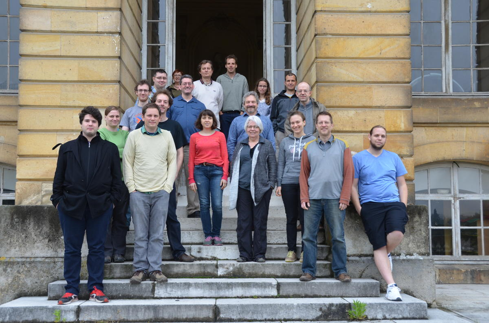

# Sage Days 74: Differential geometry and topology

<a class="http" href="http://www.sagemath.org">Sage</a> Days 74 will take place on May 30 - June 2, 2016 at the <a class="https" href="https://www.obspm.fr/-cias-.html?lang=en">Workshop Center (CIAS)</a> of Observatoire de Paris, located in Meudon, near Paris, France. 

## Registration

Registration is free and now open. Contact Eric (<a href="mailto:eric.gourgoulhon@obspm.fr">eric.gourgoulhon@obspm.fr</a>) and Travis (<a href="mailto:tscrimsh@umn.edu">tscrimsh@umn.edu</a>) to register. 

## Schedule

The morning sessions will take place in **Salle de Conférences du Château** (CIAS building) and the afternoon sessions will be held in various rooms of CIAS. 
 **Monday 30 May** |||
 9:30 - 10:30  |  Volker Braun  |  _<a href="days74/VolkerBraun-Introduction.ipynb">An introduction to SageMath</a>_ 
 10:30 - 11:00  |  coffee break ||
 11:00 - 12:00  |  Marc Culler  |  _<a href="days74/SnapPyPart1.pdf">SnapPy (Part 1)</a>_ 
 12:00 - 13:00  |  Nathan Dunfield  |  _<a href="days74/SnapPyPart2.ipynb">SnapPy (Part 2)</a>_ 
 13:00 - 14:00  |  lunch at the Observatory cafeteria||
 14:00 - 15:00  |  Organization of working groups ||
 15:00 - 16:00  |  working groups / coding sprints ||
 16:00 - 16:30  |  coffee break ||
 16:30 - ...    |  working groups / coding sprints ||
 **Tuesday 31 May** |||
 10:00 - 11:00  |  coffee break ||
 11:00 - 12:00  |  Nicolas Thiéry  |  _<a href="days74/2016-05-31-CategoriesInSage.pdf">Infrastructure for generic code in SageMath: categories, axioms, constructions</a>_  
 <a href="days74/2016-05-31-CategoriesInSage.ipynb">examples [ipynb</a>] 
 12:00 - 13:00  |  Marcin Kostur  
 & Artur Trzesiok  |  _<a class="http" href="http://mybinder.org/repo/K3D-tools/K3D-jupyter">Jupyter notebook extension for K3D visualization library</a>_ ::  <a href="/K3D-tools">Wiki</a> 
 13:00 - 14:00  |  lunch at the Observatory cafeteria||
 14:00 - 15:00  |  Volker Braun  |  _<a href="days74/VolkerBraun-Toric-Geometry.ipynb">Toric geometry</a>_ 
 15:00 - 16:00  |  working groups / coding sprints ||
 16:00 - 16:30  |  coffee break ||
 16:30 - 17:00  |  progress reports ||
 17:00 - ...    |  working groups / coding sprints ||
 **Wednesday 1 June** |||
 9:30 - 10:30  |  John Palmieri  |  _<a href="days74/palmieri-sagedays74.pdf">Simplicial sets (PDF)</a>_, <a href="days74/palmieri-sd74.ipynb">Jupyter notebook</a>   
 <a class="http" href="http://trac.sagemath.org/ticket/20745">trac #20745</a> 
 10:30 - 11:00  |  coffee break ||
 11:00 - 12:00  |  Mark Bell  |  _Flipper and Sage_   
 + _<a href="days74/sage_gotchas.pdf">Sage gotchas</a>_ 
 12:00 - 13:00  |  Frédéric Vincent   
 & Thibaut Paumard  |  _Gyoto code and geodesics_ <a href="days74/Gyoto_F_Vincent.pdf">(part 1)</a> <a href="days74/Gyoto_T_Paumard.pdf">(part 2)</a>
 13:00 - 14:00  |  lunch at the Observatory cafeteria||
 14:00 - 16:00  |  working groups / coding sprints ||
 16:00 - 16:30  |  coffee break ||
 16:30 - 17:00  |  progress reports ||
 17:00 - 18:30    |  working groups / coding sprints ||
 18:30   |  social dinner ||
 **Thursday 2 June** |||
 9:30 - 10:30  |  Jeremy Martin  |  _Simplifical complexes (and Sage, of course!)_   
 _from a combinatorialist's point of view_ <a href="days74/J_Martin_SageDays74.pdf">[slides</a>] 
 10:30 - 11:00  |  coffee break ||
 11:00 - 12:00  |  Patrick Hooper  |  _FlatSurf and translation surfaces in Sage (Part 1)_   
 <a href="days74/Hooper-flatsurf_demo.ipynb">jupyter notebook</a> <a href="days74/Hooper-flatsurf_demo.pdf">notebook as PDF</a>
 12:00 - 13:00  |  Vincent Delecroix  |  _FlatSurf and translation surfaces in Sage (Part 2)_ 
 13:00 - 14:00  |  lunch at the Observatory cafeteria||
 14:00 - 15:00  |  progress reports ||
 15:00 - 16:00  |  working groups / coding sprints ||
 16:00 - 16:30  |  coffee break ||
 16:30 - 17:00  |  progress reports ||
 17:00 - ...    |  working groups / coding sprints ||

## Projects

Here is a list of possible projects. Feel free to add your own to the list. 

* <a class="http" href="http://sagemanifolds.obspm.fr/">SageManifolds</a> inclusion into Sage (cf. <a class="http" href="http://trac.sagemath.org/ticket/18528">#18528</a>) (Travis, Eric) 
* <a class="http" href="http://trac.sagemath.org/ticket/14901">Lie algebras #14901</a> and implement their relationship with manifolds. (Travis) 
* CW/Cube complexes by generalizing the manifold classes. (Travis) 
* Computation of geodesics on pseudo-Riemannian manifolds. (Eric) 
* Include the `sage.geometry.riemannian_manifolds` (i.e. parametrized surfaces) into the more general framework of SageManifolds (Claudia, Eric) 
* Experiment plotting possibilities with OpenGL (nice stuff from SnapPy!) and more... for rendering in browser there is the <a class="https" href="https://en.wikipedia.org/wiki/WebGL">WebGL</a> javascript library that is supported by most browsers. 
* Improve persistent homology. (Travis, John) 
* Simplicial sets. (Co)simplicial objects in various categories. (John) 
* Incorporation of <a class="https" href="https://www-fourier.ujf-grenoble.fr/~sergerar/Kenzo/">Kenzo</a>? (see <a class="https" href="https://github.com/gheber/kenzo">Repackaged in a sane way Kenzo</a>) 
* Improve/Implement knot theory in Sage (cf. <a class="http" href="http://trac.sagemath.org/ticket/17030">#17030</a> <a class="http" href="http://trac.sagemath.org/ticket/20509">#20509</a>)... and link it with Snappy? (Travis, Miguel, Eric?, Nathan?) 
* Implement more (co)homology theories (e.g., De Rham cohomology). 
* Implement methods for computing homotopy groups. 
* Tropical curves/geometry. 
* Implement Lie groups and related geometric objects such as Schubert cells. 
* Implement geometric crystals. 
* Implement hyperbolic space for dimensions > 2. 
* Implement common metric spaces; for example, Lp spaces. 
* Combine/standardize features of the hyperbolic plane with <a class="http" href="http://sagemanifolds.obspm.fr/">SageManifolds</a>. 
* Sage development workflow (cf. <a href="https://wiki.sagemath.org/CodeSharingWorkflow">https://wiki.sagemath.org/CodeSharingWorkflow</a>) 
* Improve/upgrade CHomP and its interface (cf. <a class="http" href="http://trac.sagemath.org/ticket/15202">#15202</a>) (Travis, John, Volker?) 
* Clean up simplicial complex code (some easy cleanups like allowing the `_enlarged` cache to persist in `add_face`, also generally examine the code) (Travis, John) 
* From Nathan's talk: Make SnapPy a Sage package (<a class="http" href="http://trac.sagemath.org/ticket/20739">#20739</a>), Sage attach and Tkinter (<a class="http" href="http://trac.sagemath.org/ticket/15152">#15152</a>), Modernize CyPari (see <a class="http" href="http://trac.sagemath.org/ticket/20238">#20238</a>), Modularization of some parts of <a href="/SageMath">SageMath</a> kernel for use in stand-alone Snappy. 
* Relative simplicial complexes. (Jeremy) 
* Exchanging information between 2D and 3D manifolds. (Vincent) 
* From Mark Bell's talk: confusing documentation of the .n method (<a class="http" href="http://trac.sagemath.org/ticket/13055">#13055</a>), accurate numerical approximation, pushout for different number fields (<a class="http" href="http://trac.sagemath.org/ticket/20746">#20746</a>), the bitwise ~ incompatible between Python and Sage integers 
There is also the <a class="https" href="https://cloud.sagemath.com/">SageMathCloud</a> project page available for collaborations: 

<a href="https://cloud.sagemath.com/projects/bc98ddf4-68da-49db-8986-90c80b24daa3/files/">https://cloud.sagemath.com/projects/bc98ddf4-68da-49db-8986-90c80b24daa3/files/</a> 

Some of the work done within Sage 

         * <a class="http" href="http://trac.sagemath.org/query?keywords=~sd74&amp;or&amp;keywords=~days74&amp;col=id&amp;col=summary&amp;col=keywords&amp;col=status&amp;col=owner&amp;col=type&amp;col=priority&amp;order=status">List of tickets written and/or reviewed during these Sage days</a> 

## Details

### Lodging

We recommend to book a room in some hotel in Paris, in Montparnasse area (14th arrondissement). In particular, we recommend the  

* <a class="http" href="http://www.hotel-du-maine.fr/en/">Hôtel du Maine</a> (**) (109 euros/night, including breakfast) 
Other hotels are  

* <a class="http" href="http://www.hotel-denfert.com/">Hôtel Denfert Montparnasse</a> (**) (approx. 110 euros/night, including breakfast)  
* <a class="http" href="http://www.hotel-ariane.fr/English.phtml">Hôtel Ariane Montparnasse</a> (***) (approx. 130 euros/night, including breakfast) 
* <a class="http" href="http://hotelduparcparis.com/en/">Hôtel du Parc</a> (***) (approx. 170 euros/night, including breakfast) 
If you prefer to stay in Meudon, at a walking distance (25 min) from the Workshop Center (CIAS), see 

* <a class="http" href="http://www.ibis.com/fr/hotel-6277-ibis-budget-meudon/index.shtml">Hôtel Ibis Budget Meudon</a> (**) (approx. 80 euros/night, including breakfast) 
For a larger choice, see this <a class="http" href="http://lesia.obspm.fr/List-of-some-convenient-hotels.html">list of convenient hotels</a> from LESIA/Observatoire de Paris.  

**NB: since May/June is a high touristic season in Paris, it is recommended to book a room as soon as possible!** 

### Transportation

Meudon is located at 10 min by train from <a class="http" href="http://www.gares-sncf.com/fr/gare/frpmo/paris-montparnasse">Montparnasse station</a> in Paris. All hotels listed above are located at a walking distance from Montparnasse station.  A system of car shuttle will be organized from Meudon station to the Workshop Center (CIAS). 

If you plan instead to come by your own, please follow these <a class="https" href="https://www.obspm.fr/acces-au-site-de-meudon.html?lang=en">access instructions</a> (click on the map to enlarge it; the CIAS is located in BAT. 9). 

### Funding

European participants receiving some <a class="http" href="http://opendreamkit.org/">OpenDreamKit</a> funding for conferences/workshops are expected to use it to cover their expenses. 

### Support

* <a class="http" href="http://www.obspm.fr/">Observatoire de Paris</a>: <a class="https" href="https://www.obspm.fr/-cias-.html?lang=en">CIAS</a> and Federative Action _<a class="http" href="http://gphys.obspm.fr/">Gravitation et physique fondamentale (GPhys)</a>_ 
* Horizon 2020 European Research Infrastructure project _<a class="http" href="http://opendreamkit.org/">OpenDreamKit</a>_ 
* ANR Project _<a class="http" href="http://pageperso.univ-brest.fr/~jnicolas/ANRAARG/ANR_AARG.html">Analyse Asymptotique en Relativité Générale</a>_ 

### Speakers

* Mark Bell (University of Illinois, Urbana-Champaign) 
* Volker Braun (Berlin) 
* Marc Culler (University of Illinois, Chicago) 
* Vincent Delecroix (University of Bordeaux) 
* Nathan Dunfield (University of Illinois, Urbana-Champaign) 
* Patrick Hooper (City College of New York) 
* Marcin Kostur (University of Silesia, Katowice) 
* Jeremy L. Martin (University of Kansas, Lawrence) 
* John Palmieri (University of Washington, Seattle) 
* Thibaut Paumard (Observatoire de Paris) 
* Nicolas Thiéry (University Paris Sud) 
* Frédéric Vincent (Observatoire de Paris, France) 

### Participants

* Michal Bejger (N. Copernicus Astronomical Center, Warsaw, Poland) 
* Mark Bell (University of Illinois, Urbana-Champaign, USA) 
* Volker Braun (Berlin, Germany) 
* Léo Brunswic (University of Avignon, France) 
* Marc Culler (University of Illinois, Chicago, USA) 
* Vincent Delecroix (University of Bordeaux, France) 
* Jeroen Demeyer (Ghent University, Belgium / University Paris Sud, France) 
* Nathan Dunfield (University of Illinois, Urbana-Champaign, USA) 
* Anastasia Golubtsova (Bogoliubov Laboratory of Theoretical Physics, Dubna, Russia) 
* Eric Gourgoulhon (Observatoire de Paris, France) 
* Claudia Grabs (University of Potsdam, Germany) 
* Patrick Hooper (City College of New York, USA) 
* Marcin Kostur (University of Silesia, Katowice, Poland) 
* Ronja Kuhne (University of Warwick, UK) 
* Samuel Lelièvre (University Paris Sud, France) 
* Alba Malaga Sabogal (Aix-Marseille Université, France) 
* Marco Mancini (Observatoire de Paris, France) 
* Jeremy L. Martin (University of Kansas, Lawrence, USA) 
* Thomas Morzadec (University Paris Sud, France) 
* John Palmieri (University of Washington, Seattle, USA) 
* Thibaut Paumard (Observatoire de Paris, France) 
* Bonnie Saunders (University of Illinois, Chicago, USA) 
* Travis Scrimshaw (University of Minnesota, USA) 
* Nicolas Thiéry (University Paris Sud, France) 
* Artur Trzesiok (Poland) 
* Frédéric Vincent (Observatoire de Paris, France) 

#### Remote:

* Miguel Angel Marco Buzunariz (University of Zaragoza, Spain) 

#### Group photo

 

Credit: Sylvain Cnudde 

### Organizers

* Eric Gourgoulhon (LUTH, Observatoire de Paris) 
* Nicole Letourneur (CIAS, Observatoire de Paris) 
* Marco Mancini (LUTH, Observatoire de Paris) 
* Benoît Pilorget (OpenDreamKit) 
* Travis Scrimshaw (University of Minnesota) 