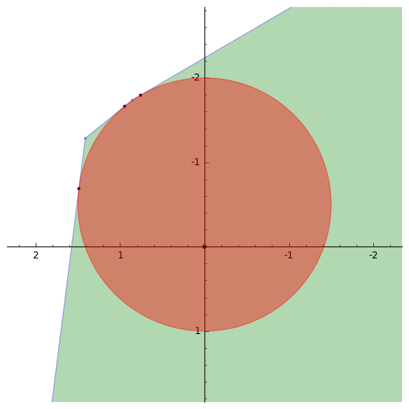

# GAP-PARI-Sage days 93: Subgroups and lattices of Lie groups

## 19th february - 4th march 2018

This is the page for a joint GAP-PARI-Sage workshop (number 93 as a Sage days). The theme is about "Subgroups and lattices of Lie groups". The aim is to bring together experts in the area (Lie groups / algebras, (real and complex) hyperbolic geometry, symmetric spaces, lattices, Coxeter groups, ...) and software developers (GAP, PARI/GP, Sage but also SnapPy, Magma,...) that can work to improve the functionality of open source packages as well as the interactions among them. 

The workshop will be held at <a class="http" href="http://faberresidency.com/">Faber Residency</a> in Olot, Catalunya (map at <a href="https://goo.gl/maps/fBVWA8U2ncr">https://goo.gl/maps/fBVWA8U2ncr</a>). 

Note that although the workshop will run for two weeks, it is possible to attend to only part of the workshop. 

The conditions of the Faber residencies require that the participants propose activities mainly aimed at high school students, that can be carried out in English, Catalan or Spanish. 

If you are interested in attending the workshop, get in contact with the organizers. The cost for semi-pension (hotel + breakfast + dinner) is only 40€ per day thanks to Faber. Some fundings is available via the <a class="http" href="http://opendreamkit.org/">OpenDreamKit European grant</a> and can be requested to the organizers. 

You can find very detailed practical information about how to reach Faber <a class="http" href="http://mat.uab.cat/~masdeu/files/faber_information.pdf">HERE</a>. 

Sage tickets worked on during this workshop can be found via the keyword <a class="https" href="https://trac.sagemath.org/query?status=!closed&amp;keywords=~days93&amp;order=status">days93</a> on the Sage trac server. 

 

## Organizers

* <a class="http" href="http://www.labri.fr/perso/vdelecro/">Vincent Delecroix</a> 
* <a class="http" href="http://mat.uab.cat/~masdeu/">Marc Masdeu</a> 

## Participants

* <a class="http" href="http://www.labri.fr/perso/vdelecro/">Vincent Delecroix</a> (Bordeaux) Feb 23-Mar 4 
* <a class="http" href="http://homeweb.unifr.ch/drewitzs/Pub/">Simon Drewitz</a> (Fribourg) - Feb 19-Mar 4 
* Charles Fougeron (Москва) -- Feb 21-Mar 3 
* Xavier Guitart (Barcelona) -- Feb 20-23 
* Nick Howell -- Feb 21-Mar 3 
* <a class="http" href="http://page.mi.fu-berlin.de/labbe/">Jean-Philippe Labbé</a> -- Feb 25-Mar 3 
* <a class="http" href="http://mat.uab.cat/~masdeu/">Marc Masdeu</a> (Barcelona) -- Feb 20-Mar 2 
* <a class="http" href="http://www.normalesup.org/~page/">Aurel Page</a> (Bordeaux) -- Feb 19-Mar 4 
* Irene Pasquinelli (Durham) -- Feb 19-Mar 3 
* <a class="http" href="http://bremy.perso.math.cnrs.fr/">Bertrand Rémy</a> (Polytechnique) Feb 26-Mar 3 
* Vít Tuček (Zagreb) Feb 19-Mar 4 

## Projects

* determine the nature (= a fundamental domain) for finite type subgroups of SL(2,R): 
         * test discretness and when discrete build fundamental domain (Gilman-Maskit did it for 2 generators) 
         * do the same in SL(2,Qp) using Bruhat-Tits tree 
         * in case of SL(2,Q), and more generally SL(2,K), one can look into a product SL(2,R) x SL(2,Qp1) x ... x SL(2,Qpk) in which the group is discrete 
* Zariski closure of finitely generated subgroups of SL(n,R): Vincent 
* Test for finiteness of the covolume for a subgroup of SL(n,R) (or Sp(2g,R)) given by a (finite) generating set. In the case of SL(2,R) there is a complete algorithm while in higher dimensional groups (even rank 1) we are faced to non-geometrically finite groups : Vincent 
* add your work plan ... 

## Support

This workshop is funded by <a class="http" href="http://opendreamkit.org/">OpenDreamKit</a> . 
