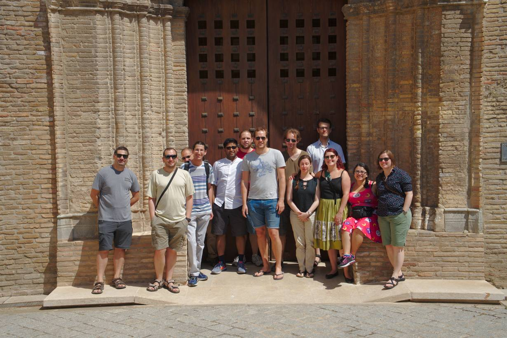

# Sage days 94 -- Sage development days

Sage days 94 took place in Zaragoza (Spain), from Thursday 28 June 2018 to Wednesday 04 July 2018, as a satellite activity of the 16th meeting of the Spanish computer algebra network (<a class="https" href="https://eventos.unizar.es/15634">XVI EACA</a>). 

They featured a series of short courses on subjects related to Sage development. The main target audience was young researchers who want to take the step from writing code for their own use to contributing their code to the Sage codebase. 

## Collaborative pad

We used <a class="https" href="https://annuel.framapad.org/p/sagedays94">this pad</a> to take notes during the workshop. 

For tickets worked on during Sage days 94, we used the keyword "days94": 

   * <a class="https" href="https://trac.sagemath.org/query?keywords=~days94&amp;group=status&amp;col=id&amp;col=summary&amp;col=status&amp;order=priority">days94 tickets by status</a> 
   * <a class="https" href="https://trac.sagemath.org/query?order=id&amp;desc=1&amp;keywords=~days94">days94 tickets by ticket number</a> 

## Mini-course speakers and contributed talks

Topics to cover 

   * The Sage development workflow (Trac, Git, doctests...) 
   * The coercion model 
   * Parents and elements, and their implementation 
   * The category framework 
   * Cython 
   * Using external C/C++ libraries 
   * Communication with external packages using pexpect 
Mini-course speakers 

   * Samuel Lelièvre 
   * Travis Scrimshaw 
   * Jeroen Demeyer 
   * Thierry Monteil 
Besides mini-courses on those subjects, there was some space for short talks contributed by the participants (which could be quite informal); interested participants could just contact the organizers to offer such a talk. 

Proposed talks included: 

   * Rebecca Miller: Applying and Participating in Google Summer of Code 
   * Pablo Angulo: PyTorch, a machine learning framework, and Pyro, a universal probabilistic programming language on top of PyTorch (subtitle: do they fit in Sage?) 
   * Vít Tuček: How Sage is helping me with my research 
   * Sebastian Oehms: Cubic braid groups 
   * Peleg Michaeli: Symbolic discrete random variables 
   * Thierry Monteil: The various representations of real and complex numbers 
   * Mckenzie West: Solving the S-unit equation in Sage 

## Program

#### Thursday 28 June 2018

   * 10:00-11:00 Registration 
   * 11:00-12:00 **The Sage development workflow** (Samuel) 
   * 12:00-13:00 **Basics of git**: init, add, commit, status (Samuel, Thierry) 
   * 13:30-15:00 Lunch break 
   * 15:00-16:30 **Basics of git**: clone, remote, push, pull, branch, checkout (Samuel, Thierry) 
   * 16:30-17:30 Trac bureaucracy (account, ssh-keygen, git-trac, develop (Samuel, Thierry) 
   * 15:00-16:00 Coding sprint 
   * 16:00-16:30 Coffee break 
   * 16:30-18:30 Coding sprint 

#### Friday 29 June 2018

   * 09:00 - 11:00 **Categories** (Travis) - <a class="https" href="https://drive.google.com/open?id=1TDd6Ph2RG2WBOA09z8hR0x-v62TOWsJb">ipynb</a>, <a href="days94/categories_Zaragoza_Days94.ipynb">categories_Zaragoza_Days94.ipynb</a> 
   * 11:00 - 11:30 Coffee break 
   * 11:30 - 13:00 **Parents, elements, coercion, for the user** (Thierry) - <a class="https" href="https://tmpsage.metelu.net/days94/parent_element_coercion_user.ipynb">ipynb</a> 
   * 13:00 - 15:00 Lunch break 
   * 15:00 - 16:00 **The Sage development workflow** (practice) 
   * 16:00 - 16:30 Coffee break 
   * 16:30 - 17:00 Peleg Michaeli: Symbolic discrete random variables 
   * 17:00 - 19:00 Coding sprints 

#### Saturday 30 June 2018

   * 10:00 - 11:30 **The category framework in Sage** (practice) 
   * 11:30 - 12:00 Coffee break 
   * 12:00 - 13:30 **The coercion model** (practice) 

#### Sunday 01 July 2018

   * Excursion 

#### Monday 02 July 2018

   * 09:00 - 11:00 **Categories, parents, coercion** (Travis) - <a href="days94/parent_examples_travis.sage">Example parent .sage file</a> 
   * 11:00 - 11:30 Coffee break 
   * 11:30 - 13:00 **Cython** (Jeroen) - <a class="http" href="http://sage.ugent.be/www/jdemeyer/Cython.ipynb">ipynb</a> 
   * 13:00 - 15:00 Lunch break 
   * 15:00 - 16:00 **Parents and elements** (practice) 
   * 16:00 - 16:30 Coffee break 
   * 16:30 - 17:00 Vít Tuček: How Sage is helping me with my research - <a href="days94/tucek.pdf">tucek.pdf</a> 
   * 17:00 - 19:00 Coding sprint 

#### Tuesday 03 July 2018

   * 09:00 - 11:00 **Third-party components** 
   * 11:00 - 11:30 Coffee break 
   * 11:30 - 13:00 Sebastian Oehms: Cubic braid groups - <a class="https" href="https://cocalc.com/share/a3c9835337b41b0c1c7808ac5d793f5dbbef7064/CubicBraidGroup/?viewer=share">shared folder on CoCalc</a> 
   * 13:00 - 15:00 Lunch break 
   * 15:00 - 15:30 Rebecca Miller: Applying and Participating in Google Summer of Code - <a class="http" href="http://lifebynumber.org/sagemath-gsoc-info">Sage GSOC info</a> 
   * 15:30 - 16:00 Mckenzie West: Solving the S-unit equation in Sage - <a href="days94/MWest_Presentation.pdf">slides</a> 
   * 16:00 - 16:30 Demo: run a <a href="/patchbot">patchbot</a>! (Thierry) 
   * 16:30 - 18:30 Coding sprint 

#### Wednesday 04 July 2018

   * 09:00 - 10:00 Final report and wrap-up 
   * 10:30 - <a class="https" href="https://eventos.unizar.es/15634">EACA talks</a> 

## Organizers

   * Miguel Marco 
   * Enrique Artal 
   * Adrien Boussicault 

## Participants

   * Akshar Nair 
   * Antonio Rojas 
   * <a class="https" href="https://biancasmath.wordpress.com/">Bianca Thompson</a> 
   * Elisa Palezzato 
   * Enrique Artal 
   * Francisco Castro 
   * Friedrich Wiemer 
   * Jeroen Demeyer 
   * Luis Felipe Tabera 
   * Mckenzie West 
   * Miguel Marco 
   * Pablo Angulo 
   * Peleg Michaeli 
   * <a class="http" href="http://www.lifebynumber.org/">Rebecca Lauren Miller</a> 
   * <a href="/slelievre">Samuel Lelièvre</a> 
   * Sebastian Oehms 
   * Simón Isaza 
   * Thierry Monteil 
   * Tomer Bauer 
   * Vít Tuček 

## Development

Add here the things you plan to work on during the week: 

   * (Thierry) Fix oeis internet doctest issues <a class="https" href="https://trac.sagemath.org/ticket/25471">#25471</a> 
   * Try to progress in the inclusion of train-tracks in Sage <a class="https" href="https://trac.sagemath.org/ticket/20154">#20154</a> 
   * Polynomial division <a class="https" href="https://trac.sagemath.org/ticket/17638">#17638</a> 
   * Sage packaging 
   * Crypto module 
   * Linear algebra 
   * CoCoa  integration? 
         * package cocoalib <a class="https" href="https://trac.sagemath.org/ticket/25707">#25707</a> 
   * #8558 
   * Ticket <a class="https" href="https://trac.sagemath.org/ticket/25745">#25745</a> 
Please tag any tickets you work on during this week with the <a class="https" href="https://trac.sagemath.org/query?keywords=~days94&amp;group=status&amp;col=id&amp;col=summary&amp;col=status&amp;order=priority">days94 keyword</a>. This makes it easy to list all tickets worked on during this week. 

## Instructions for participants

Given the focus on Sage development, we recommend participants come with their own laptop, including a Sage installation that is well suited for development (don't worry if you have trouble installing, we can help with installation during the workshop, but it would save time if it is done in advance). Also, please ask in advance for an account for <a class="https" href="https://trac.sagemath.org/">Sage's Trac server</a>. 

## Lodging

Several apartments were booked in <a class="https" href="https://www.apartamentoslossitios.com">Apartamentos Los Sitios</a>. They are located in the city centre. The reception is open until 22:30. 

## Location

Talks took place in the main campus of the Universidad de Zaragoza, in the mathematics building. It is about 25 minutes by walk from the apartments (maybe 15 minutes by public transport). 

You can see the train station, the apartments and the event location in <a class="https" href="https://drive.google.com/open?id=1jEMgFXLy7lM-Fenxs8MxKOUnwIklZdkf&amp;usp=sharing">this map</a>. 

## Financial support

The school was partly funded by the <a class="https" href="https://opendreamkit.org">OpenDreamKit</a> project. The LaBRI (University of Bordeaux) and the CNRS co-organized the project via the OpenDreamKit project. We expect to be able to cover the travel and lodging expenses of most participants and speakers. 

## Contact

If you are interested in participating, or have any questions, please send an email to `mmarco <at> unizar <dot> es` 

## Excursion

Here is a picture from the visit to <a class="https" href="https://zaragoza.es/ciudad/turismo/en/que-visitar/detalle_Monumento?id=7">Palacio de la Aljaferia</a> on Sunday morning.  

 
