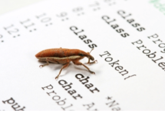
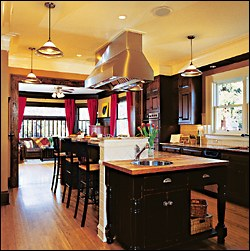
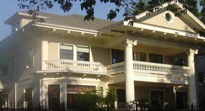

# Sage Days 19: Bug Smash 2

Dates: January 16-20, 2010  (arrive Jan 15, checkout Jan 20).   

Note that Monday, Jan 18 is a Washington State holiday (Martin Luther King Day). 

Organizers: Craig Citro, William Stein (206-419-0925 cell phone number), Robert Bradshaw, Mike Hansen 

*  

## Hit List

* <a class="http" href="http://trac.sagemath.org/sage_trac/wiki/sd19-bugs">Find it here!</a> 

## Base version of Sage

* <a class="http" href="http://boxen.math.washington.edu/home/rlmill/sage-4.3.1.rc0.tar">sage-4.3.1.rc0</a> 

## Location

* Participants will stay and work at the <a class="http" href="http://www.shueyhouse.com/">Shuey House Mansion</a> for the workshop: 
      * 5218 16th ave NE, Seattle, WA 98105   <a class="http" href="http://maps.google.com/maps?oe=utf-8&amp;client=firefox-a&amp;ie=UTF8&amp;cid=0,0,8834837676951190706&amp;fb=1&amp;hnear=5218+16th+ave+NE,+Seattle,+WA+98105&amp;gl=us&amp;daddr=5218+16th+ave+NE,+Seattle,+WA+98105&amp;geocode=1879113126593815553,47.667055,-122.310448&amp;ei=pspMS6ymHo6eswPgrsiLAQ&amp;ved=0CAoQngIwAA&amp;ll=47.665647,-122.306929&amp;spn=0.01341,0.038581&amp;z=15">Google Map</a> 
   

* People sleeping at Shuey (6 rooms; ~10 beds): Arthur Gaer (own room), Willem Jan Palenstijn, Jason Grout, Burcin Erocal, Mike Hansen (+1, so own room), Sebastian Pancratz, Tim Dumol  

## Mailing list

* <a href="http://groups.google.com/group/sagedays19">http://groups.google.com/group/sagedays19</a> 

## Confirmed Participants

* **Cancelled**: Nick Alexander (UC Irvine, California) 
* Rob Beezer (day trip, Mon Jan 18, Tacoma, WA) 
* Tom Boothby (UW) 
* Robert Bradshaw (UW) 
* Nils Bruin (SFU) -- "I am considering joining you for the Saturday and Sunday (16, 17 January). I'll leave Sunday early evening." 
* Craig Citro (UW) 
* Tim Dumol (Philipines) -- Coming in Fri, 15 Jan, 7 AM; leaving Thu, 21 Jan 12:50 PM. 
* Burcin Erocal  (Austria) -- Coming in Thu, 14 Jan 11:55 AM; leaving Thu, 21 Jan, 12:45 PM. 
* Arthur Gaer (Harvard) -- Coming in Fri, 15 Jan 9pm Jet Blue flt 497; leaving Wed 20 Jan, 11pm flt 498.  
* Jason Grout   (Drake U.) -- Coming in Sat, 16 Jan, 9:51PM; leaving Thu, 21 Jan, 6AM. 
* Mike Hansen (World) -- Coming Friday, 15 Jan 8:54PM; leaving ... 
* Robert Miller (UW) -- moving this weekend, but will be around otherwise 
* Willem Jan Palenstijn  (Holland) -- Coming in Fri, 15 Jan, 8PM (from Chicago); leaving Sat, 23 Jan, 8:14AM 
* Sebastian Pancratz  (Cambridge, England) 
* William Stein (UW) -- Coming in Fri, 15 Jan 10pm Alaska flt 221. 
* Kevin Stueve (UW) 
* Bill Cauchois (UW) -- I'll be there for Saturday and Sunday 