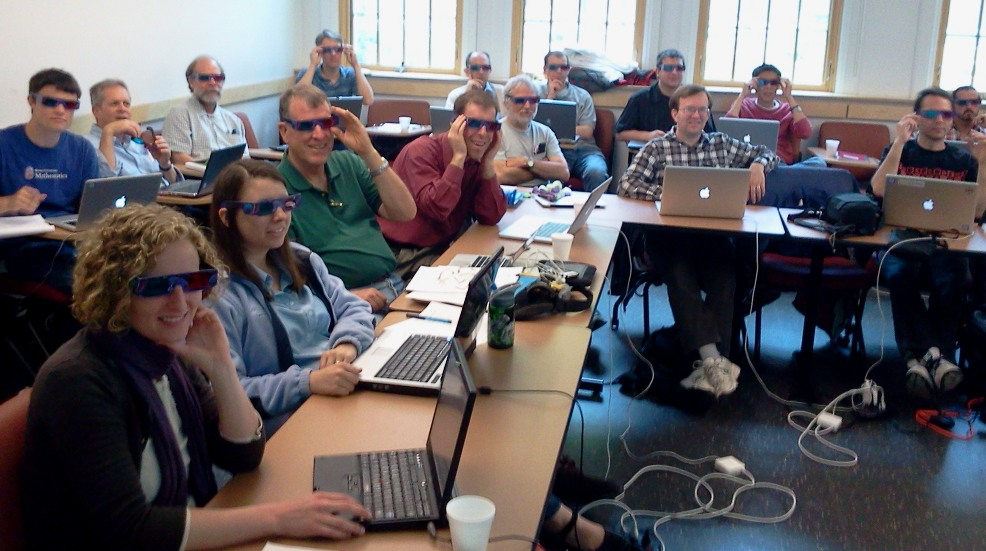

# Sage Education Days 3

The third <a class="http" href="http://www.sagemath.org">Sage</a> Education Days will be held in conjunction with <a href="/days31">Sage Days 31</a>, at the University of Washington in Seattle, June 16-18, 2011. 

Funded by the National Science Foundation Division of Undergraduate Education. 

[[_TOC_]] 

<a name="schedule"></a> 
# Schedule
  |  Topic  |  Speaker  |  Links 
  |   |   |  
 Thursday  |  June 16  |   |  <a class="http" href="http://www.facebook.com/media/set/?set=a.10150214463828682.330939.504538681&amp;l=8e2d184c1b">Pictures (Facebook)</a>  <a class="https" href="https://picasaweb.google.com/wstein/20110616Sagedays31Day4">Pictures (Picasa)</a> 
  9:00 AM  |  Introductions              |   |  <a class="http" href="http://tinyurl.com/6cxt7ua">Video</a> 
  9:30 AM  |  Calculus                   |  John Perry, U of Southern Mississippi  |  <a class="http" href="http://www.math.usm.edu/sage/">Worksheets</a>, <a class="http" href="http://tinyurl.com/65kqers">Video</a>, <a href="education3/Calc2011.tar.gz">Calc2011.tar.gz</a> 
 10:15 AM  |  Multivariable Calculus     |  John Travis, Mississippi College  |  <a class="http" href="http://sagenb.mc.edu/home/pub/21">Presentation</a><a class="http" href="http://euclid.mc.edu/mywiki/Multivariate%20Calculus%20Presentation">Worksheets</a>   <a class="http" href="http://tinyurl.com/68byo93">Video (part 1 of 2)</a>  <a class="http" href="http://tinyurl.com/5t7hp38">Video (part 2 of 2)</a>
 11:00 AM  |  Textbook Conversion        |  Rob Beezer, U of Puget Sound  |  <a href="education3/beezer-2011-seattle-sed3-textbooks.pdf">Presentation</a> <a class="http" href="http://tinyurl.com/62wzl5a">Video (part 1 of 2)</a> <a class="http" href="http://tinyurl.com/6xvy57c">Video (part 2 of 2)</a>
  3:30 PM  |  SD31 Status Reports        |   OPTIONAL  |  
  5:30 PM  |  Status Reports             |    |  <a class="http" href="http://tinyurl.com/3nsttc2">Video (part 1 of 2)</a>  <a class="http" href="http://tinyurl.com/3q9yb39">Video (part 2 of 2)</a>
 Friday  |  June 17  |   |  
  9:00 AM  |  Abstract Algebra           |  Tom Judson, Stephen F. Austin U  |  <a class="http" href="http://faculty.sfasu.edu/judsontw/UTMOST/EduDays3.pdf">Presentation</a><a class="http" href="http://faculty.sfasu.edu/judsontw/UTMOST/Worksheets.zip">Worksheets</a>  <a class="http" href="http://tinyurl.com/447yhfe">Video</a> 
 10:00 AM  |  Number Theory              |  Karl-Dieter Crisman, Gordon College  |  <a class="http" href="http://tinyurl.com/63a9v7s">Video (part 1 of 2)</a>, <a class="http" href="http://tinyurl.com/5tujdvv">Video (part 2 of 2)</a>, <a href="education3/kdc-number_theory.sws">kdc-number_theory.sws</a>, <a class="http" href="http://sage.math.gordon.edu/pub/?typ=pub&amp;search=mat+338">Worksheets</a>
 10:45 AM  |  Linear Algebra Lab Manual  |  Ryan Grout, Brigham Young University |  <a class="http" href="http://tinyurl.com/3dkvq6r">Video</a> 
 11:15 AM  |  SageTeX                    |  Dan Drake, KAIST, Korea  |  Jason Grout's <a class="http" href="http://artsci.drake.edu/grout/sage-slides.pdf">awesome example slides</a> (<a class="http" href="http://artsci.drake.edu/grout/lib/exe/fetch.php/sage-tex.zip">latex source</a>)  <a class="http" href="http://tinyurl.com/3zwnfhz">Video</a> <a href="education3/example-sagetex-files.tar.gz">files used in the talk</a> 
  2:30 PM  |  UTMOST Staff Meeting  |    |  
  3:30 PM  |  Status Reports             |    |  <a class="http" href="http://tinyurl.com/3fbzd8q">Video (part 1 of 2)</a>  <a class="http" href="http://tinyurl.com/3o7zahf">Video (part 2 of 2)</a>  
 Saturday  |  June 18  |   |  
  9:00 AM  |  Linear Algebra             |  Rob Beezer, U of Puget Sound  |  <a class="http" href="http://tinyurl.com/44svcjv">Video</a>
 10:00 AM  |  Numerical Analysis         |  Jason Grout, Drake U  |  <a class="http" href="http://tinyurl.com/3co4mxx">Video</a>; Worksheets: <a class="http" href="http://sagenb.org/home/pub/2832">floating point numbers</a>, <a class="http" href="http://sagenb.org/home/pub/2833">repeated roots</a>, <a class="http" href="http://sagenb.org/home/pub/2834">polynomial approximation</a>, <a class="http" href="http://sagenb.org/home/pub/2835">splines and netlib</a>, <a class="http" href="http://sagenb.org/home/pub/2836">LAPACK</a>, <a class="http" href="http://sagenb.org/home/pub/2837">iterative methods</a>
 11:00 AM  |  Interact Design            |  Open Mic, MC Jason Grout  |  <a class="http" href="http://wiki.sagemath.org/interact/">Sage Interact Wiki</a>, <a class="http" href="http://sagenb.org/pub/?typ=pub&amp;search=interact">Published Sage Worksheets with Interacts</a>, <a class="http" href="http://sagenb.org/home/pub/2838">Interact tutorial</a>, <a class="http" href="http://sagenb.org/home/pub/2851/">Interact highlights</a>,  <a class="http" href="http://tinyurl.com/5rkpmo6">Video</a>  
  2:00 PM  |  UTMOST Test Sites Meeting  |   |  
  3:30 PM  |  Status Reports, Wrap-Up    |   |  


# Pictures

 Viewing JMOL 3D images 


# Blog Roll

<a class="http" href="http://mathematicseducationissues.blogspot.com/">Tom Judson</a> 


# Topics

* Tutorials and Teaching Experiences 
      * Single Variable Calculus 
      * Multivariate Calculus 
      * Linear Algebra 
      * Abstract Algebra 
      * Number Theory 
      * Numerical Analysis 
* Authoring Materials 
      * SageTeX 
      * Textbooks 
      * Worksheets 
      * Interacts 
* Notebook Improvements 
      * In consultation with onsite notebook developers 
* Personal Projects 
      * There will be abundant time to work on your own projects 
<a name="participants"></a> 
# Participants

1. <a class="http" href="http://buzzard.ups.edu">Rob Beezer</a> (University of Puget Sound) 
1. <a class="http" href="http://www.cgl.ucsf.edu/home/bic">Bruce Cohen</a> (Lowell High School, San Francisco) 
1. <a class="http" href="http://www.math.gordon.edu/~kcrisman/">Karl-Dieter Crisman</a> (Gordon College) 
1. <a class="http" href="http://www.acadiau.ca/~ecurry">Eva Curry</a> (Acadia University) 
1. <a href="/DanDrake">DanDrake</a> (KAIST, South Korea) 
1. Michael Garcia (San Francisco State University) 
1. <a class="http" href="http://artsci.drake.edu/grout/">Jason Grout</a> (Drake University) 
1. <a class="http" href="http://math.jasonbhill.com">Jason B. Hill</a> (University of Colorado) 
1. <a class="http" href="http://www.uni.edu/theron/">TJ Hitchman</a> (University of Northern Iowa) 
1. <a class="http" href="http://facweb.northseattle.edu/ejasso/">Edgar Jasso</a> (North Seattle Community College) 
1. <a class="http" href="http://faculty.sfasu.edu/judsontw/">Tom Judson</a> (Stephen F. Austin State University) 
1. <a class="http" href="http://math.ucsd.edu/~kkedlaya/">Kiran Kedlaya</a> (University of California, San Diego) 
1. Benjamin <a href="/LeVeque">LeVeque</a> (Brown University, undergrad) 
1. <a class="http" href="http://www2.sfasu.edu/math/people/faculty/longj.html">Jane Long</a> (Stephen F. Austin State University) 
1. <a class="http" href="http://www.maa.org/Aboutmaa/pearsonbio.html">Michael Pearson</a> (MAA, Washington, DC) 
1. <a class="http" href="http://www.reed.edu/~davidp/">David Perkinson</a> (Reed College) 
1. <a class="http" href="http://www.csudh.edu/math/wpong/">Wai Yan Pong</a> (California State University, Dominguez Hills) 
1. Rao Potluri (Reed College) 
1. <a class="http" href="http://www.math.usm.edu/perry/">John Perry</a> (University of Southern Mississippi) 
1. Philip Robinson (Western Washington University, Undergrad) 
1. <a class="http" href="http://www.mc.edu/faculty/travis">John Travis</a> (Mississippi College) 
1. <a class="http" href="http://wstein.org/">William Stein</a> (University of Washington) 

# Organizers

* Rob Beezer <a class="http" href="http://buzzard.ups.edu">http://buzzard.ups.edu</a> 
* William Stein <a class="http" href="http://wstein.org/">http://wstein.org/</a> 

# UW Campus Wireless


```txt
UW NetID:       event0896
Password:       kfeu:xsuo:kzoo
```

# Mailing Lists

* Mailing list for <a class="http" href="http://groups.google.com/group/sagedays31">Sage Days 31</a>, which will be used for Education Days also.  Please add yourself to this list if you are not already on it.  This will be the primary vehicle for announcements, and last-minute changes during the week. 
* There is also a list specifically for discussing <a class="http" href="http://groups.google.com/group/sage-edu">education and Sage</a>. 

# IRC

* There is an IRC channel for sage days: #sagemath-days on irc.freenode.net. Feel free to join to discuss whatever...   For those without IRC clients, <a href="http://webchat.freenode.net/?channels=sagemath,sagemath-days">http://webchat.freenode.net/?channels=sagemath,sagemath-days</a> 

# Funding

Participants from the test sites for the NSF UTMOST project will have first priority for funding, though we will support travel for a few participants with a demonstrated interest and experience in using Sage in educational settings.  We also expect to have a similar workshop in Summer 2012 which will have twice the available funding. 

<a name="registration"></a> 
# Registration

Sign up by adding your name to the "Participants" list above.  Email Rob Beezer  at <a href="mailto:beezer@ups.edu">beezer@ups.edu</a> if you'd rather not figure out how to edit the wiki page and he'll add your name. 


# Logistics

* June 16, 17 and 18 are expected to be full days.  So plan to travel on June 15 and June 19. 
* <a href="/days31">Sage Days 31</a> will happen the same week at the University of Washington with the Sage Notebook as its theme. 
* Sessions will be held in <a class="http" href="http://www.washington.edu/maps/?l=SAV">Savery Hall</a> on the historic Quad, just northeast of Red Square.  Specifically, <a class="http" href="http://www.css.washington.edu/room/SAV+156">Savery 156</a>  (ROOM CHANGE as of Wed). 
* Lodging will be arranged for funded participants at the Collegiana Inn near the UW campus.  For other lodging options see the local information page. 
* See the <a href="/uw-local-info">local information page</a> for more specifics. 

# Projects

Sage Days typically allow a great deal of unstructured time to work on projects, either in groups or with the assistance of experts that are available.  Please plan to have a project to work on.  Examples could be: 

* Learning a new area of Sage in preparation for teaching a course. 
* Preparing worksheets for a course. 
* Learning how to create interacts for the Sage library. 
* Learning how to contribute new code to Sage. 
* (wstein): Work on my free open Sage book: <a href="http://code.google.com/p/sage-power-book/">http://code.google.com/p/sage-power-book/</a> 
* Documentation and stability of implementation for using Sage in Windows 
   * difficulty of transferring files between Windows and virtual machine? 
   * people: John Perry, Jane, (Karl-Dieter), Jason G., Rob, William 
* Sage branded 3-D glasses 
* Organization of Sage educational resources 
   * rating of worksheets? 
   * tagging, organization of available options 
   * suggestion from chemistry: set up committees to curate resources so that faculty get service credit 

# Career Advice Related to Trying New Things Before Tenure

* Prepare your dean/department head beforehand (thanks to Arnold Lebow, related by Jason): 
   * what you're trying (and why) 
   * how students might respond (and why) 
   * how they can respond to student comments 
* Prepare your students (suggestions from Eva): 
   * Explain that you are trying something new and/or different. 
   * Explain why, discuss (potential) advantages and disadvantages. 
   * Obtain appropriate feedback from your students: standardized end-of-semester student evaluations don't always ask detailed enough questions or questions that are sufficiently relevant to evaluate the success of your new method, so have students complete an additional evaluation form that solicits feedback specific to your goals. 
   * Consider obtaining feedback from the students at multiple points during the semester, and build this into the course design.  This has two advantages: 
      * It allows you to address major student concerns early on before they become problems. 
      * It reminds students of the goals of your course (that may differ from their assumptions or expectations for courses in general) at multiple times during the semester. 
* <a class="http" href="http://serendip.brynmawr.edu/sci_cult/scienceis/burns.html">"With Friends Like These..."</a> Wm. David Burns, P.I. of <a class="http" href="http://www.sencer.net/">SENCER</a> (Science Education for New Civic Engagements and Responsibilities) 

# Other materials related (perhaps tangentially) to education and Sage

* A bunch of Java applets made with Mathematica, obsoleted by factors out of my (<a href="/DanDrake">DanDrake</a>'s) control: <a href="http://mathsci.kaist.ac.kr/~drake/tes.html">http://mathsci.kaist.ac.kr/~drake/tes.html</a> 


# Previous Sage Education Days

* <a href="/education1">Sage Education Day 1 (December 5, 2009)</a> 
* <a href="/education2">Sage Education Day 2 (February 24, 2010)</a> (and <a href="/education2fr">in French</a>) 