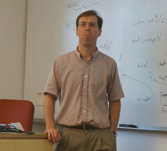
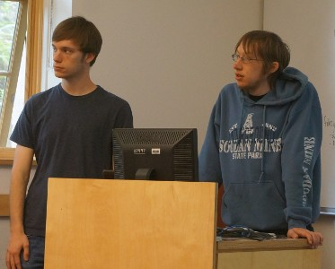
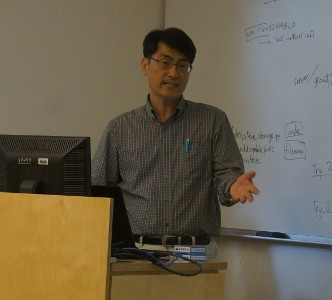
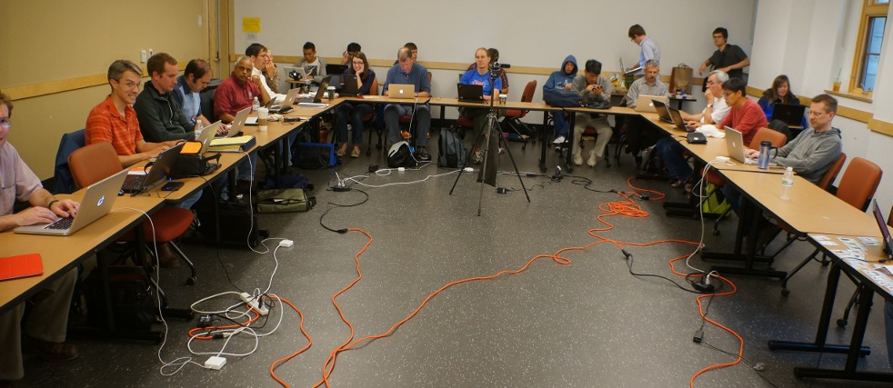
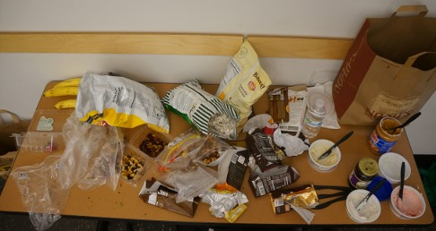

# Sage Education Days 4

The fourth <a class="http" href="http://www.sagemath.org">Sage</a> Education Days will be held in conjunction with <a href="/days41">Sage Days 41</a>, at the University of Washington in Seattle, June 13-15, 2012. 

Funded by the National Science Foundation Division of Undergraduate Education. 

[[_TOC_]] 


## Schedule
  |  Topic  |  Speaker  |  Links 
  |   |   |  
 Wednesday   |  June 13      |   |  
  9:30 AM  |  Introductions                          |                         |  <a class="http" href="http://www.youtube.com/watch?v=aUU5Xl-XT78">Welcome</a>, <a class="http" href="http://www.youtube.com/watch?v=_KJbTOyQUlM">Introductions, Part 1</a>, <a class="http" href="http://www.youtube.com/watch?v=jYN6Avkkrt8">Introductions, Part 2</a> 
           |  Test-Site, Reed College (30 minutes)   |  Rao Potluri            |  <a href="education4/reed-potluri-utmost.pdf">Slides (PDF)</a> <a class="http" href="http://www.youtube.com/watch?v=9Af0IL79mT0">Video</a> 
           |  SALG Survey Roundtable  (15 minutes)   |  Susan Lynds            |  <a class="http" href="http://www.salgsite.org/student">Site</a>, Instrument: 27688, <a class="http" href="http://www.youtube.com/watch?v=RJDujngvY4o">Video</a>, <a href="education4/InvitationEmailSageSALG.doc">Invitation</a>, <a href="education4/SageSALG-MDirections.doc">Directions</a>
 4:00 PM   |  Status Reports                         |                         |  <a class="https" href="https://www.surveymonkey.com/s/SageDays2012Wednesday">Wednesday Survey</a> <a class="http" href="http://youtu.be/4VR1t1auK4s">Video</a> 
  |   |   |   
 Thursday    |  June 14  |   |  
  9:00 AM   |  Test-Site, Stephen F Austin State U (60 minutes)      | Jane Long, Tom Judson       |  <a href="education4/judson-edudays4.pdf">PDF Presentation</a> <a href="education4/long-sfa-sed4.pdf">Jane's PDF Presentation</a> <a class="http" href="http://youtu.be/Kl6QQpri1Rs">Video, Part 1</a>; <a class="http" href="http://youtu.be/aYrWjtRjtiI">Video, Part 2</a>
           |  Sage in Korea : Present and Future (20 minutes)       | Hee-Dong Yoon, Sang-Gu Lee  |  <a class="http" href="http://youtu.be/TAfL8HCHbPE">Video for all Korea talks</a> 
           |  Sage/Mobile: Sage Tools and Contents (20 minutes)     | Kyung-Won Kim, Sang-Gu Lee  |  
           |  Use of Sage in Teaching Linear Algebra (20 minutes)   | Sang-Gu Lee                 |  <a href="education4/sglee-edudays4.pdf">PDF Presentation</a>
           |  Sage Single Cell Server (20 minutes)                  | Jason Grout, Ira Hanson, Steven Johnson  |  <a class="http" href="http://sage.math.washington.edu/home/jason/cellserverintro/">Introduction</a>, <a class="http" href="http://youtu.be/0sf5s2w8seM">Video for Introduction and Interact Database</a>, <a class="http" href="http://youtu.be/KYQNOAF36GQ">Video for next generation discussion</a>
           |  Interact Database (20 minutes)                        | Byron Varberg               |  <a class="http" href="http://youtu.be/0sf5s2w8seM?t=14m9s">Video for Introduction and Interact Database</a> (Byron's talk starts at 14:00)
~2:00 PM   |  Question Session                                      | Rob Beezer, et al           |  
 4:00 PM   |  Status Reports                                        |                             |  <a class="https" href="https://www.surveymonkey.com/s/SageDays2012Thursday">Thursday Survey</a>
   |    |   |   
 Friday  |  June 15  |   |  
 9:30 AM   |  Sage + WeBWorK                                        | John Travis, et al  |  <a href="education4/Sage_WeBWorK 2012.pptx">Powerpoint Presentation</a>, Video: <a class="http" href="http://youtu.be/omAEE24lt6Q">part 1</a>, <a class="http" href="http://youtu.be/8YMAT1i7qLE">part 2</a>
           |  Test-Site, Northern Iowa University (30 min)           | Theron Hitchman     |   <a href="education4/hitchman-sed4.pdf">PDF Presentation</a>, <a class="http" href="http://youtu.be/kOUCasZWjYE">Video</a>
           |  Test-Site, Cal State, Dominguez Hills (30 min)         | Wai Yan Pong        |  <a class="http" href="http://math.csudh.edu:8800">csudh math server</a>, <a class="http" href="http://csudh.sagenb.org">csudh sagenb server</a>  <a class="http" href="http://youtu.be/YCQ-LeRc8NA">Video</a>
           |  Generalized Interacts  (10 min)                        | Gwyn Whieldon       |  <a class="http" href="http://youtu.be/mgLpIAZUVRQ">Video</a>  
           |  Worksheets and Textbooks via XML (20 min)              | Rob Beezer          |   <a class="http" href="http://youtu.be/-HAs5m1cclM">Video</a> 
~2:00 PM   |  UTMOST PI Meeting                                      |                     |  
~3:00 PM   |  UTMOST Test-Site Meeting                               |                     |  
 4:00 PM   |  Status Reports                                         |                     |  <a class="http" href="http://youtu.be/f_QPtzYQW7o">Video</a>, <a class="https" href="https://www.surveymonkey.com/s/SageDays2012Final">Final Survey</a>

<a name="mailinglist"></a> 


## Resources

* Brad Burkman's Sage <a href="education4/SagePoster3.pdf">poster</a>. 
* <a class="http" href="http://sage.math.washington.edu/home/jason/sage-HLA2.pdf">HLA Linear Algebra article preprint</a> 
* XML/XSLT Books and Online Course 
      * XML: Visual QuickStart Guide (2nd Edition), Kevin Howard Goldberg. Practical introduction.  
      * Beginning XSLT 2.0: From Novice to Professional, Jeni Tennison.  Comprehensive guided progression. 
      * <a class="https" href="https://p2pu.org/en/groups/learn-xslt-for-transforming-structured-docuements/">P2PU Online Course</a> (started ~June 1) 
* Abstract Algebra QuickRef, developed at SED4 by Balof, Perkinson, Judson, Potluri.  Find it at <a href="/quickref">Sage QuickRefs</a>. 
* Beezer's <a class="http" href="http://buzzard.ups.edu/courses/2012spring/m290s2012.html">course page</a> with 16 in-class linear algebra demos. 
* <a class="http" href="http://tex.mendelu.cz/en/">TexOnWeb</a>: simple, reliable TeX processor online. 

## Mailing Lists

* The mailing list for <a class="https" href="https://groups.google.com/forum/#!forum/sagedays41">Sage Days 41</a>,  will be used for Education Days also (once created).  Please add yourself to this list if you are not already on it.  This will be the primary vehicle for announcements, and last-minute changes during the week. 
* There is also a list specifically for discussing <a class="http" href="http://groups.google.com/group/sage-edu">education and Sage</a>. 

## Organizers

* Rob Beezer <a class="http" href="http://buzzard.ups.edu">http://buzzard.ups.edu</a> 
* William Stein <a class="http" href="http://wstein.org/">http://wstein.org/</a> 
<a name="participants"></a> 
## Participants

To register, please add yourself alphabetically by last name.  You need to request a Trac account to be able to login to the wiki - you can do that by following the instructions at the top of the page located <a class="http" href="http://trac.sagemath.org/sage_trac">here</a>.  As a last resort, email Rob Beezer  at <a href="mailto:beezer@ups.edu">beezer@ups.edu</a> and he'll add your name (please include a relevant web link, if available). 

1. <a class="http" href="http://www.math.missouri.edu/personnel/other/aubreyj.html">Jason Aubrey</a> (University of Missouri) 
1. <a class="http" href="http://people.whitman.edu/~balofba/">Barry Balof</a> (Whitman College) 
1. <a class="http" href="http://buzzard.ups.edu">Rob Beezer</a> (University of Puget Sound) 
1. <a class="https" href="https://sites.google.com/a/lsmsa.edu/bburkman/">Brad Burkman</a> (Louisiana School for Math, Science, and the Arts) 
1. <a class="http" href="http://www.tetrahedra.net">Bruce Cohen</a> (Lowell High School, San Francisco) 
1. <a class="http" href="http://www.jsg.utexas.edu/researcher/sergey_fomel/">Sergey Fomel</a> (The University of Texas at Austin) 
1. <a class="http" href="http://artsci.drake.edu/grout/">Jason Grout</a> (Drake University) 
1. Malcolm Harper (Champlain College Saint Lambert) 
1. <a class="http" href="http://www.uni.edu/theron/">TJ Hitchman</a> (University of Northern Iowa) 
1. <a class="http" href="http://facweb.northseattle.edu/ejasso/">Edgar Jasso</a> (North Seattle Community College) 
1. <a class="http" href="http://faculty.sfasu.edu/judsontw/">Tom Judson</a> (Stephen F Austin State University, Texas) 
1. <a class="http" href="http://math.ucsd.edu/~kedlaya/">Kiran Kedlaya</a> (University of California, San Diego) 
1. Kyung-Won Kim  <a href="mailto:kwkim@skku.edu">kwkim@skku.edu</a> (Sungkyunkwan University, Korea) 
1. <a class="http" href="http://matrix.skku.ac.kr/sglee/">Sang-Gu Lee</a> (Sungkyunkwan University, Korea) 
1. <a class="http" href="http://www.faculty.sfasu.edu/longjh/">Jane Long</a> (Stephen F Austin State University, Texas) 
1. Susan Lynds (University of Colorado) 
1. <a class="http" href="http://www.pvamu.edu/pages/4916.asp">Manouchehr Misaghian</a> (Prairie View A & M University, Texas) 
1. <a class="http" href="http://www.reed.edu/~davidp">David Perkinson</a> (Reed College) 
1. <a class="http" href="http://www.reed.edu/~potluri">Rao Potluri</a> (Reed College) 
1. <a class="http" href="http://wstein.org/">William Stein</a> (University of Washington) 
1. <a class="http" href="http://math.mc.edu/travis">John Travis</a> (Mississippi College) 
1. <a class="http" href="http://www.math.cornell.edu/~whieldon">Gwyn Whieldon</a> (Hood College) 
1. Hee-Dong Yoon <a href="mailto:jini1237@naver.com">jini1237@naver.com</a> (Sungkyunkwan University, Korea) 
1. <a class="http" href="http://csudh.edu/math/wpong">Wai Yan Pong</a> (California State University Dominguez Hills) 

## Funding

We only have enough funding for participants from the test sites for the NSF UTMOST project and for a few "outside" speakers.  The concurrent <a href="/days41">Sage Days 41</a> workshop has ample funding for those interested in working all week on projects related to the notebook.  However, anyone with an interest in the use of Sage in educational settings is welcome, and encouraged to attend. 


## Important: Lodging

There is limited availability of hotel rooms in the area close to campus.  You will want to make your own arrangements immediately for a room, since we have been unable to reserve a block at any one hotel.  Suggestions are available at the <a href="/days41/travel#hotels">travel</a> page. 

<a name="schedule"></a> 
## Blog Roll

<a class="http" href="http://mathematicseducationissues.blogspot.com/">Tom Judson</a> 

<a name="topics"></a> 
## Topics

<a name="logistics"></a> 
## Logistics

* June 13, 14 and 15 are expected to be full days.  So plan to travel on June 12 and June 16. 
* All sessions are **now** in <a class="http" href="http://www.css.washington.edu/room/SAV+132">SAVERY 132</a>.  This building is just north of the campus center  <a class="http" href="http://www.washington.edu/maps/">interactive campus map</a>. 
* <a href="/days41">Sage Days 41</a> will happen the same week at the University of Washington with the Sage Notebook as its theme. 
* See the <a href="/uw-local-info">local information page</a> for more specifics. 
<a name="irc"></a> 
## IRC

* There is an IRC channel for sage days: #sagemath-days on irc.freenode.net. Feel free to join to discuss whatever...   For those without IRC clients, <a href="http://webchat.freenode.net/?channels=sagemath,sagemath-days">http://webchat.freenode.net/?channels=sagemath,sagemath-days</a> 
<a name="projects"></a> 
## Projects

Sage Days typically allow a great deal of unstructured time to work on projects, either in groups or with the assistance of experts that are available.  Please plan to have a project to work on.  Examples could be: 

* Learning a new area of Sage in preparation for teaching a course. 
* Preparing worksheets for a course. 
* Learning how to create interacts for the Sage library. 
* Learning how to contribute new code to Sage. 
* (wstein): Work on my free open Sage book: <a href="http://code.google.com/p/sage-power-book/">http://code.google.com/p/sage-power-book/</a> 
* Organization of Sage educational resources 
   * rating of worksheets? 
   * tagging, organization of available options 
   * suggestion from chemistry: set up committees to curate resources so that faculty get service credit 
<a name="wireless"></a> 
## UW Campus Wireless


```txt
UW NetID:       event0146
Password:       6U6B;8B7K;5P6R
```
<a name="pictures"></a> 
## Pictures
   
 Jason Grout, Steven Johnson and Ira Hanson, Sang-Gu Lee
 
 Savery 132
 
 Snacks!


## Previous Sage Education Days

* <a href="/education1">Sage Education Day 1 (December 5, 2009)</a> 
* <a href="/education2">Sage Education Day 2 (February 24, 2010)</a> (and <a href="/education2fr">in French</a>) 
* <a href="/education3">Sage Education Days 3 (June 16-18, 2011)</a> 