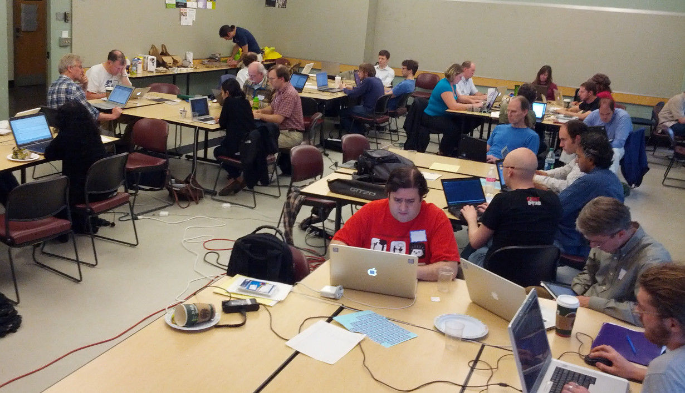
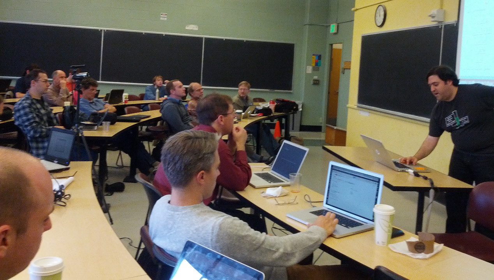

# Sage Education Days 5

The fifth <a class="http" href="http://www.sagemath.org">Sage</a> Education Days will be held in conjunction with <a href="/days48">Sage Days 48</a>, at the University of Washington in Seattle, June 19-21, 2013. 

Funded by the National Science Foundation Division of Undergraduate Education. 

[[_TOC_]] 


## Logistics

* At the <a class="http" href="http://www.washington.edu">University of Washington</a> Seattle campus (on the west coast of the US, not Washington, DC). 
* June 19, 20 and 21 are expected to be full days.  So plan to travel on June 18 and June 22. 
* Campus location:  We have <a class="http" href="http://www.css.washington.edu/room/MEB+246">MEB 246</a> and <a class="http" href="http://www.css.washington.edu/room/MEB+248">MEB 248</a> reserved in the <a class="http" href="http://www.washington.edu/students/maps/map.cgi?MEB">Mechanical Engineering Building</a> for the week's events. 
* <a href="/days48">Sage Days 48</a> will happen the same week at the University of Washington with the Notebook Development as its theme. 
* **Be sure to buy your plane ticket on a US carrier.** 
* See the <a href="/uw-local-info">local information page</a> for more specifics. 

## Mailing Lists

* The mailing list for <a class="https" href="https://groups.google.com/forum/?fromgroups#!forum/sagedays48">Sage Days 48</a>,  will be used for Education Days also.  Please add yourself to this list if you are not already on it.  This will be the primary vehicle for announcements, and last-minute changes during the week. 
* There is also a list specifically for discussing <a class="http" href="http://groups.google.com/group/sage-edu">education and Sage</a>. 

## Pictures

* <a class="https" href="https://plus.google.com/photos/115360165819500279592/albums/5892087641640203729">William Stein (roll 2)</a> 
* <a class="https" href="https://plus.google.com/photos/115360165819500279592/albums/5891333630845429009">William Stein (roll 1)</a> 
<a href="education5/WednesdayGroupSansTravis.jpg">WednesdayGroupSansTravis.jpg</a> 


## Schedule

This schedule is tentative and may change.  We are leaving plenty of time in the afternoons and evenings for small working groups that will organize at the conference to get things done. 
  |  Topic  |  Speaker  |  Links 
  |   |   |  
 Wednesday   |  June 19      |   |  
  9:30 AM    |  Introductions |                         |  <a class="http" href="http://youtu.be/rr04pB9ugfg">video</a>  
 20min  |  Sage Cell Server  |  Jason Grout   |  <a class="http" href="http://youtu.be/sBs7tBGTsZE">video</a>, <a class="http" href="http://sagecell.sagemath.org/static/amsjointslides-2013/index.html">Slides</a>, <a class="https" href="https://sagecell.sagemath.org">Sage Cell server</a>
 20min  |  Using Sage cell to create an online text  |  Karl-Dieter Crisman  |  <a class="http" href="http://youtu.be/NlbfIJmdvUc">video</a>, <a href="education5/MyDemo.html">The live-created demo webpage</a> <a href="education5/MyTalk.rtf">Cribsheet for the talk</a>, <a class="http" href="http://www.math-cs.gordon.edu/~kcrisman/mat338/">Number Theory Notes created with Sage cell</a>
 20min  |  Sage Cloud  |  William Stein |  <a class="http" href="http://youtu.be/_vmJiZ-I7Kc">video</a>, <a class="https" href="https://github.com/williamstein/sd48/blob/master/edu-days-talk.sagews">Slides</a> 
  afternoon  |  Working groups   |                         |   
  4:40 PM    |  Status Reports   |                         |   
  5:00 PM    |  Ten-minute survey  |                         |  <a class="https" href="https://www.surveymonkey.com/s/SageDays2013Wednesday">Wed Survey</a> 
  |   |   |   
 Thursday    |  June 20      |   |  
 9:30 AM  |  Announcements     |     |   
 20min  |  Publishing with XML  |  Rob Beezer          |   <a class="http" href="http://buzzard.ups.edu/talks/beezer-2013-sage-edu-5-publish.pdf">Slides</a>, <a class="http" href="http://youtu.be/2CbfOU_k110">video</a> 
 20min  |  Sage Widgets for Teaching Calculus     |    Jeff Denny           |   <a href="education5/SageEduDennytalk.pdf">Slides</a>, <a class="http" href="http://youtu.be/Ln3ciImMBc0">video</a>,<a class="http" href="http://sagewidgets.pbworks.com">http://sagewidgets.pbworks.com</a> 
 20min  |  Sage in Calculus    |    Brian Beavers           |   <a class="http" href="http://youtu.be/WlmcHazG8bA">video</a> 
 20min  |  Sage in class: MV calc. & hyp. arrangements  |  David Perkinson  |  <a class="http" href="http://youtu.be/rwT_j0IOQNU">video</a>, <a href="education5/PerkinsonSageEdu5.pdf">Slides</a>, <a href="education5/hyperplane.sage">hyperplane.sage</a> 
 20min  |  Sage for undergrads via interacts and worksheets, Running own cell and notebook servers  |  Andrey Novoseltsev   |  <a class="http" href="http://youtu.be/R5pb9kIBQEA">video</a> 
  afternoon  |  Working groups                          |                         |   
  1:00 PM  |  Introduction to interacts                  |   Jason Grout         |  <a href="education5/InteractQuickstart.sws">Sage worksheet</a> 
  2:00 PM  |  Classrooms in the Cloud                  |           |   
  3:00 PM  |  Discussion: Sage Book Series                         |                         |   
  4:40 PM  |  Status Reports                         |                         |   
  5:00 PM  |  Ten-minute survey                        |                         |  <a class="https" href="https://www.surveymonkey.com/s/SageDays2013Thursday">Thu Survey</a> 
  |   |   |   
 Friday      |  June 21      |   |  
  9:30 AM   |  Announcements  |   |   
 20min  |  Cryptography    |  Chris Davis   |  <a class="https" href="https://eee.uci.edu/13s/45070/shiftcipher.html">Shift ex</a>, <a class="https" href="https://eee.uci.edu/13s/45070/subcipher.html">Sub ex</a>, <a href="education5/DavisSlides.pdf">Slides</a>, <a class="http" href="http://youtu.be/n61BNVCuTgM">video</a> 
 20min  |  Math. Finance     |  Gregory Bard  |  <a class="http" href="http://youtu.be/pwECZKcMl0A">video</a> 
 15min  |  Abstract Algebra  |  Barry Balof  |   <a href="education5/SAGETalk-Balof.pdf">Slides</a>, <a class="http" href="http://youtu.be/34-zjidNfQU">video</a>
 30min  |  Webwork  |   |  <a class="https" href="https://testcourses.webwork.maa.org/webwork2/PREP13_Problem_Authoring/Sage_Applets/">Slides</a> | <a class="http" href="http://youtu.be/upHtI52wVUg">video</a> 
 30min  |  SALG Surveys  |  Susan Lynds  |  <a href="education5/SALG_MSageInstrument.pptx">PowerPoint</a> <a class="http" href="http://www.salgsite.org/">SALG Website</a> <a href="education5/SALG_M_Invitation.pdf">SALG Invitation</a> <a href="education5/SageSALG_MDirections.pdf">SALG Directions</a>
  afternoon  |  Working groups                          |                         |   
  2:30 PM  |  UTMOST PI Meeting                         |                         |   
  4:20 PM  |  Status Reports                         |      <a class="http" href="http://youtu.be/H4hs-NxcPHg">video</a>                   |   
  5:00 PM  |  Thirty-minute survey                        |                         |  <a class="https" href="https://www.surveymonkey.com/s/SageDaysPostWorkshopSurvey2013">Fri WrapUp Survey</a> 
  |   |   |   


## Organizers

* Rob Beezer <a class="http" href="http://buzzard.ups.edu">http://buzzard.ups.edu</a> 
* William Stein <a class="http" href="http://wstein.org/">http://wstein.org/</a> 
* Jason Grout <a class="http" href="http://artsci.drake.edu/grout/">http://artsci.drake.edu/grout/</a> 
* Tom Judson <a class="http" href="http://faculty.sfasu.edu/judsontw/">http://faculty.sfasu.edu/judsontw/</a> 
* Kiran Kedlaya <a class="http" href="http://math.ucsd.edu/~kedlaya/">http://math.ucsd.edu/~kedlaya/</a> 

## Participants

To register, please add yourself alphabetically by last name.  You need to request a Trac account to be able to login to the wiki - you can do that by following the instructions at the top of the page located <a class="http" href="http://trac.sagemath.org/sage_trac">here</a>.  As a last resort, email Rob Beezer  at <a href="mailto:beezer@ups.edu">beezer@ups.edu</a> and he'll add your name (please include a relevant web link, if available). 

1. <a class="http" href="http://www.cwu.edu/~andonie/">Razvan Andonie</a> (Central Washington University) 
1. <a class="http" href="http://www.math.missouri.edu/personnel/other/aubreyj.html">Jason Aubrey</a> (Univ. of Missouri until July, then University of Arizona) 
1. <a class="http" href="http://www.math.harvard.edu/~jen/">Jennifer Balakrishnan</a> (Harvard University) 
1. <a class="http" href="http://people.whitman.edu/~balofba">Barry Balof</a> (Whitman College) 
1. <a class="http" href="http://www.gregorybard.com/">Gregory Bard</a> (University of Wisconsin---Stout, Menomonie, Wi) 
1. <a class="http" href="http://www2.sfasu.edu/math/people/faculty/beavers.html">Brian Beavers</a> (Stephen F. Austin State University) 
1. <a class="http" href="http://buzzard.ups.edu">Rob Beezer</a> (University of Puget Sound) 
1. <a class="http" href="http://www.math.gordon.edu/~kcrisman/">Karl-Dieter Crisman</a> (Gordon College, Wenham, MA) 
1. <a class="http" href="http://math.uci.edu/~davis">Chris Davis</a> (University of California, Irvine) 
1. <a class="http" href="http://faculty.mercer.edu/denny_jk">Jeff Denny</a> (Mercer University, Macon, GA) 
1. <a class="http" href="http://math.csuci.edu/people/all.html">Laurel Drane</a> (California State University Channel Islands, Camarillo, CA) 
1. <a class="http" href="http://www.math.osu.edu/~fowler.291/">Jim Fowler</a> (Ohio State University) 
1. <a class="http" href="http://users.humboldt.edu/flashman/">Martin Flashman</a> (Humboldt State University) 
1. <a class="http" href="http://www.math.rochester.edu/people/faculty/gage">Mike Gage</a> (University of Rochester, Rochester, NY) 
1. <a class="http" href="http://artsci.drake.edu/grout/doku.php/home">Jason Grout</a> (Drake University, Des Moines, IA) 
1. <a class="http" href="http://skink.whitman.edu/~guichard/">David Guichard</a> (Whitman College) 
1. <a class="http" href="http://math.csuci.edu/people/Glenn.Henshaw/">Glenn R Henshaw</a> (California State University Channel Islands, Camarillo, CA) 
1. <a class="http" href="http://www.uni.edu/theron">TJ Hitchman</a> (University of Northern Iowa) 
1. <a class="http" href="http://www.csudh.edu/math/gjennings">George Jennings</a> (California State University, Dominguez Hills) 
1. <a class="http" href="http://faculty.sfasu.edu/judsontw/">Tom Judson</a> (Stephen F Austin State University, Texas) 
1. <a class="http" href="http://math.ucsd.edu/~kedlaya/">Kiran Kedlaya</a> (University of California, San Diego) 
1. Susan Lynds (University of Colorado) 
1. <a class="http" href="http://www.math.ualberta.ca/~novoseltsev/">Andrey Novoseltsev</a> (University of Alberta) 
1. <a class="http" href="http://www.reed.edu/~davidp">David Perkinson</a> (Reed College, Portland, OR) 
1. Steve Singleton (Coe College, Cedar Rapids, IA) 
1. <a class="http" href="http://wstein.org/">William Stein</a> (University of Washington) 
1. Sepideh Stewart (University of Oklahoma) 
1. <a class="http" href="http://math.mc.edu/travis/">John Travis</a> (Mississippi College, Clinton, MS) 
1. <a class="http" href="http://scholar.harvard.edu/aravisamuel/people/vivek-venkatachalam">Vivek Venkatachalam</a> (Harvard University) 

## Blog Roll

* <a class="http" href="http://www.beezers.org/blog/bb/">Rob Beezer</a> 
* <a class="http" href="http://mathematicseducationissues.blogspot.com/">Tom Judson</a> 
* <a class="http" href="http://sagemath.blogspot.com/">Wiliam Stein</a> 

## Resources

* Barry Balof's Combinatorics Quickref  <a href="education5/CombinatoricsReference.pdf">PDF</a>  <a href="education5/CombinatoricsReference.tex">tex</a> 

## Lodging

Arrangements for rooms at <a class="http" href="http://www.hoteldeca.com/">Hotel Deca</a> have been made.  Please see the <a href="/days48/travel">travel page</a> for exact details on reserving a room at a special rate. 


## Homework

1.  Please complete, by May 31, the pre-event <a class="https" href="https://www.surveymonkey.com/s/SageDaysPreWorkshopSurvey2013">survey</a>, which is part of the grant funding this event. 
1.  Please add a description of projects you plan to work on to the section below. 

## IRC

* There is an IRC channel for sage days: #sagemath-days on irc.freenode.net. Feel free to join to discuss whatever...   For those without IRC clients, <a href="http://webchat.freenode.net/?channels=sagemath,sagemath-days">http://webchat.freenode.net/?channels=sagemath,sagemath-days</a> 

## Projects

Sage Days typically allow a great deal of unstructured time to work on projects, either in groups or with the assistance of experts that are available.  Please plan to have a project to work on.  Examples could be: 

* Learning a new area of Sage in preparation for teaching a course. 
* Preparing worksheets for a course. 
* Learning how to create interacts for the Sage library. 
* Learning how to contribute new code to Sage. 

### Jason Aubrey, Mike Gage, John Travis

* Finishing at least one of the SAGE-WeBWorK bridges; hopefully the one that allows webwork problem authors to include SAGE code in webwork problems for computations and other fun.  

### Greg Bard

* Making videos suitable for 100-level students to use SAGE in calculus, finite math, statistics, linear algebra, etc... (even precalculus?) 

### Rob Beezer

* Keep workshop organized 
* Document my finitely-generated abelian groups patch <a href="/education5#A9773">http://trac.sagemath.org/sage_trac/ticket/9773</a> 
* Generate a killer worksheet for <a class="http" href="http://cloud.sagemath.org/">Salvus</a> from XML source 

### Chris Davis

* Organize and polish the cryptography labs that I used this past year.  A preliminary writeup is <a class="http" href="http://math.uci.edu/~davis/Fall2012Labs.pdf">here</a> and preliminary code is <a class="http" href="http://math.uci.edu/~davis/Fall2012Code.sage">here</a>. 
* Learn how others use Sage in education.  For example, I've seen a Sage Notebook Worksheet that included instructions between the text cells; I did not know this was possible, and would like to learn how to produce such a worksheet myself. 

### Martin Flashman

   * Work on a project for visualizing functions using mapping diagrams (aka dynagraphs) for a teaching resource on the subject for beginning algebra through calculus using SAGE. 
   * Work with others on how to make these visualizations easy to create making it part of a SAGE toolbox/workspace/workbook. 
   * Learn how to embed SAGE in other materials- especially for my on-line calculus book. <a class="http" href="http://users.humboldt.edu/flashman/senscalca_x.html">(The Sensible Calculus Book)</a> 
   * ** If you go to my page for The Sensible Calculus Book you will find how I've added SAGE to this page- with interacts for graphs, direction fields and Euler's Method for DE's as well as one of the mapping diagram interacts I am developing from the assistance of Jeff Denny, Jason Grout, and others. I would like feedback on this if you have suggestions- I have currently hidden the code from the users using the interact buttons. IS it better to show the code? 
ALSO- I have a new demo of using Geogebra on the same page to do similar  things with graphs and mapping diagrams dynamically. Is there some way to have Geogebra and SAGE interact? 


### Jim Fowler

   * Work on using Sage serverside (instead of my javascript CAS clientside) for the online homework system for <a class="http" href="http://mooculus.osu.edu/">MOOCulus</a> as well as in-person calculus courses 

### David Guichard

   * Work on material for a combinatorics and graph theory course. 

### Andrey Novoseltsev

* Figure out the best way for public posting of Sage applets like <a class="http" href="http://www.math.ualberta.ca/~novoseltsev/2013Winter215Q1/MI06_three_iterated_integrals_public.html">Three Iterated Integrals</a> or <a class="http" href="http://www.math.ualberta.ca/~novoseltsev/2013Winter215Q1/VC01_vector_fields_public.html">Vector Field Plotter</a> Meanwhile here are all the applets I made so far: <a href="education5/MV-Calculus-Interacts.zip">MV-Calculus-Interacts.zip</a> 
* Work on issues preventing these applets from working within Sage notebook, e.g. <a class="http" href="http://trac.sagemath.org/sage_trac/ticket/14020">#14020 Broken layout</a> 
* Figure out the best way for public posting of Sage worksheets using "modules for teaching" like <a class="http" href="http://trac.sagemath.org/sage_trac/ticket/14288">#14288 Interactive Simplex Method</a> 

### David Perkinson

   * Work on a Sage package for hyperplane arrangements. 

### S Singleton

* Develop new worksheets that complement current <a class="http" href="http://www.pogil.org/resources/curriculum-materials">POGIL curriculum materials</a> 
* See if a physical chemistry course with "no calculus by hand" is feasible (traditional approaches involving multivariable calculus is problematic for some students). 
* Utilize @interacts for exploratory worksheets. 

### William Stein

* Work on my free open Sage book: <a href="http://code.google.com/p/sage-power-book/">http://code.google.com/p/sage-power-book/</a> 

### Karl-Dieter Crisman

* Work on cleaning up HTML and organization etc. for my <a class="http" href="http://www.math.gordon.edu/~kcrisman/mat338">number theory book</a> 
* Develop resources for people wanting to make Sage-enabled lecture notes? 
* Review tons of tickets 
* More stuff? 

### Jeff Denny

* Create collection of Sage widgets for teaching calculus 
* Build these into a database similar to the one at <a href="http://sagemath.org/eval.html">http://sagemath.org/eval.html</a> 

### TJ Hitchman

* Work on linear algebra IBL course notes using Sage 
* Make short "intro to cloud.sagemath.com" for students 
* learn about sage development process 

### Glenn Henshaw

* Design interactives for planar lattices corresponding to ideals in quadratic number fields 
* Come up with project ideas, using sage, for a discrete math for IT class 
* Make progress towards a planar lattice class (object) in sage. 

### Barry Balof

* Investigate and build course materials for Combinatorics and Graph Theory, Multivariable Calculus, and Calculus Laboratory courses.   

## UW Campus Wireless


```txt
UW NetID:   event0531    
Password:   y7f3/y3a5/h7x4
```
<a name="pictures"></a> 
## Pictures
  
 Sage Edu Days 5, Work Room 
  
 Sage Edu Days 5, Morning Talks, Greg Bard 
  
 Wednesday Morning, sans John Travis 


## Funding

We have more travel funding than in the past (airfare and lodging, not food).  If you are involved with Sage, or allied projects, in an educational setting and have a project to work on during the workshop, send a request for funding, with details, to Rob Beezer, <a href="mailto:beezer@ups.edu">beezer@ups.edu</a>. 

Anyone with any interest in the use of Sage in educational settings is welcome, and encouraged to attend, with or without funding. 

Reimbursement form for Sage Days 5 (not Sage Days 48):  <a href="education5/Sage-Days-5-Reimbursement-Form.pdf">Sage-Days-5-Reimbursement-Form.pdf</a> 


## Previous Sage Education Days

* <a href="/education1">Sage Education Day 1 (December 5, 2009)</a> 
* <a href="/education2">Sage Education Day 2 (February 24, 2010)</a> (and <a href="/education2fr">in French</a>) 
* <a href="/education3">Sage Education Days 3 (June 16-18, 2011)</a> 
* <a href="/education4">Sage Education Days 4 (June 13-15, 2012)</a> 