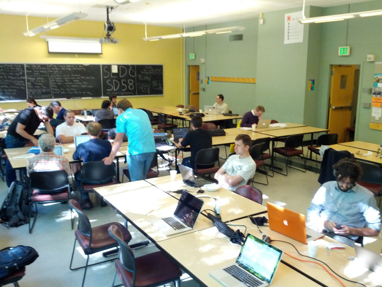
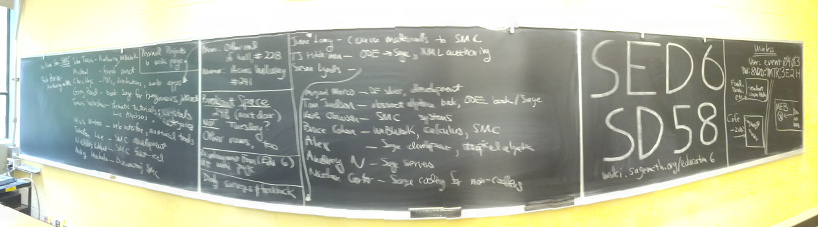

# Sage Education Days 6

The Sixth <a class="http" href="http://www.sagemath.org">Sage</a> Education Days will be held in conjunction with <a href="/days58">Sage Days 58</a>, Sage on the Web, at the University of Washington in Seattle, June 16-18, 2014. 

Funded by the National Science Foundation Division of Undergraduate Education. 

<a href="/education6/projects">Projects</a> 

[[_TOC_]] 


## Schedule

This schedule is tentative, preliminary and evolving.  We are leaving plenty of time in the afternoons and evenings for small working groups that will organize at the conference to get things done. 
  |  Topic  |  Speaker  |  Links 
  |   |   |  
  |        |   |  
            |  Homework      |   |  <a class="https" href="https://www.surveymonkey.com/s/SageEduDays2014Pre">Pre-Survey</a> 
  |   |   |   
 Monday   |  June 16      |   |  
  9:30 AM    |  Introductions  |                         |    <a class="http" href="http://youtu.be/3ODSS_5bBA8">http://youtu.be/3ODSS_5bBA8</a> 
  11:00 AM   |  State of the SageMathCloud  |  William Stein  |  <a class="https" href="https://cloud.sagemath.com/">SageMathCloud</a>, <a href="education6/stein-smc.pdf">stein-smc.pdf</a>  <a class="http" href="http://youtu.be/dctYHEb-daU">video (part 1 of 2)</a>   <a class="http" href="http://youtu.be/wqLPCmgnkh0">(part 2 or 2)</a>   
  Noon       |  2014 Spies Sage Development Prize  |  William Stein  |   <a class="http" href="http://www.sagemath.org/development-prize.html">Annual Spies Sage Development Prize</a> 
  Afternoon  |  Working Groups  |                         |    
  4:00 PM    |  Status Reports   |                         |  <a class="http" href="http://youtu.be/7Cij7OA9n3I">part 1</a>   <a class="http" href="http://youtu.be/WCM_6zvPlY4">part 2</a>  
  5:00 PM    |  Ten-minute survey  |                         |   <a class="https" href="https://www.surveymonkey.com/s/SageEduDays2014Mon">Daily Survey</a>
  |   |   |   
 Tuesday   |  June 17      |   |  
  9:30 AM      |  MathBook XML   |   Rob Beezer            |  <a class="http" href="http://mathbook.pugetsound.edu">MathBook XML</a> <a class="http" href="http://youtu.be/1Kw359-d2Uw">video part 1/2</a>  <a class="http" href="http://youtu.be/GrO3DvC3VLs">video part 2/2</a>  <a class="http" href="http://buzzard.ups.edu/talks/beezer-2014-sage-edu-days-6/sed-6-talk.html">HTML</a> <a class="http" href="http://buzzard.ups.edu/talks/beezer-2014-sage-edu-days-6.pdf">PDF</a>
 10:45 AM      |  Hashdist    |  Chris Kees  |  <a class="http" href="http://youtu.be/no4MyXn4Uik">video part 1/2</a>   <a class="http" href="http://youtu.be/5w_UpX3nhX4">video part 2/2</a> 
 11:15 AM      |  IPython Interactive Widgets   |  Kevin Winters  |  <a class="http" href="http://youtu.be/AntjkbXv1bA">video</a> 
  1:30 PM  |  <a href="/education6/discussion">Discussion: SMC Support for Courses</a>   |     William Stein                    |    
  3:00 PM  |  Informal technical discussion about bup  |  Rob Browning  |    
  Afternoon    |  Working Groups  |                         |    
  4:00 PM      |  UTMOST PI Meeting   |                         |   
  4:30 PM      |  Status Reports   |                        | <a class="http" href="http://youtu.be/ZlXK6dfpa4U">video</a>  
  5:00 PM      |  Ten-minute survey  |                         |  <a class="https" href="https://www.surveymonkey.com/s/SageEduDays2014Tues">Daily Survey</a> 
  |   |   |   
 Wednesday   |  June 18      |   |  
  9:30 AM    |  (Approximately) What/How Students Learn Sage at SFASU  |   Jane Long             |  <a class="http" href="http://youtu.be/ogLq5TZE8Kg">video</a>   
  10:00 AM    |  No code, please  |   Nathan Carter             |  <a class="http" href="http://youtu.be/JjnDNRqItq8">video</a> If you want to see (or take over!) this project, contact Nathan directly; see contact info below.   
  Afternoon  |  Working Groups  |                         |    
  4:00 PM    |  Status Reports   |      |  <a class="http" href="http://youtu.be/hywFC4gaVps">video</a>   
  5:00 PM  |  Thirty-minute survey                        |                         |  <a class="https" href="https://www.surveymonkey.com/s/SageEduDays2014Post">Post-Survey</a> 
  |   |   |   


## Participants

To register, please add yourself alphabetically by last name.  You need to request a Trac account to be able to login to the wiki - you can do that by following the instructions at the top of the page located <a class="http" href="http://trac.sagemath.org/sage_trac">here</a>.  As a last resort, email Rob Beezer  at <a href="mailto:beezer@ups.edu">beezer@ups.edu</a> and he'll add your name (please include a relevant web link, if available). 

1. <a class="http" href="http://www.gregorybard.com">Gregory Bard</a> (University of Wisconsin---Stout) 
1. <a class="http" href="http://buzzard.ups.edu">Rob Beezer</a> (University of Puget Sound) 
1. <a class="http" href="http://web.bentley.edu/empl/c/ncarter/">Nathan Carter</a> (Bentley University) 
1. <a class="http" href="http://tetrahedra.net/">Bruce Cohen</a> (Lowell High School, San Francisco) 
1. <a class="http" href="http://www.math.umanitoba.ca/people/faculty.php?id=Michael_Doob">Michael Doob</a> (University of Manitoba, Canada) -- unable to attend, 2014/06/12 
1. <a class="http" href="http://www.uni.edu/theron">TJ Hitchman</a> (University of Northern Iowa) 
1. <a class="http" href="http://faculty.sfasu.edu/judsontw/">Tom Judson</a> (Stephen F Austin State University, Texas) 
1. Chris Kees (Coastal and Hydraulics Laboratory, US Army ERDC) 
1. <a class="http" href="http://kskedlaya.org">Kiran Kedlaya</a> (University of California, San Diego) 
1. <a class="http" href="http://faculty.washington.edu/rjl/">Randy LeVeque</a> (University of Washington) 
1. <a class="http" href="http://www.math.washington.edu/~lieblich">Max Lieblich</a> (University of Washington, Seattle) 
1. <a class="http" href="http://www.faculty.sfasu.edu/longjh/">Jane Long</a> (Stephen F Austin State University, Texas) 
1. <a class="http" href="http://cires.colorado.edu/education/outreach/workwithus.html">Susan Lynds</a> (University of Colorado) 
1. <a class="http" href="http://riemann.unizar.es/~mmarco/">Miguel Marco</a> (Leibniz Universität Hannover) 
1. Alex Nowak (Bates College) 
1. <a class="http" href="http://www.csudh.edu/math/wpong/">Wai Yan Pong</a> (California State University Dominguez Hills) 
1. Travis Scrimshaw (University of California Davis) 
1. <a class="http" href="http://wstein.org/">William Stein</a> (University of Washington) 
1. <a class="http" href="http://math.mc.edu/travis">John Travis</a> (Mississippi College) 
1. Kevin Winters (Coastal and Hydraulics Laboratory, US Army ERDC) 
1. Michael Wise (Mississippi College) 

## Mailing Lists

* The mailing list for <a class="https" href="https://groups.google.com/forum/#!forum/sagedays58">Sage Days 58</a>,  will be used for Education Days 6 as well.  Please add yourself to this list if you are not already on it.  This will be the primary/only vehicle for announcements before and during the workshop, and last-minute changes during the week. 
* There is also a list specifically for discussing <a class="http" href="http://groups.google.com/group/sage-edu">education and Sage</a>. 

## Organizers

* Rob Beezer <a class="http" href="http://buzzard.ups.edu">http://buzzard.ups.edu</a> 
* Tom Judson <a class="http" href="http://faculty.sfasu.edu/judsontw/">http://faculty.sfasu.edu/judsontw/</a> 
* William Stein <a class="http" href="http://wstein.org/">http://wstein.org/</a> 

## Logistics

* At the <a class="http" href="http://www.washington.edu">University of Washington</a> Seattle campus (on the west coast of the US, not Washington, DC). 
* This <a href="/uw-local-info">local information page</a> could be helpful but **has not been reviewed** lately for accuracy, so double-check anything critical. 
* The airport code for Seattle-Tacoma International Airport is SEA. 
* June 16, 17 and 18 will be full days.  So plan to travel on June 15 and June 19. 
* If you are attending the IBL Conference in Denver, TJ Hitchman suggests Alaska Airlines 860, which departs at 8:25 PM, Wednesday, June 18. 
* All activities will take place in the <a class="http" href="http://www.washington.edu/maps/#!/meb">Mechanical Engineering Building, MEB</a>.  <a class="http" href="http://www.css.washington.edu/room/MEB+238">MEB 238</a> will be used for presentations and <a class="http" href="http://www.css.washington.edu/room/MEB+246">MEB 246</a> will be used as a workspace.  We also have <a class="http" href="http://www.css.washington.edu/room/MEB+248">MEB 248</a>, for every day but Tuesday, as overflow or breakout workspace. 
* <a href="education6/Sage-Edu-Days-6-reimbursement.pdf">Reimbursement Form</a> for participants at Sage Edu Days 6 whose travel was approved in advance for funding.  Please help us by submitting these **as soon as possible,** since our grant ends **very soon.** 

## Pictures
 
 Working Groups 
 
 Logistics 


## Lodging

* We have a block of rooms reserved at <a class="http" href="http://www.hoteldeca.com/">Hotel Deca</a> right at the NW corner of campus and in the heart of the business dostrict close to the University.  Information for making a reservation is: 
      * Reservations are to be made by each individual calling the hotel directly at 1.800.899.0251 between the hours of 8a.m. – 7p.m. Monday through Friday and 10 a.m. – 4p.m. on Saturday and Sunday, or by faxing reservations to 1.206.545.2103, or emailing requests to <a href="mailto:reservations@hoteldeca.com">reservations@hoteldeca.com</a>.  To guarantee rate and room type, please ensure the name of the group, arrival date, and any other information needed is given at the time of reservation.    
      * Your Group Names is: SAGE Days 
      * Your first date of arrival is: 06/16/2014 (this should be 6/15/2014) 
      * Your last date of departure is: 06/19/2014 
      * Your group rate of \$179.00  is valid for 3 days pre / post contracted dates. (Reimbursment maximum is \$152 on federal grant money.) 
      * Your guests have until 05/16/2014 to make reservations for this group. 
* We plan to have some rooms at <a class="http" href="http://www.uwmedicine.org/patient-resources/lodging/collegiana">The Collegianna</a>, but they cannot confirm those until we are closer to the event. 
* (2014/04/16) More lodging information will be coming soon. 

## UW Campus Wireless


```txt
UW NetID:   event0403    
Password:   8V2D:9M7R:3E2H
```

## Previous Sage Education Days

* <a href="/education1">Sage Education Day  1 (December 5, 2009)</a> 
* <a href="/education2">Sage Education Day  2 (February 24, 2010)</a> (and <a href="/education2fr">in French</a>) 
* <a href="/education3">Sage Education Days 3 (June 16-18, 2011)</a> 
* <a href="/education4">Sage Education Days 4 (June 13-15, 2012)</a> 
* <a href="/education5">Sage Education Days 5 (June 19-21, 2013)</a> 

<div style="display:none">
LOTS OF OLD STUFF COMMENTED OUT, WILL RETURN IN EDITED, UPDATED FORM 

Campus location:  We have <a class="http" href="http://www.css.washington.edu/room/MEB+246">MEB 246</a> and <a class="http" href="http://www.css.washington.edu/room/MEB+248">MEB 248</a> reserved in the <a class="http" href="http://www.washington.edu/students/maps/map.cgi?MEB">Mechanical Engineering Building</a> for the week's events. 

<a href="/days48">Sage Days 48</a> will happen the same week at the University of Washington with the Notebook Development as its theme. 

**Be sure to buy your plane ticket on a US carrier.** 

See the <a href="/uw-local-info">local information page</a> for more specifics. 
</div>

<div style="display:none">

## Pictures

<a class="https" href="https://plus.google.com/photos/115360165819500279592/albums/5892087641640203729">William Stein (roll 2)</a> 

<a class="https" href="https://plus.google.com/photos/115360165819500279592/albums/5891333630845429009">William Stein (roll 1)</a> 

<a href="education6/WednesdayGroupSansTravis.jpg">WednesdayGroupSansTravis.jpg</a> 


## Schedule

This schedule is tentative and may change.  We are leaving plenty of time in the afternoons and evenings for small working groups that will organize at the conference to get things done. 
  |  Topic  |  Speaker  |  Links 
  |   |   |  
 Wednesday   |  June 19      |   |  
  9:30 AM    |  Introductions |                         |  <a class="http" href="http://youtu.be/rr04pB9ugfg">video</a>  
 20min  |  Sage Cell Server  |  Jason Grout   |  <a class="http" href="http://youtu.be/sBs7tBGTsZE">video</a>, <a class="http" href="http://sagecell.sagemath.org/static/amsjointslides-2013/index.html">Slides</a>, <a class="https" href="https://sagecell.sagemath.org">Sage Cell server</a>
 20min  |  Using Sage cell to create an online text  |  Karl-Dieter Crisman  |  <a class="http" href="http://youtu.be/NlbfIJmdvUc">video</a>, <a href="education6/MyDemo.html">The live-created demo webpage</a> <a href="education6/MyTalk.rtf">Cribsheet for the talk</a>, <a class="http" href="http://www.math-cs.gordon.edu/~kcrisman/mat338/">Number Theory Notes created with Sage cell</a>
 20min  |  Sage Cloud  |  William Stein |  <a class="http" href="http://youtu.be/_vmJiZ-I7Kc">video</a>, <a class="https" href="https://github.com/williamstein/sd48/blob/master/edu-days-talk.sagews">Slides</a> 
  afternoon  |  Working groups   |                         |   
  4:40 PM    |  Status Reports   |                         |   
  5:00 PM    |  Ten-minute survey  |                         |  <a class="https" href="https://www.surveymonkey.com/s/SageDays2013Wednesday">Wed Survey</a> 
  |   |   |   
 Thursday    |  June 20      |   |  
 9:30 AM  |  Announcements     |     |   
 20min  |  Publishing with XML  |  Rob Beezer          |   <a class="http" href="http://buzzard.ups.edu/talks/beezer-2013-sage-edu-5-publish.pdf">Slides</a>, <a class="http" href="http://youtu.be/2CbfOU_k110">video</a> 
 20min  |  Sage Widgets for Teaching Calculus     |    Jeff Denny           |   <a href="education6/SageEduDennytalk.pdf">Slides</a>, <a class="http" href="http://youtu.be/Ln3ciImMBc0">video</a>,<a class="http" href="http://sagewidgets.pbworks.com">http://sagewidgets.pbworks.com</a> 
 20min  |  Sage in Calculus    |    Brian Beavers           |   <a class="http" href="http://youtu.be/WlmcHazG8bA">video</a> 
 20min  |  Sage in class: MV calc. & hyp. arrangements  |  David Perkinson  |  <a class="http" href="http://youtu.be/rwT_j0IOQNU">video</a>, <a href="education6/PerkinsonSageEdu5.pdf">Slides</a>, <a href="education6/hyperplane.sage">hyperplane.sage</a> 
 20min  |  Sage for undergrads via interacts and worksheets, Running own cell and notebook servers  |  Andrey Novoseltsev   |  <a class="http" href="http://youtu.be/R5pb9kIBQEA">video</a> 
  afternoon  |  Working groups                          |                         |   
  1:00 PM  |  Introduction to interacts                  |   Jason Grout         |  <a href="education6/InteractQuickstart.sws">Sage worksheet</a> 
  2:00 PM  |  Classrooms in the Cloud                  |           |   
  3:00 PM  |  Discussion: Sage Book Series                         |                         |   
  4:40 PM  |  Status Reports                         |                         |   
  5:00 PM  |  Ten-minute survey                        |                         |  <a class="https" href="https://www.surveymonkey.com/s/SageDays2013Thursday">Thu Survey</a> 
  |   |   |   
 Friday      |  June 21      |   |  
  9:30 AM   |  Announcements  |   |   
 20min  |  Cryptography    |  Chris Davis   |  <a class="https" href="https://eee.uci.edu/13s/45070/shiftcipher.html">Shift ex</a>, <a class="https" href="https://eee.uci.edu/13s/45070/subcipher.html">Sub ex</a>, <a href="education6/DavisSlides.pdf">Slides</a>, <a class="http" href="http://youtu.be/n61BNVCuTgM">video</a> 
 20min  |  Math. Finance     |  Gregory Bard  |  <a class="http" href="http://youtu.be/pwECZKcMl0A">video</a> 
 15min  |  Abstract Algebra  |  Barry Balof  |   <a href="education6/SAGETalk-Balof.pdf">Slides</a>, <a class="http" href="http://youtu.be/34-zjidNfQU">video</a>
 30min  |  Webwork  |   |  <a class="https" href="https://testcourses.webwork.maa.org/webwork2/PREP13_Problem_Authoring/Sage_Applets/">Slides</a> | <a class="http" href="http://youtu.be/upHtI52wVUg">video</a> 
 30min  |  SALG Surveys  |  Susan Lynds  |  <a href="education6/SALG_MSageInstrument.pptx">PowerPoint</a> <a class="http" href="http://www.salgsite.org/">SALG Website</a> <a href="education6/SALG_M_Invitation.pdf">SALG Invitation</a> <a href="education6/SageSALG_MDirections.pdf">SALG Directions</a>
  afternoon  |  Working groups                          |                         |   
  2:30 PM  |  UTMOST PI Meeting                         |                         |   
  4:20 PM  |  Status Reports                         |      <a class="http" href="http://youtu.be/H4hs-NxcPHg">video</a>                   |   
  5:00 PM  |  Thirty-minute survey                        |                         |  <a class="https" href="https://www.surveymonkey.com/s/SageDaysPostWorkshopSurvey2013">Fri WrapUp Survey</a> 
  |   |   |   


## Blog Roll

<a class="http" href="http://www.beezers.org/blog/bb/">Rob Beezer</a> 

<a class="http" href="http://mathematicseducationissues.blogspot.com/">Tom Judson</a> 

<a class="http" href="http://sagemath.blogspot.com/">Wiliam Stein</a> 


## Resources

Barry Balof's Combinatorics Quickref  <a href="education6/CombinatoricsReference.pdf">PDF</a>  <a href="education6/CombinatoricsReference.tex">tex</a> 


## Lodging

Arrangements for rooms at <a class="http" href="http://www.hoteldeca.com/">Hotel Deca</a> have been made.  Please see the <a href="/days48/travel">travel page</a> for exact details on reserving a room at a special rate. 


## Homework

 Please complete, by May 31, the pre-event <a class="https" href="https://www.surveymonkey.com/s/SageDaysPreWorkshopSurvey2013">survey</a>, which is part of the grant funding this event. 
 Please add a description of projects you plan to work on to the section below. 

## IRC

There is an IRC channel for sage days: #sagemath-days on irc.freenode.net. Feel free to join to discuss whatever...   For those without IRC clients, <a href="http://webchat.freenode.net/?channels=sagemath,sagemath-days">http://webchat.freenode.net/?channels=sagemath,sagemath-days</a> 


## Projects

Sage Days typically allow a great deal of unstructured time to work on projects, either in groups or with the assistance of experts that are available.  Please plan to have a project to work on.  Examples could be: 
Learning a new area of Sage in preparation for teaching a course. Preparing worksheets for a course. Learning how to create interacts for the Sage library. Learning how to contribute new code to Sage. 

### Jason Aubrey, Mike Gage, John Travis
Finishing at least one of the SAGE-WeBWorK bridges; hopefully the one that allows webwork problem authors to include SAGE code in webwork problems for computations and other fun.  

### Greg Bard
Making videos suitable for 100-level students to use SAGE in calculus, finite math, statistics, linear algebra, etc... (even precalculus?) 

### Rob Beezer
Keep workshop organized 
Document my finitely-generated abelian groups patch <a href="/education6#A9773">http://trac.sagemath.org/sage_trac/ticket/9773</a> 

Generate a killer worksheet for <a class="http" href="http://cloud.sagemath.org/">Salvus</a> from XML source 


### Chris Davis

Organize and polish the cryptography labs that I used this past year.  A preliminary writeup is <a class="http" href="http://math.uci.edu/~davis/Fall2012Labs.pdf">here</a> and preliminary code is <a class="http" href="http://math.uci.edu/~davis/Fall2012Code.sage">here</a>. 
Learn how others use Sage in education.  For example, I've seen a Sage Notebook Worksheet that included instructions between the text cells; I did not know this was possible, and would like to learn how to produce such a worksheet myself. 

### Martin Flashman
Work on a project for visualizing functions using mapping diagrams (aka dynagraphs) for a teaching resource on the subject for beginning algebra through calculus using SAGE. Work with others on how to make these visualizations easy to create making it part of a SAGE toolbox/workspace/workbook. 
Learn how to embed SAGE in other materials- especially for my on-line calculus book. <a class="http" href="http://users.humboldt.edu/flashman/senscalca_x.html">(The Sensible Calculus Book)</a> 
** If you go to my page for The Sensible Calculus Book you will find how I've added SAGE to this page- with interacts for graphs, direction fields and Euler's Method for DE's as well as one of the mapping diagram interacts I am developing from the assistance of Jeff Denny, Jason Grout, and others. I would like feedback on this if you have suggestions- I have currently hidden the code from the users using the interact buttons. IS it better to show the code? 
ALSO- I have a new demo of using Geogebra on the same page to do similar  things with graphs and mapping diagrams dynamically. Is there some way to have Geogebra and SAGE interact? 


### Jim Fowler

Work on using Sage serverside (instead of my javascript CAS clientside) for the online homework system for <a class="http" href="http://mooculus.osu.edu/">MOOCulus</a> as well as in-person calculus courses 


### David Guichard
Work on material for a combinatorics and graph theory course. 

### Andrey Novoseltsev

Figure out the best way for public posting of Sage applets like <a class="http" href="http://www.math.ualberta.ca/~novoseltsev/2013Winter215Q1/MI06_three_iterated_integrals_public.html">Three Iterated Integrals</a> or <a class="http" href="http://www.math.ualberta.ca/~novoseltsev/2013Winter215Q1/VC01_vector_fields_public.html">Vector Field Plotter</a> Meanwhile here are all the applets I made so far: <a href="education6/MV-Calculus-Interacts.zip">MV-Calculus-Interacts.zip</a> 

Work on issues preventing these applets from working within Sage notebook, e.g. <a class="http" href="http://trac.sagemath.org/sage_trac/ticket/14020">#14020 Broken layout</a> 

Figure out the best way for public posting of Sage worksheets using "modules for teaching" like <a class="http" href="http://trac.sagemath.org/sage_trac/ticket/14288">#14288 Interactive Simplex Method</a> 


### David Perkinson
Work on a Sage package for hyperplane arrangements. 

### S Singleton

Develop new worksheets that complement current <a class="http" href="http://www.pogil.org/resources/curriculum-materials">POGIL curriculum materials</a> 
See if a physical chemistry course with "no calculus by hand" is feasible (traditional approaches involving multivariable calculus is problematic for some students). Utilize @interacts for exploratory worksheets. 

### William Stein

Work on my free open Sage book: <a href="http://code.google.com/p/sage-power-book/">http://code.google.com/p/sage-power-book/</a> 


### Karl-Dieter Crisman

Work on cleaning up HTML and organization etc. for my <a class="http" href="http://www.math.gordon.edu/~kcrisman/mat338">number theory book</a> 
Develop resources for people wanting to make Sage-enabled lecture notes? Review tons of tickets More stuff? 

### Jeff Denny
Create collection of Sage widgets for teaching calculus 
Build these into a database similar to the one at <a href="http://sagemath.org/eval.html">http://sagemath.org/eval.html</a> 


### TJ Hitchman
Work on linear algebra IBL course notes using Sage Make short "intro to cloud.sagemath.com" for students learn about sage development process 

### Glenn Henshaw
Design interactives for planar lattices corresponding to ideals in quadratic number fields Come up with project ideas, using sage, for a discrete math for IT class Make progress towards a planar lattice class (object) in sage. 

### Barry Balof
Investigate and build course materials for Combinatorics and Graph Theory, Multivariable Calculus, and Calculus Laboratory courses.   
<a name="pictures"></a> 
## Pictures
  
 Sage Edu Days 5, Work Room 
  
 Sage Edu Days 5, Morning Talks, Greg Bard 
  
 Wednesday Morning, sans John Travis 


## Funding

We have more travel funding than in the past (airfare and lodging, not food).  If you are involved with Sage, or allied projects, in an educational setting and have a project to work on during the workshop, send a request for funding, with details, to Rob Beezer, <a href="mailto:beezer@ups.edu">beezer@ups.edu</a>. 

Anyone with any interest in the use of Sage in educational settings is welcome, and encouraged to attend, with or without funding. 

Reimbursement form for Sage Days 5 (not Sage Days 48):  <a href="education6/Sage-Days-5-Reimbursement-Form.pdf">Sage-Days-5-Reimbursement-Form.pdf</a> 
</div>