The Cayley graph for $A_5$: 


```txt
sage: G = sage.groups.perm_gps.permgroup.AlternatingGroup(5)
sage: C = G.cayley_graph()
sage: C.show3d(bgcolor=(0,0,0), arc_color=(1,1,1), vertex_size=0.02, arc_size=0.007, arc_size2=0.01, xres=1000, yres=800, iterations=200)
```
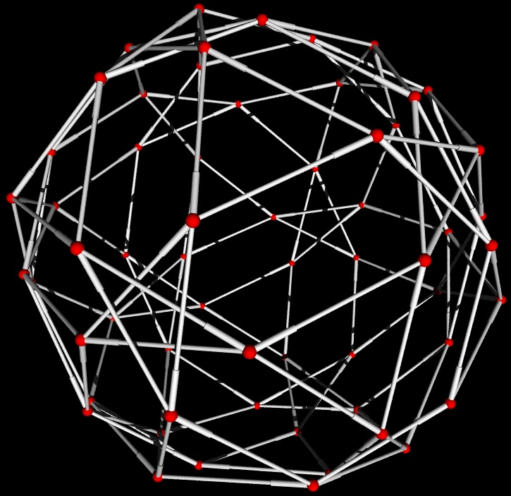 

Emily Kirkman and Robert Miller are working on this project.  <a class="http" href="http://wiki.sagemath.org/graph">Back to main wiki.</a> 

The goal of the Graph Generators Class is to implement constructors for many common graphs, as well as thorough docstrings that can be used for reference.  The graph generators will grow as the Graph Theory Project does.  So please check back for additions and feel free to leave requests in the suggestions section. 

We currently have 54 constructors of named graphs and basic structures.  Most of these graphs are constructed with a preset dictionary of x-y coordinates of each node.  This is advantageous for both style and time.  (The default graph plotting in SAGE uses the spring-layout algorithm).  SAGE graphs all have an associated graphics object, and examples of plotting options are shown on the graphs below. 

As we implement algorithms into the Graph Theory Package, the constructors of known graphs would set their properties upon instantiation as well.  For example, if someone created a very large complete bipartite graph and then asked if it is a bipartite graph (not currently implemented), then instead of running through an algorithm to check it, we could return a value set at instantiation.  Further, this will improve the reference use of the docstrings as we would list the properties of each named graph. 

Due to the volume of graphs now in the generators class, this wiki page is now intended to give status updates and serve as a gallery of graphs currently implemented.  To see information on a specific graph, run SAGE or the SAGE <a class="http" href="http://sage.math.washington.edu:8100">notebook</a>.  For a list of graph constructors, type "graphs." and hit tab.  For docstrings, type the graph name and one question mark (i.e.:  "graphs.CubeGraph?") then shift + enter.  For source code, do likewise with two question marks. 

[[_TOC_]] 


# Suggestions

* ??? 

# Graphs I Plan to Add


## Inherited from NetworkX

* Bipartite Generators 
* Grid (n-dim) 
* Sedgewick 
* Truncated cube 
* Truncated tetrahedron 
* Tutte 

## Families of Graphs

* Generalized Petersen graphs 
* Petersen Graph family 
* Trees (Directed – not simple.  Maybe Balanced tree constructor and query isTree) 
* Cayley (Requires Edge Coloring) 
* Paley 

## Named Graphs

* Brinkman 
* Clebsch 
* Grötzsch graph 
* Tutte eight-cage 
* Szekeres snark 
* Thomassen graph 
* Johnson (maybe own class) 
* Turan 

# Gallery of Graph Generators in SAGE


## Named Graphs


### Chvatal Graph


```txt
sage: (graphs.ChvatalGraph()).show(figsize=[4,4], graph_border=True)
```
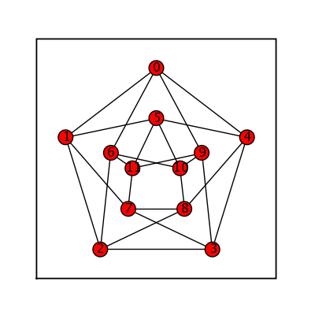 


### Desargues Graph


```txt
sage: (graphs.DesarguesGraph()).show(figsize=[4,4], graph_border=True)
```
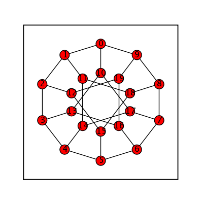 


### Flower Snark


```txt
sage: flower_snark = graphs.FlowerSnark()
sage: flower_snark.set_boundary([15,16,17,18,19])
sage: flower_snark.show(figsize=[4,4], graph_border=True)
```
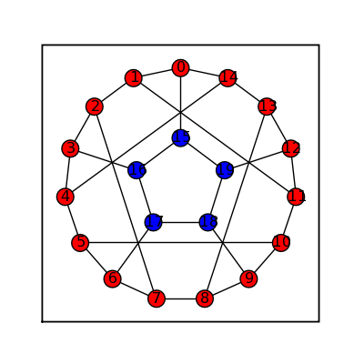 


### Frucht


```txt
sage: frucht = graphs.FruchtGraph()
sage: frucht.show(figsize=[4,4], graph_border=True)
```
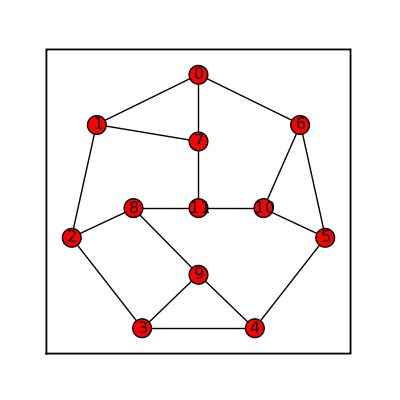 


### Heawood


```txt
sage: heawood = graphs.HeawoodGraph()
sage: heawood.show(figsize=[4,4], graph_border=True)
```
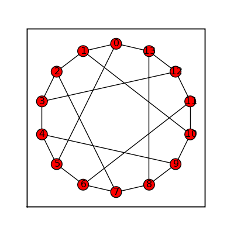 


### Möbius Kantor


```txt
sage: moebius_kantor = graphs.MoebiusKantorGraph()
sage: moebius_kantor.show(figsize=[4,4], graph_border=True)
```
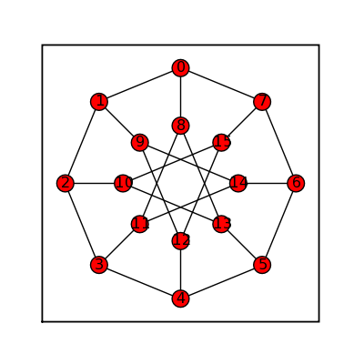 


### Pappus Graph


```txt
sage: (graphs.PappusGraph()).show(figsize=[4,4], graph_border=True)
```
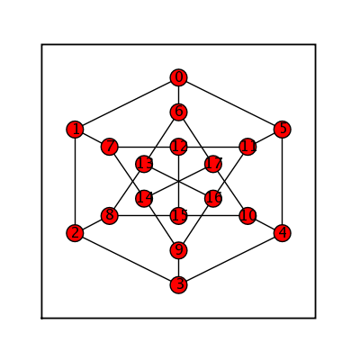 


### Petersen


```txt
sage: petersen = graphs.PetersenGraph()
sage: petersen.show(figsize=[4,4], graph_border=True)
```
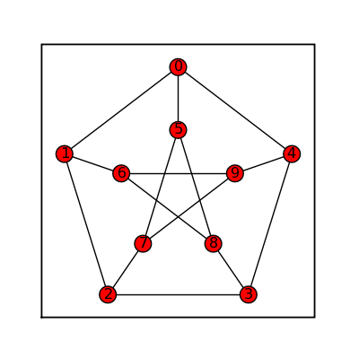 


### Thomsen


```txt
sage: thomsen = graphs.ThomsenGraph()
sage: thomsen.show(figsize=[4,4], graph_border=True)
```
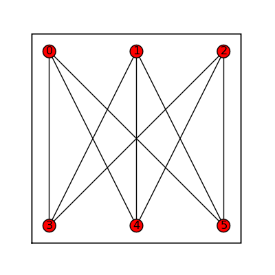 


## Graph Families


### Complete Bipartite Graphs


```txt
sage: comp_bip_list = []
sage: for i in range (2):
... for j in range (4):
...  comp_bip_list.append(graphs.CompleteBipartiteGraph(i+3,j+1))
...
sage: graphs_list.show_graphs(comp_bip_list)
```
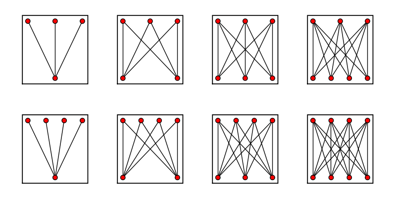 


### Complete Graphs


```txt
sage: comp_list = []
sage: for i in range(13)[1:]:
... comp_list.append(graphs.CompleteGraph(i))
...
sage: graphs_list.show_graphs(comp_list)
```
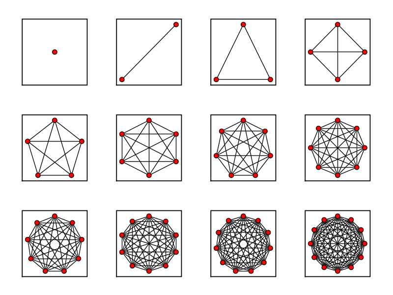 


### Cube Graphs


```txt
sage: cube_list = []
sage: for i in range(6)[2:]:
... cube_list.append(graphs.CubeGraph(i))
...
sage: graphs_list.show_graphs(cube_list)
```
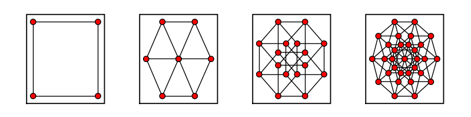 


```txt
sage: bigger_cube = graphs.CubeGraph(8)
sage: bigger_cube.show(figsize=[8,8], node_size=20, vertex_labels=False, graph_border=True)
```
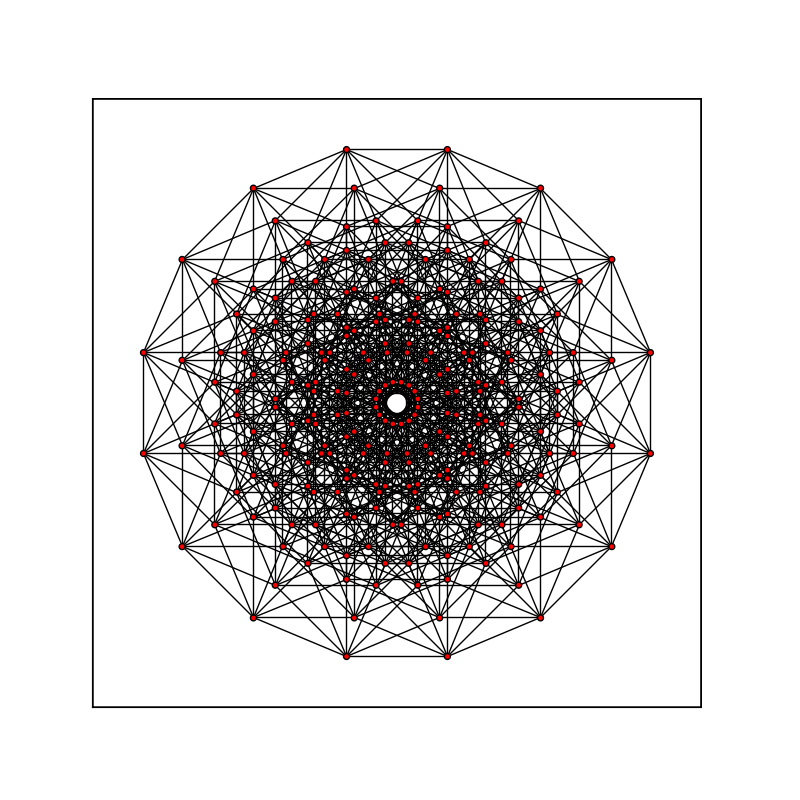 


### Balanced Tree


```txt
sage: (graphs.BalancedTree(3,5)).show(node_size=20, vertex_labels=False, figsize=[4,4], graph_border=True)
```
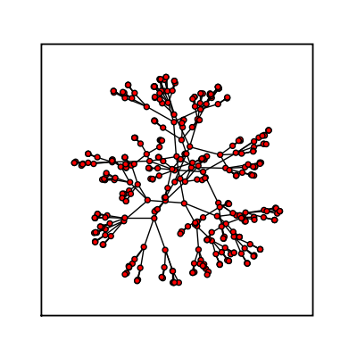 


### LCF Graph


```txt
sage: (graphs.LCFGraph(20, [-10,-7,-5,4,7,-10,-7,-4,5,7,-10,-7,6,-5,7,-10,-7,5,-6,7], 1)).show(figsize=[4,4], graph_border=True)
```
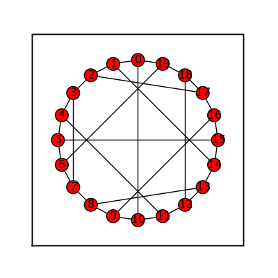 


## Platonic Solids


### Tetrahedral Graph


```txt
sage: tetrahedral = graphs.TetrahedralGraph()
sage: tetrahedral.show(figsize=[4,4], graph_border=True)
```
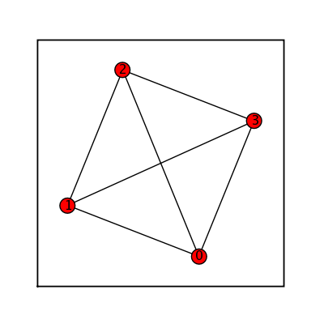 


### Hexahedral Graph


```txt
sage: (graphs.HexahedralGraph()).show(figsize=[4,4], graph_border=True)
```
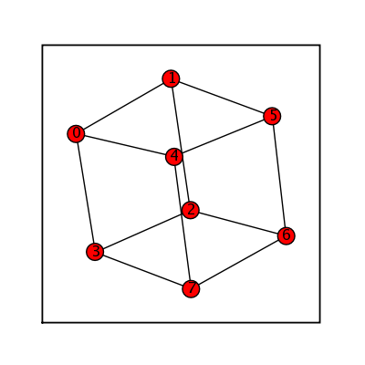 


### Octahedral Graph


```txt
sage: octahedral = graphs.OctahedralGraph()
sage: octahedral.show(figsize=[4,4], vertex_labels=False, node_size=50, graph_border=True)
```
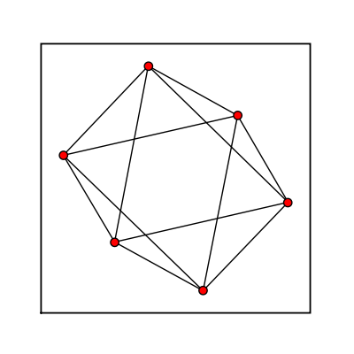 


### Icosahedral Graph


```txt
sage: (graphs.IcosahedralGraph()).show(figsize=[4,4], graph_border=True)
```
 


### Dodecahedral Graph


```txt
sage: dodecahedral = graphs.DodecahedralGraph()
sage: dodecahedral.show(figsize=[4,4], vertex_labels=False, node_size=50, graph_border=True)
```
 


## Pseudofractal Graphs


### Dorogovtsev Goltsev Mendes Graph


```txt
sage: (graphs.DorogovtsevGoltsevMendesGraph(5)).show(figsize=[4,4], graph_border=True, vertex_size=10, vertex_labels=False)
```
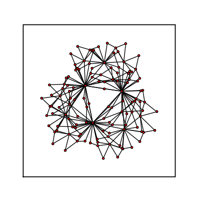 


## Basic Structures


### Barbell Graph


```txt
sage: barbell_list = []
sage: for i in range (4):
... for j in range (2):
...  barbell_list.append(graphs.BarbellGraph(i+3, j+2))
...
sage: graphs_list.show_graphs(barbell_list)
```
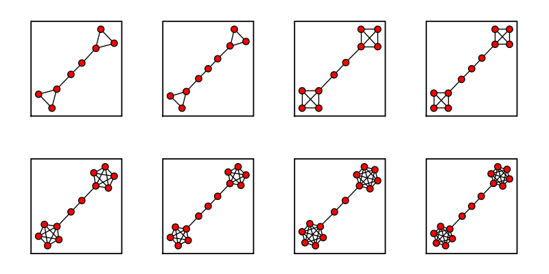 


### Bull Graph


```txt
sage: bull = graphs.BullGraph()
sage: bull.show(figsize=[4,4], graph_border=True)
```
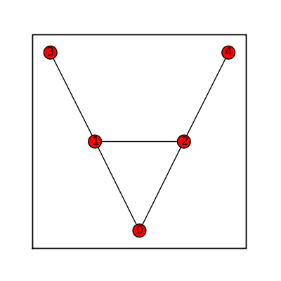 


### Circular Ladder Graph


```txt
sage: circ_ladder = graphs.CircularLadderGraph(9)
sage: circ_ladder.show(figsize=[4,4], graph_border=True)
```
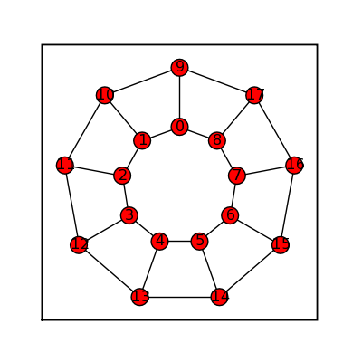 


### Claw Graph


```txt
sage: claw = graphs.ClawGraph()
sage: claw.show(figsize=[4,4], graph_border=True)
```
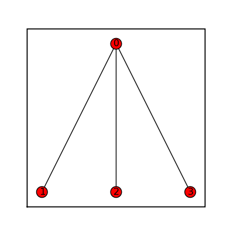 


### Cycle Graphs


```txt
sage: cycle = graphs.CycleGraph(17)
sage: cycle.show(figsize=[4,4], graph_border=True)
```
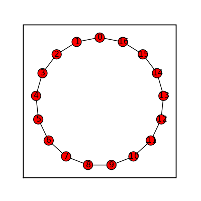 


### Diamond Graph


```txt
sage: diamond = graphs.DiamondGraph()
sage: diamond.show(figsize=[4,4], graph_border=True)
```
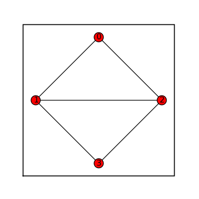 


### Empty Graph


```txt
sage: empty = graphs.EmptyGraph()
sage: empty.show(figsize=[1,1], graph_border=True)
```
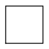 


### Grid 2d Graph


```txt
sage: grid = graphs.Grid2dGraph(3,5)
sage: grid.show(figsize=[5,3])
```
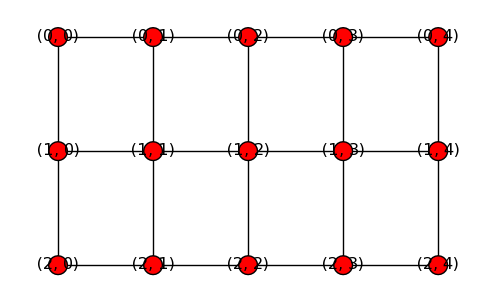 


### House Graph


```txt
sage: house = graphs.HouseGraph()
sage: house.show(figsize=[4,4], graph_border=True)
```
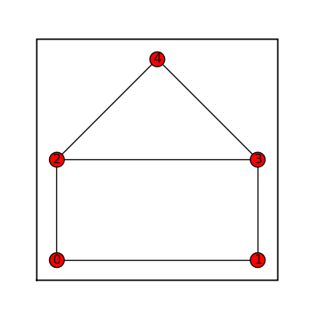 


### House X Graph


```txt
sage: houseX = graphs.HouseXGraph()
sage: houseX.show(figsize=[4,4], graph_border=True)
```
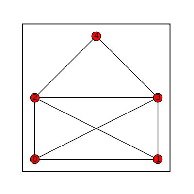 


### Krackhardt Kite Graph


```txt
sage: krackhardt = graphs.KrackhardtKiteGraph()
sage: krackhardt.show(figsize=[4,4], graph_border=True)
```
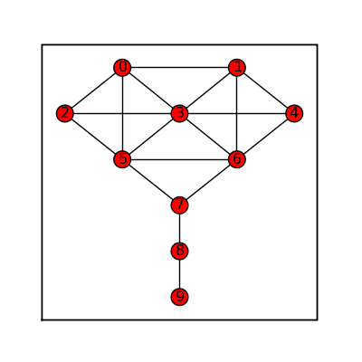 


### Ladder Graph


```txt
sage: ladder = graphs.LadderGraph(5)
sage: ladder.show(figsize=[4,4], graph_border=True)
```
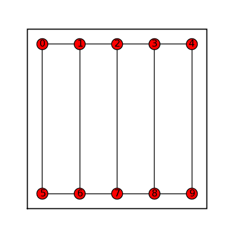 


### Lollipop Graph


```txt
sage: lollipop_list = []
sage: for i in range (4):
... for j in range (2):
...  lollipop_list.append(graphs.LollipopGraph(i+3, j+2))
...
sage: graphs_list.show_graphs(lollipop_list)
```
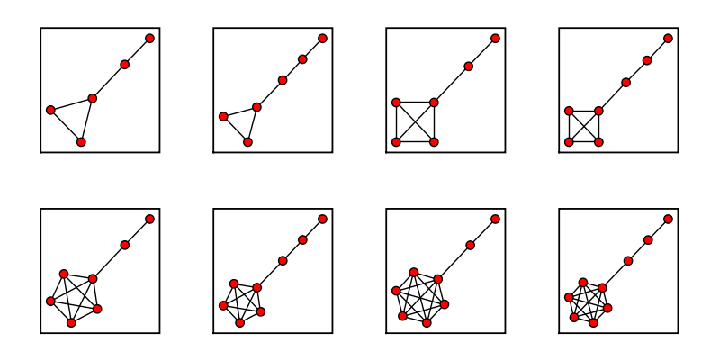 


### Path Graph


```txt
sage: path_line = graphs.PathGraph(5)
sage: path_circle = graphs.PathGraph(15)
sage: path_maze = graphs.PathGraph(45)
sage: path_list = [path_line, path_circle, path_maze]
sage: graphs_list.show_graphs(path_list)
```
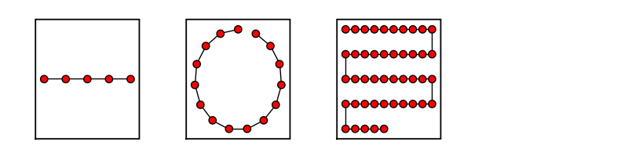 


### Star Graph


```txt
sage: star_list = []
sage: for i in range (12)[4:]:
... star_list.append(graphs.StarGraph(i))
...
sage: graphs_list.show_graphs(star_list)
```
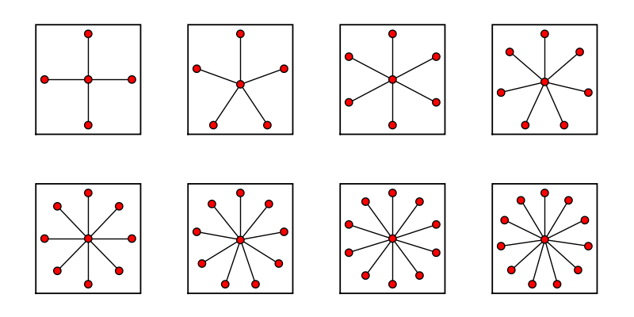 


### Wheel Graph


```txt
sage: wheel_list = []
sage: for i in range (12)[4:]:
... wheel_list.append(graphs.WheelGraph(i))
...
sage: graphs_list.show_graphs(wheel_list)
```
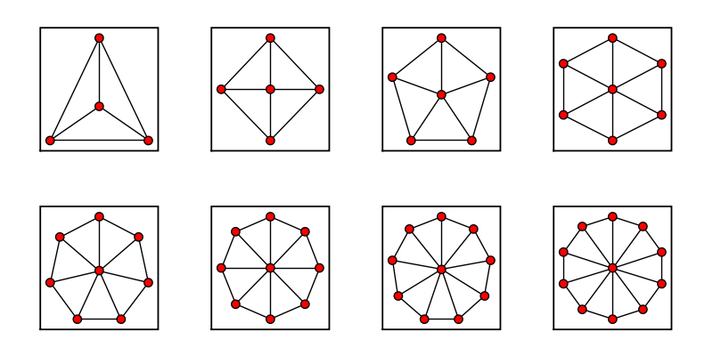 


## Random Generators


### Random GNP

Use for dense graphs: 
```txt
time
sage: (graphs.RandomGNP(16,.77)).show(figsize=[4,4], graph_border=True)
```
My results: CPU time: 0.74 s,  Wall time: 0.73 s 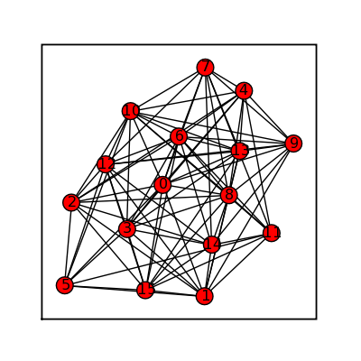 


### Random GNP Fast

Use for sparse graphs: 
```txt
time
sage: (graphs.RandomGNPFast(16,.19)).show(figsize=[4,4], graph_border=True)
```
My results: CPU time: 0.63 s,  Wall time: 0.62 s 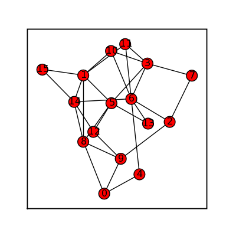 


### Random Barabasi Albert


```txt
sage: (graphs.RandomBarabasiAlbert(7,3)).show(figsize=[4,4], graph_border=True)
```
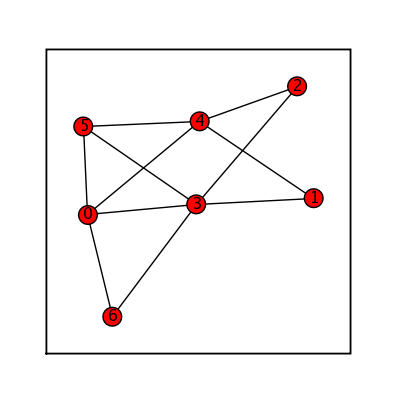 


### Random GNM


```txt
sage: (graphs.RandomGNM(7,16)).show(figsize=[4,4], graph_border=True)
```
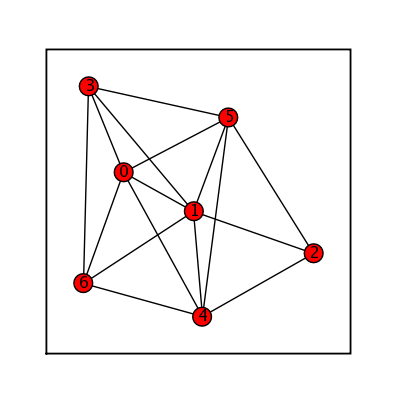 


### Random Newman Watts Strogatz


```txt
sage: (graphs.RandomNewmanWattsStrogatz(7,3,.5)).show(figsize=[4,4], graph_border=True)
```
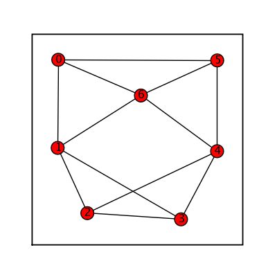 


### Random Holme Kim


```txt
sage: (graphs.RandomHolmeKim(12,3,.4)).show(figsize=[4,4], graph_border=True)
```
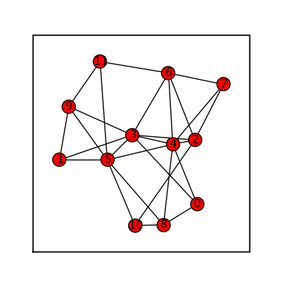 


### Random Lobster


```txt
sage: (graphs.RandomHolmeKim(12,3,.4)).show(figsize=[4,4], graph_border=True)
```
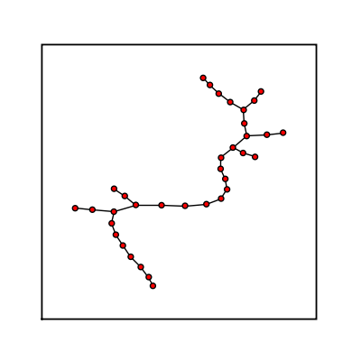 


### Random Tree Powerlaw


```txt
sage: (graphs.RandomTreePowerlaw(15)).show(figsize=[4,4], graph_border=True)
```
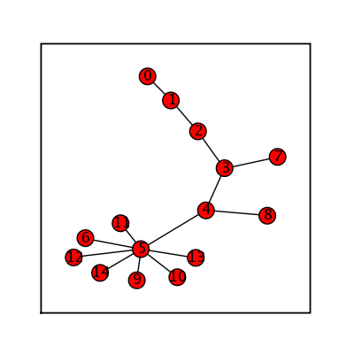 


### Random Regular


```txt
sage: (graphs.RandomRegular(3,20)).show(node_size=20, vertex_labels=False, figsize=[4,4], graph_border=True)
```
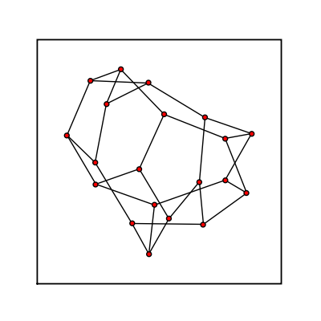 


### Random Shell


```txt
sage: (graphs.RandomShell([(10,20,0.8),(20,40,0.8)])).show(node_size=20, vertex_labels=False, figsize=[4,4], graph_border=True)
```
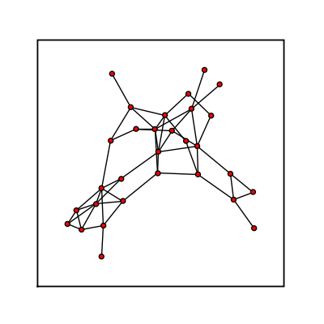 


## Random Directed Graphs


### Random Directed GN


```txt
sage: (graphs.RandomDirectedGN(12)).show(node_size=20, vertex_labels=False, figsize=[4,4], graph_border=True)
```
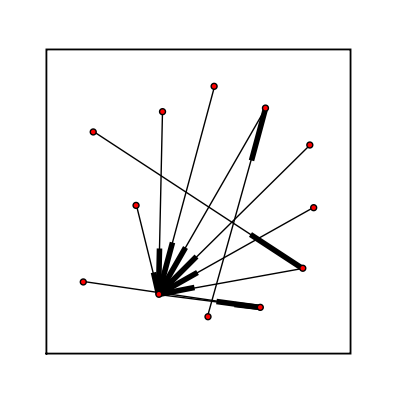 


### Random Directed GNC


```txt
sage: (graphs.RandomDirectedGNC(12)).show(node_size=20, vertex_labels=False, figsize=[4,4], graph_border=True)
```
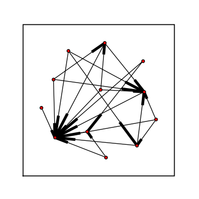 


### Random Directed GNR


```txt
sage: (graphs.RandomDirectedGNR(12,.15)).show(node_size=20, vertex_labels=False, figsize=[4,4], graph_border=True)
```
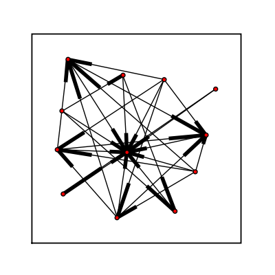 


## Graphs With a Given Degree Sequence


### Degree Sequence


```txt
sage: (graphs.DegreeSequence([3,3,3,3,3,3,3,3,3,3,3,3,3,3,3,3,3,3,3,3,3,3])).show(vertex_labels=False, node_size=30, figsize=[4,4], graph_border=True)
```
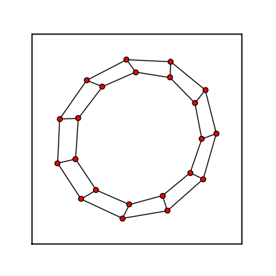 


### Degree Sequence Configuration Model


```txt
sage: (graphs.DegreeSequenceConfigurationModel([3,3,3,3,3,3,3,3,3,3,3,3,3,3,3,3,3,3,3,3])).show(vertex_labels=False, node_size=30, figsize=[4,4], graph_border=True)
```
 


### Degree Sequence Tree


```txt
sage: (graphs.DegreeSequenceTree([3,1,3,3,1,1,1,2,1])).show(figsize=[4,4], graph_border=True)
```
 


### Degree Sequence Expected


```txt
sage: (graphs.DegreeSequenceExpected([1,2,3,2,3])).show(figsize=[4,4],graph_border=True)
```
 
