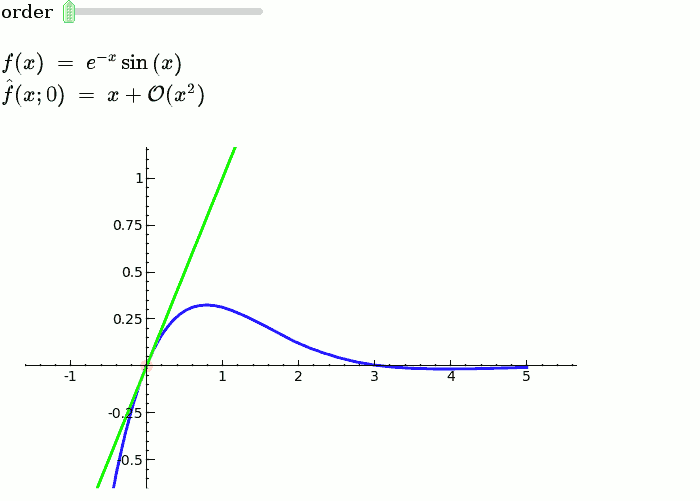

# Sage Interactions

This is a collection of pages demonstrating the use of the **interact** command in Sage. It should be easy to just scroll through and copy/paste examples into Sage notebooks. If you have suggestions on how to improve interact, add them <a href="/interact/Suggestions">here</a> or email the sage-support mailing list. Of course, your own examples are also welcome! 

Documentation links: 

   * <a class="http" href="http://doc.sagemath.org/html/en/reference/repl/sage/repl/ipython_kernel/interact.html">interacts in the Jupyter notebook</a> (see this page and the two following ones) 
   * <a class="https" href="https://github.com/sagemath/sagenb/blob/master/sagenb/notebook/interact.py">interacts in the legacy SageNB notebook</a> (many helpful examples) 
   * <a class="https" href="https://github.com/sagemath/sagecell/blob/master/interact_compatibility.py">Sage Cell Server implementation</a> 
   * <a class="https" href="https://github.com/sagemathinc/cocalc/blob/master/src/smc_sagews/smc_sagews/sage_salvus.py#L348">CoCalc Sage worksheet implementation</a> 
Examples: 

* <a href="/interact/algebra">Algebra</a> 
* <a href="/interact/bio">Bioinformatics</a> 
* <a href="/interact/calculus">Calculus</a> 
* <a href="/interact/complex">Complex Analysis</a> 
* <a href="/interact/cryptography">Cryptography</a> 
* <a href="/interact/diffeq">Differential Equations</a> 
* <a href="/interact/graphics">Drawing Graphics</a> 
* <a href="/interact/dynsys">Dynamical Systems</a> 
* <a href="/interact/fractal">Fractals</a> 
* <a href="/interact/games">Games and Diversions</a> 
* <a href="/interact/geometry">Geometry</a> 
* <a href="/interact/graph_theory">Graph Theory</a> 
* <a href="/interact/groups">Groups</a> 
* <a href="/interact/linear_algebra">Linear Algebra</a> 
* <a href="/interact/Loop%20Quantum%20Gravity">Loop Quantum Gravity</a> 
* <a href="/interact/misc">Miscellaneous</a> 
* <a href="/interact/number_theory">Number Theory</a> 
* <a href="/interact/stats">Statistics/Probability</a> 
* <a href="/interact/topology">Topology</a> 
* <a href="/interact/web">Web Applications</a> 

## Explanatory example: Taylor Series

This is the code and a mockup animation of the interact command. It defines a slider, seen on top, that can be dragged. Once dragged, it changes the value of the variable "order" and the whole block of code gets evaluated. This principle can be seen in various examples presented on the pages above! 


```sagecell
x   = SR.var('x')
x0  = 0
f   = sin(x) * e^(-x)
p   = plot(f, -1, 5, thickness=2)
dot = point((x0, f(x=x0)), pointsize=80, rgbcolor=(1, 0, 0))

@interact
def _(order=slider([1 .. 12])):
  ft = f.taylor(x, x0, order)
  pt = plot(ft, -1, 5, color='green', thickness=2)
  pretty_print(html(r'$f(x)\;=\;%s$' % latex(f)))
  pretty_print(html(r'$\hat{f}(x;%s)\;=\;%s+\mathcal{O}(x^{%s})$' % (x0, latex(ft), order+1)))
  show(dot + p + pt, ymin=-.5, ymax=1)
```
 
